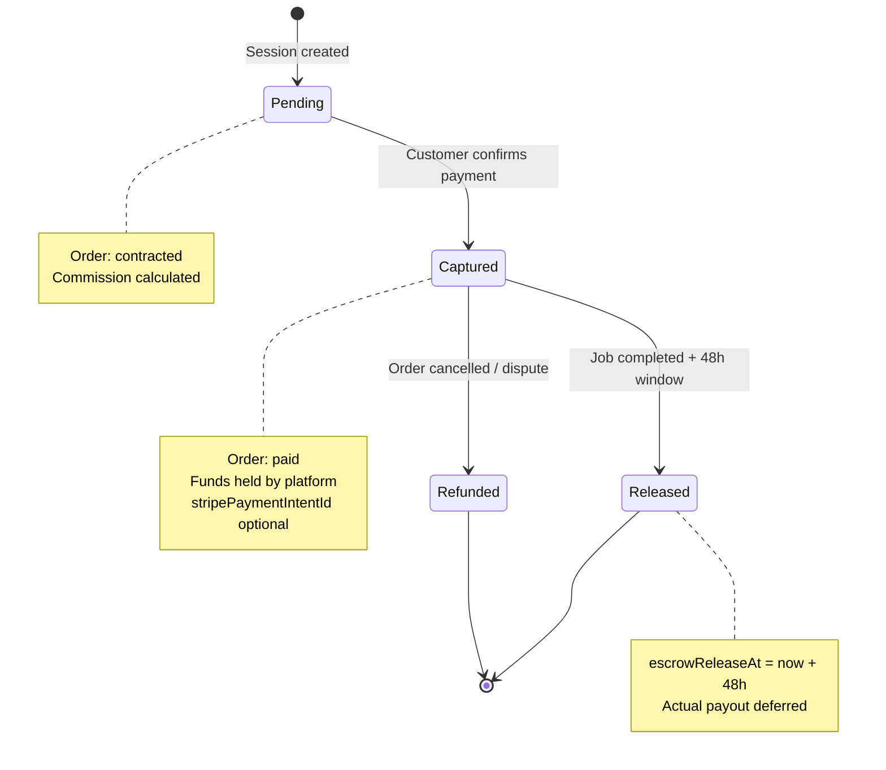

# Architecture Decision Record

## ADR-0063 — Escrow Payment System

**Status:** Accepted
**Date:** 2026-05-26
**Author:** AI Agent (Orchestrator)

### Context

The order lifecycle requires a trusted payment flow that protects both customers and providers. When a customer accepts a contract (ADR-0048), payment must be held securely until the job is completed satisfactorily. The existing [`routes/orderPayments.ts`](routes/orderPayments.ts) and [`lib/orderPayments.ts`](lib/orderPayments.ts) provide a mock payment gateway with session creation and capture, but the escrow semantics — hold, release, refund — were partially implemented without a formal ADR documenting the design decisions.

Key requirements:
1. **Hold on contract approval** — Payment must be authorized/held when the customer approves the contract, not when the job starts.
2. **Release on completion** — Funds are released to the provider after the customer confirms job completion (with a 48-hour dispute window).
3. **Refund on cancel** — If the order is cancelled after payment, funds are returned to the customer.
4. **Platform commission** — A configurable percentage (default 15%) is deducted as platform fee.
5. **Audit trail** — Every payment state transition is recorded via `Transaction` and `AuditLog` entries.
6. **No real payment provider dependency** — The system uses a mock checkout flow; Stripe/PayPal integration is deferred (consistent with the project's "NO Stripe" rule — see AGENTS.md).

### Decision

Implement a three-phase escrow payment lifecycle managed through the [`Payment`](prisma/schema.prisma:517) model, with monetary values stored as **cents (Int)** to avoid floating-point rounding errors (consistent with ADR-0062's monetary convention).

### Escrow Lifecycle

```
Order Status Flow:     contracted → paid → in_progress → completed → closed
Payment Status Flow:   pending   → captured → [held]    → released
                                        ↘ refunded (on cancel/dispute)
```

#### Phase 1: Hold (Pending)
- Triggered when the customer creates a payment session via `POST /api/orders/:orderId/payments/session` ([`routes/orderPayments.ts:116`](routes/orderPayments.ts:116))
- A [`Payment`](prisma/schema.prisma:517) record is created with `status: pending`, storing `amount`, `commission` (15% default), and `deduction` (amount - commission) in cents
- The payment gate ([`evaluateOrderPaymentGate`](lib/orderPayments.ts:38)) enforces that the order must be `contracted` with an approved `ContractVersion` before a session can be created
- A `Transaction` with category `order_payment_session` is recorded for audit

#### Phase 2: Capture
- Triggered when the customer confirms payment via `POST /api/orders/:orderId/payments/confirm` ([`routes/orderPayments.ts:192`](routes/orderPayments.ts:192))
- The [`captureEscrowPayment`](lib/orderPayments.ts:150) function transitions the `Payment` status from `pending` → `captured`
- The order transitions to `paid` status and `job` phase
- A `Transaction` with category `order_payment_capture` is recorded
- At this point, funds are "held" by the platform — not yet released to the provider

#### Phase 3: Release
- Triggered when the provider marks the job as `completed` and the customer confirms satisfaction
- The [`releaseEscrowPayment`](lib/orderPayments.ts:188) function sets `escrowReleaseAt` to 48 hours from now
- This provides a dispute window — the customer can raise a dispute within 48 hours
- After the 48-hour window expires, funds would be released to the provider (actual payout requires Stripe Connect or equivalent — deferred)

#### Refund Path
- Triggered when an order is cancelled after being paid (e.g., customer cancels, dispute resolved in customer's favor)
- The [`refundEscrowPayment`](lib/orderPayments.ts:222) function transitions the `Payment` status from `captured` → `refunded`
- Only `captured` payments can be refunded (not `pending` or already `refunded`)

### Key Design Choices

1. **Cents-based monetary values** ([`Payment`](prisma/schema.prisma:517)) — `amount`, `commission`, `deduction` are all `Int` (cents). Display values are divided by 100. Consistent with ADR-0062's quote monetary convention.

2. **Commission as deduction from amount** — `deduction = amount - commission`. The `deduction` field represents the provider's payout (in cents). This makes payout calculation trivial without runtime computation.

3. **Mock payment gateway** — The current implementation uses a mock checkout URL (`/payments/mock-checkout?orderId=...&session=...`) rather than a real payment provider. This is intentional per the project's "NO Stripe" rule (AGENTS.md). The `stripePaymentIntentId` and `stripeTransferId` fields exist on the [`Payment`](prisma/schema.prisma:525-526) model as future-proofing but are not used.

4. **48-hour dispute window** ([`releaseEscrowPayment`](lib/orderPayments.ts:200)) — `escrowReleaseAt` is set to 48 hours from the release trigger. This is a business decision balancing provider payout speed with customer protection. Configurable via a future env var if needed.

5. **Non-fatal escrow operations** ([`routes/orderPayments.ts:171-173`](routes/orderPayments.ts:171), [`routes/orderPayments.ts:246-249`](routes/orderPayments.ts:246)) — Escrow payment creation and capture are wrapped in try/catch and treated as non-fatal. The order state machine progresses regardless of escrow record success. This prevents escrow failures from blocking the customer's core flow.

6. **Audit via Transaction + AuditLog** — Every payment action creates both a `Transaction` record (financial audit) and an `AuditLog` entry (operational audit). The `Transaction.description` field encodes structured metadata (`order:orderId|contractVersion:versionId|currency:CAD|session:token`) for traceability.

7. **Payment gate enforcement** ([`evaluateOrderPaymentGate`](lib/orderPayments.ts:38)) — Before any payment operation, the gate checks:
   - Order has an approved `ContractVersion`
   - Order status is `contracted`, `paid`, `in_progress`, `completed`, or `closed`
   - Returns `CONTRACT_APPROVAL_REQUIRED` code if the gate fails

8. **Inbox preview access** ([`routes/orderPayments.ts:60-70`](routes/orderPayments.ts:60)) — Invited workspace members (pre-match) can see payment status with `readOnly: true` and a descriptive `lockReason`, consistent with ADR-0053's pre-match read access pattern.

### State Machine Diagram



### Consequences

**Positive:**
- ✅ Clear escrow lifecycle with well-defined state transitions (pending → captured → released / refunded)
- ✅ Cents-based monetary accuracy preventing floating-point rounding errors
- ✅ 48-hour dispute window protects customers while bounding provider payout delay
- ✅ Non-fatal escrow operations prevent payment failures from blocking order flow
- ✅ Dual audit trail (Transaction + AuditLog) provides financial and operational traceability
- ✅ Pre-match inbox preview access for invited providers (consistent with ADR-0053)
- ✅ Commission model is simple, configurable, and transparent

**Negative:**
- ❌ No real payment provider integration — mock checkout flow requires replacement before production
- ❌ No automatic release after 48-hour window — relies on manual or future cron-based release
- ❌ No dispute resolution workflow — `disputed` order status exists but no payment reversal flow beyond refund
- ❌ `stripePaymentIntentId` and `stripeTransferId` fields exist but are unused — could cause confusion
- ❌ No provider payout tracking — `deduction` is calculated but no mechanism to actually disburse funds
- ❌ Escrow release is a single `escrowReleaseAt` timestamp — no partial release or milestone-based release

### Files

- [`prisma/schema.prisma`](prisma/schema.prisma:517) — `model Payment` with `amount`, `commission`, `deduction`, `status`, `stripePaymentIntentId`, `stripeTransferId`, `escrowReleaseAt`
- [`prisma/schema.prisma:102`](prisma/schema.prisma:102) — `enum PaymentStatus { pending, captured, refunded, failed }`
- [`lib/orderPayments.ts`](lib/orderPayments.ts) — Core escrow logic: `createEscrowPayment`, `captureEscrowPayment`, `releaseEscrowPayment`, `refundEscrowPayment`, `evaluateOrderPaymentGate`, `getOrderPaymentSummary`
- [`routes/orderPayments.ts`](routes/orderPayments.ts) — Express routes: `GET /status`, `POST /session`, `POST /confirm`
- [`lib/orderPayments.test.ts`](lib/orderPayments.test.ts) — 14 tests covering create, capture, release, refund with edge cases
