# Neighborly — Architecture Reference

> **Version:** 2.1.0
> **Last updated:** 2026-05-23  
> **Status:** ✅ Production-ready  
> **Convention:** All TypeScript/JavaScript imports use the `.js` extension (e.g. `import './foo.js'`)

---

## Table of Contents

1. [System Context (C4 Level 1)](#1-system-context-c4-level-1)
2. [Container Diagram (C4 Level 2)](#2-container-diagram-c4-level-2)
3. [Component Diagram (C4 Level 3)](#3-component-diagram-c4-level-3)
4. [State Machines](#4-state-machines)
   - [4.1 Order Lifecycle](#41-order-lifecycle)
   - [4.2 Contract Lifecycle](#42-contract-lifecycle)
   - [4.3 KYC Lifecycle](#43-kyc-lifecycle)
5. [Eventing System](#5-eventing-system)
6. [Auth & RBAC](#6-auth--rbac)
7. [Data Flows](#7-data-flows)
   - [7.1 Order Creation & Matching](#71-order-creation--matching)
   - [7.2 KYC Submission & Review](#72-kyc-submission--review)
8. [Infrastructure & Deployment](#8-infrastructure--deployment)
9. [Domain Models](#9-domain-models)
10. [Key File Reference (C4 Level 4)](#10-key-file-reference-c4-level-4)

---

## 1. System Context (C4 Level 1)

The **Neighborly Platform** is a local services marketplace connecting customers with service providers. The system serves four distinct user types and integrates with several external systems.

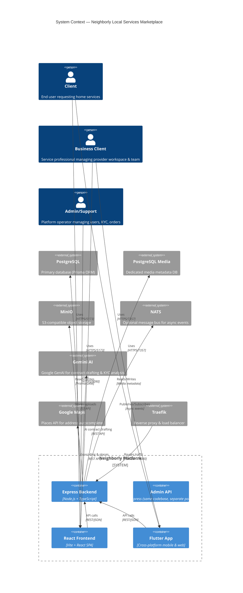

---

## 2. Container Diagram (C4 Level 2)

The platform consists of four main containers plus supporting infrastructure services.

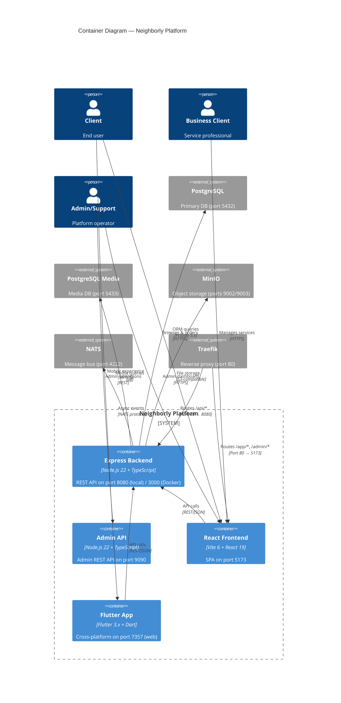

### Port Map

| Service | Local Dev | Docker Host | Notes |
|---|---|---|---|
| Backend API | `8080` | `3000` | `PORT` env var |
| Admin API | `9090` | `9090` | `ADMIN_PORT` env var |
| Vite Frontend | `5173` | `5173` | `cd frontend && npm run dev` |
| Flutter Web | `7357` | via Traefik | `flutter run -d web-server --web-port 7357` |
| PostgreSQL | `5432` | `5432` | Primary database |
| PostgreSQL Media | `5433` | `5433` | Media metadata database |
| MinIO API | `9002` | `9002` | S3-compatible object storage |
| MinIO Console | `9003` | `9003` | Web UI for MinIO |
| NATS | `4222` | `4222` | Optional message bus |
| Redis | `6379` | `6379` | Cache & location GEO (optional, fallback to in-memory) |
| Traefik Dashboard | — | `9191` | Docker mode only |
| Portainer | `9000` | `9000` | Container management |
| Dozzle | `8899` | `8899` | Container log viewer |
| Metabase | `3001` | `3001` | Analytics dashboard |

> **Note:** In local dev, cache uses **Redis** ([`lib/redis.ts`](lib/redis.ts)) with an **in-memory fallback** ([`lib/cache.ts`](lib/cache.ts)) when Redis is unavailable. NATS is optional (non-fatal if unavailable).

---

## 3. Component Diagram (C4 Level 3)

### 3.1 Backend Components

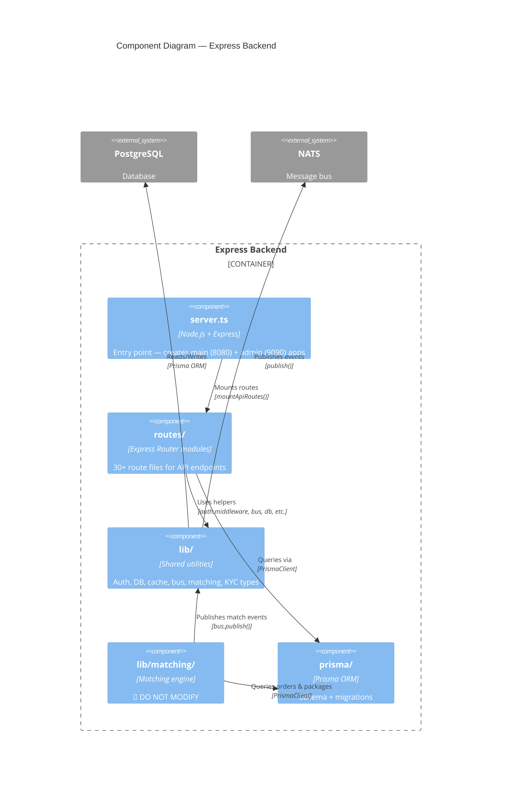

#### Route Modules

| Prefix | File | Description |
|---|---|---|
| `/api/auth` | [`routes/auth.ts`](routes/auth.ts) | Login, register, refresh, logout |
| `/api/users` | [`routes/users.ts`](routes/users.ts) | User profile CRUD |
| `/api/orders` | [`routes/orders.ts`](routes/orders.ts) | Order CRUD, my orders, cancel |
| `/api/orders/:id/chat` | [`routes/orderChat.ts`](routes/orderChat.ts) | Order-scoped chat |
| `/api/orders/:id/contracts` | [`routes/orderContracts.ts`](routes/orderContracts.ts) | Contract operations per order |
| `/api/orders/:id/payments` | [`routes/orderPayments.ts`](routes/orderPayments.ts) | Payment operations per order |
| `/api/kyc` | [`routes/kyc.ts`](routes/kyc.ts) | Legacy KYC endpoints |
| `/api/kyc/v2` | [`routes/kycUser.ts`](routes/kycUser.ts) | Multi-level KYC (personal, business, level0) |
| `/api/services` | [`routes/services.ts`](routes/services.ts) | Service CRUD |
| `/api/service-catalog` | [`routes/serviceCatalog.ts`](routes/serviceCatalog.ts) | Catalog browsing |
| `/api/categories` | [`routes/categories.ts`](routes/categories.ts) | Category tree |
| `/api/requests` | [`routes/requests.ts`](routes/requests.ts) | Service requests |
| `/api/contracts` | [`routes/contracts.ts`](routes/contracts.ts) | Legacy contracts |
| `/api/chat` | [`routes/chat.ts`](routes/chat.ts) | General chat rooms |
| `/api/companies` | [`routes/companies.ts`](routes/companies.ts) | Company/workspace management |
| `/api/providers` | [`routes/providers.ts`](routes/providers.ts) | Provider profiles |
| `/api/products` | [`routes/products.ts`](routes/products.ts) | Product/BOM management |
| `/api/workspaces` | [`routes/workspaces.ts`](routes/workspaces.ts) | Workspace operations |
| `/api/upload` | [`routes/upload.ts`](routes/upload.ts) | File uploads |
| `/api/media` | [`routes/media.ts`](routes/media.ts) | Media asset management |
| `/api/feed` | [`routes/feed.ts`](routes/feed.ts) | Social feed |
| `/api/posts` | [`routes/posts.ts`](routes/posts.ts) | Social posts |
| `/api/notifications` | [`routes/notifications.ts`](routes/notifications.ts) | User notifications |
| `/api/tickets` | [`routes/tickets.ts`](routes/tickets.ts) | Support tickets |
| `/api/transactions` | [`routes/transactions.ts`](routes/transactions.ts) | Financial transactions |
| `/api/places` | [`routes/places.ts`](routes/places.ts) | Google Maps places |
| `/api/system` | [`routes/system.ts`](routes/system.ts) | System config |
| `/api/utility-links` | [`routes/utilityLinks.ts`](routes/utilityLinks.ts) | Utility links directory |
| `/api/admin/*` | [`routes/admin.ts`](routes/admin.ts) | Admin dashboard & overview |
| `/api/admin/kyc` | [`routes/adminKyc.ts`](routes/adminKyc.ts) | Admin KYC review |
| `/api/admin/orders` | [`routes/adminOrders.ts`](routes/adminOrders.ts) | Admin order management |
| `/api/admin/contracts` | [`routes/adminContracts.ts`](routes/adminContracts.ts) | Admin contract queue |
| `/api/admin/payments` | [`routes/adminPayments.ts`](routes/adminPayments.ts) | Admin payment management |
| `/api/admin/chat` | [`routes/adminChat.ts`](routes/adminChat.ts) | Admin chat moderation |
| `/api/admin/media` | [`routes/adminMedia.ts`](routes/adminMedia.ts) | Admin media moderation |
| `/api/admin/users` | [`routes/admin.ts`](routes/admin.ts) | Admin user management |
| `/api/admin/service-definitions` | [`routes/adminServiceDefinitions.ts`](routes/adminServiceDefinitions.ts) | Service definition CRUD |
| `/api/admin/categories-tree` | [`routes/adminCategoriesTree.ts`](routes/adminCategoriesTree.ts) | Category tree management |
| `/api/admin/service-packages` | [`routes/adminServicePackages.ts`](routes/adminServicePackages.ts) | Package management |
| `/api/admin/products` | [`routes/adminProducts.ts`](routes/adminProducts.ts) | Product management |
| `/api/admin/utility-links` | [`routes/adminUtilityLinks.ts`](routes/adminUtilityLinks.ts) | Utility links management |

#### Shared Library Modules

| File | Purpose |
|---|---|
| [`lib/auth.middleware.ts`](lib/auth.middleware.ts) | JWT authentication (`authenticate`) + role-based access (`requireRole`, `isAdmin`) |
| [`lib/bus.ts`](lib/bus.ts) | NATS connection, `publish()`, `startNatsNotificationConsumers()` |
| [`lib/cache.ts`](lib/cache.ts) | In-memory cache (Map-based fallback when Redis is unavailable) |
| [`lib/db.ts`](lib/db.ts) | PrismaClient singleton |
| [`lib/orderPhase.ts`](lib/orderPhase.ts) | Order status → phase mapping, phase list filters |
| [`lib/orderLifecycleNotifications.ts`](lib/orderLifecycleNotifications.ts) | NATS-driven notification creation |
| [`lib/contractDraft.ts`](lib/contractDraft.ts) | AI-powered contract drafting (Gemini) with template fallback |
| [`lib/contractEvents.ts`](lib/contractEvents.ts) | Contract event logging |
| [`lib/contractMismatchGuard.ts`](lib/contractMismatchGuard.ts) | Contract content mismatch analysis |
| [`lib/kycTypes.ts`](lib/kycTypes.ts) | KYC type definitions & validators |
| [`lib/kycBusinessValidate.ts`](lib/kycBusinessValidate.ts) | Business KYC validation |
| [`lib/kycExpiryFlags.ts`](lib/kycExpiryFlags.ts) | KYC document expiry tracking |
| [`lib/kycLegacyPersonal.ts`](lib/kycLegacyPersonal.ts) | Legacy personal KYC shim |
| [`lib/categoryTreeOps.ts`](lib/categoryTreeOps.ts) | Category tree operations |
| [`lib/categoryBreadcrumbs.ts`](lib/categoryBreadcrumbs.ts) | Category breadcrumb generation |
| [`lib/categoryServiceTreeView.ts`](lib/categoryServiceTreeView.ts) | Service tree view helpers |
| [`lib/googleMapsConfig.ts`](lib/googleMapsConfig.ts) | Google Maps API configuration |
| [`lib/chatModeration.ts`](lib/chatModeration.ts) | Chat message moderation |
| [`lib/chatTranslate.ts`](lib/chatTranslate.ts) | Chat message translation |
| [`lib/dependencyCatalog.ts`](lib/dependencyCatalog.ts) | Dependency catalog types |
| [`lib/serviceDefinitionTypes.ts`](lib/serviceDefinitionTypes.ts) | Service definition types |
| [`lib/serviceQuestionnaireValidate.ts`](lib/serviceQuestionnaireValidate.ts) | Questionnaire validation |
| [`lib/serviceQuestionnaireBuilderValidate.ts`](lib/serviceQuestionnaireBuilderValidate.ts) | Questionnaire builder validation |
| [`lib/workspaceAccess.ts`](lib/workspaceAccess.ts) | Workspace access control |
| [`lib/orderNegotiationAccess.ts`](lib/orderNegotiationAccess.ts) | Order negotiation access control |
| [`lib/orderPayments.ts`](lib/orderPayments.ts) | Order payment processing |
| [`lib/orderSnapshot.ts`](lib/orderSnapshot.ts) | Order snapshot utilities |
| [`lib/orderPhotosForValidate.ts`](lib/orderPhotosForValidate.ts) | Order photo validation |
| [`lib/orderPhaseFacets.ts`](lib/orderPhaseFacets.ts) | Order phase facet counts |
| [`lib/renderContractTemplate.ts`](lib/renderContractTemplate.ts) | Contract template rendering |
| [`lib/packageMargin.ts`](lib/packageMargin.ts) | Package margin calculations |
| [`lib/buildProviderWorkspaceFinance.ts`](lib/buildProviderWorkspaceFinance.ts) | Provider workspace finance |
| [`lib/wizardFallbackQuestionnaire.ts`](lib/wizardFallbackQuestionnaire.ts) | Fallback questionnaire |
| [`lib/paintingResidentialQuestionnaire.ts`](lib/paintingResidentialQuestionnaire.ts) | Painting-specific questionnaire |
| [`lib/adminOverviewStats.ts`](lib/adminOverviewStats.ts) | Admin dashboard stats types |
| [`lib/adminUsersList.ts`](lib/adminUsersList.ts) | Admin user list types |
| [`lib/adminUsersTypes.ts`](lib/adminUsersTypes.ts) | Admin user detail types |
| [`lib/adminUserDetail.ts`](lib/adminUserDetail.ts) | Admin user detail types |
| [`lib/adminOrdersList.ts`](lib/adminOrdersList.ts) | Admin order list types |
| [`lib/redis.ts`](lib/redis.ts) | Redis connection manager (ioredis) with graceful in-memory fallback |
| [`lib/locationCache.ts`](lib/locationCache.ts) | GEO-based location caching with Redis (georadius, geoadd) and async PostgreSQL flush |

### 3.2 Frontend Components

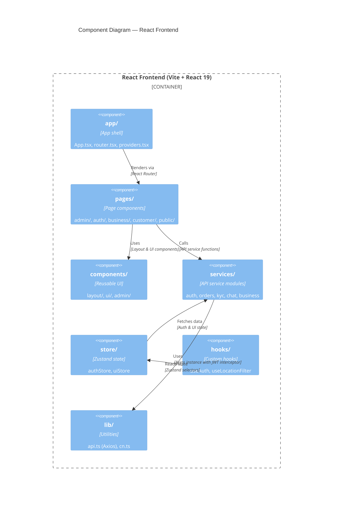

#### Frontend Directory Structure

| Directory | Contents |
|---|---|
| `app/` | [`App.tsx`](frontend/src/app/App.tsx), [`router.tsx`](frontend/src/app/router.tsx), [`providers.tsx`](frontend/src/app/providers.tsx) |
| `pages/public/` | HomeScreen, Explore, ServiceDetail |
| `pages/auth/` | Login |
| `pages/customer/` | Activity, Profile |
| `pages/business/` | BusinessDashboard |
| `pages/admin/` | AdminDashboard, AdminUsers, AdminKyc, AdminOrders, AdminContracts, AdminPayments, AdminMedia, AdminSettings |
| `components/layout/` | PublicLayout, CustomerLayout, BusinessLayout, AdminLayout |
| `components/ui/` | AccountAvatarBadge, phone/BottomNav, phone/PhoneContainer, phone/StatusBar |
| `services/` | auth, business, chat, kyc, orders, orderContracts, orderPayments, admin/* |
| `store/` | [`authStore.ts`](frontend/src/store/authStore.ts) (Zustand + persist), [`uiStore.ts`](frontend/src/store/uiStore.ts) |
| `hooks/` | useAuth, useLocationFilter |
| `lib/` | [`api.ts`](frontend/src/lib/api.ts) (Axios with JWT interceptor + refresh queue), cn.ts |

#### Flutter App Structure

| File | Purpose |
|---|---|
| [`flutter_project/lib/main.dart`](flutter_project/lib/main.dart) | App entry point |
| [`flutter_project/lib/screens/`](flutter_project/lib/screens/) | Screen widgets (auth, home, dashboard, profile, business, activity, social) |
| [`flutter_project/lib/services/`](flutter_project/lib/services/) | API service (`api_service.dart`) + auth service (`auth_service.dart`) |
| [`flutter_project/lib/theme/`](flutter_project/lib/theme/) | App theme (`app_theme.dart`) |
| [`flutter_project/lib/widgets/`](flutter_project/lib/widgets/) | Shared widgets (bottom nav, status bar) |

---

## 4. State Machines

### 4.1 Order Lifecycle

The `Order` model uses the `OrderStatus` enum with **11 states** organized into **3 phases** (`offer`, `order`, `job`).

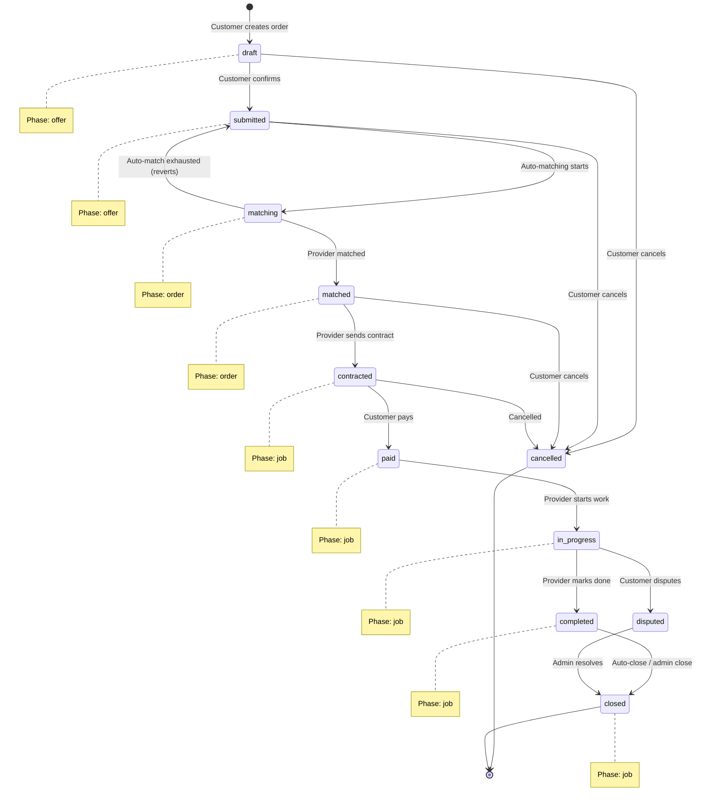

**Phase mapping** (from [`lib/orderPhase.ts`](lib/orderPhase.ts)):

| Phase | Statuses |
|---|---|
| `offer` | `draft`, `submitted`, `cancelled` |
| `order` | `matching`, `matched` |
| `job` | `contracted`, `paid`, `in_progress`, `completed`, `disputed`, `closed` |

**Key transitions:**
- `draft → submitted`: Customer confirms the order (triggers matching)
- `submitted → matching`: Auto-matching engine begins
- `matching → matched`: Provider found via auto or manual match
- `matched → contracted`: Contract sent by provider
- `contracted → paid`: Customer pays (platform payment)
- `paid → in_progress`: Provider starts job
- `in_progress → completed`: Provider marks job done
- `completed → closed`: System auto-closes or admin closes
- `in_progress → disputed → closed`: Dispute resolution path
- Any state → `cancelled`: Customer or admin can cancel (subject to business rules)

### 4.2 Contract Lifecycle

Contracts use the `ContractVersionStatus` enum with **6 states**. Each contract version goes through a lifecycle, and new versions can supersede old ones.

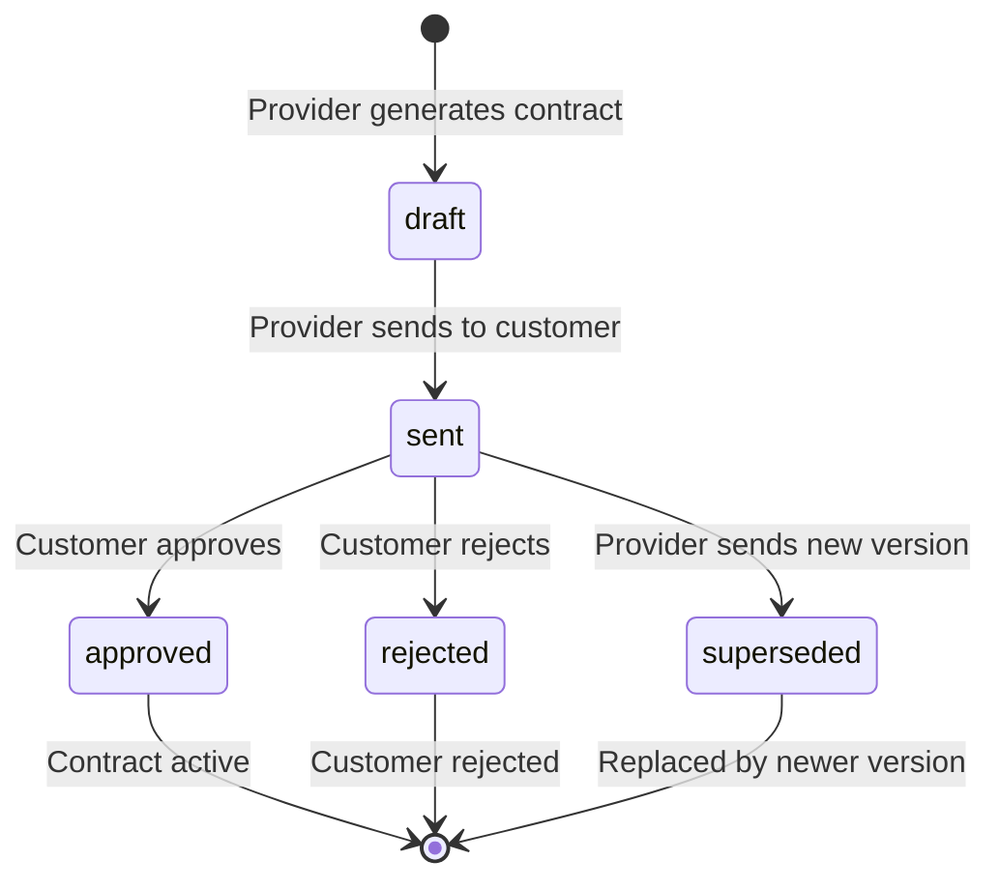

**Contract action types** (from [`lib/contractEvents.ts`](lib/contractEvents.ts)):

| Action | Actor | Description |
|---|---|---|
| `provider_sent` | Provider | Contract sent to customer |
| `customer_approved` | Customer | Customer approved contract |
| `customer_rejected` | Customer | Customer rejected contract |
| `customer_requested_edit` | Customer | Customer requested changes |
| `provider_superseded` | Provider | Provider sent new version |
| `admin_override` | Admin | Admin overrode contract status |
| `admin_marked_reviewed` | Admin | Admin reviewed contract |
| `admin_internal_note` | Admin | Admin added internal note |

**Legacy `Contract` model** (pre-order-contract system):
- Uses `status` string (default `"pending"`)
- Dual signing: `clientSigned` / `providerSigned` boolean flags
- Not connected to the new `OrderContract` / `ContractVersion` system

### 4.3 KYC Lifecycle

KYC (Know Your Customer) uses the `KycStatus` enum with **5 states** across **3 submission types**.

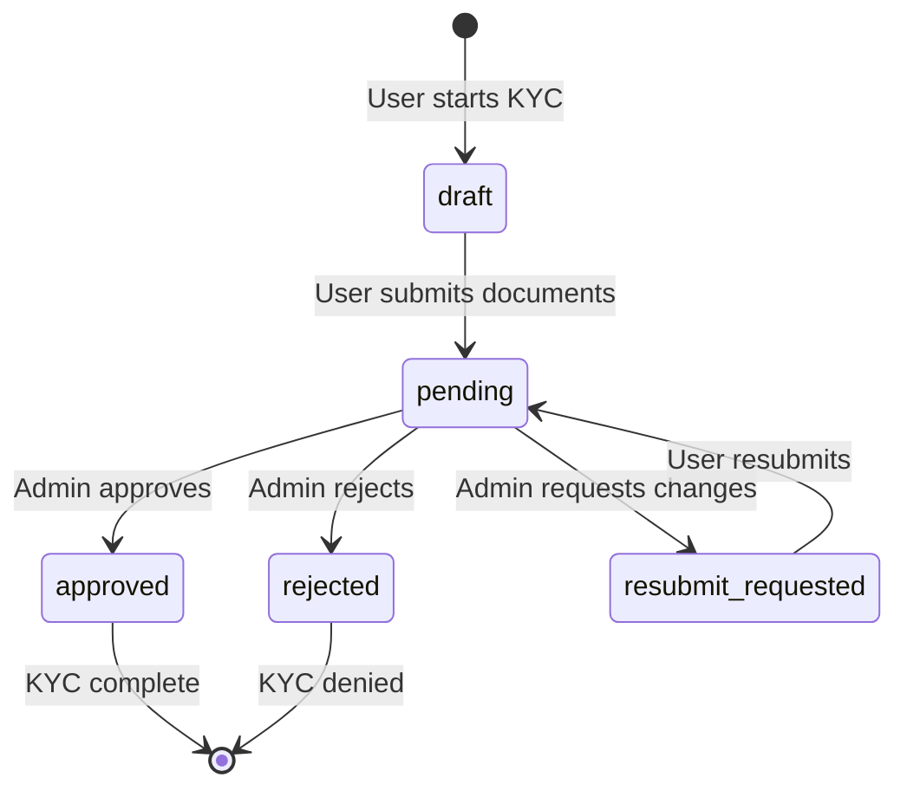

**KYC submission types:**

| Type | Model | Description |
|---|---|---|
| `level0` | [`KycLevel0Profile`](prisma/schema.prisma:782) | Basic profile (email/phone verification, address) |
| `personal` | [`KycPersonalSubmission`](prisma/schema.prisma:797) | Identity verification (ID docs, selfie, AI analysis) |
| `business` | [`BusinessKycSubmission`](prisma/schema.prisma:834) | Business verification (dynamic form schema, inquiries) |

**AI integration:** Personal KYC submissions are analyzed by Gemini AI ([`lib/kycTypes.ts`](lib/kycTypes.ts)) for:
- Fraud detection (`isLikelyFraud`)
- OCR name matching (`ocrName`, `nameMatchesProfile`)
- Document authenticity (`isEdited`, `isInternetDownloaded`)
- Recommendation: `approve` | `reject` | `manual_review`

---

## 5. Eventing System

The platform uses **NATS** as an optional message bus for asynchronous event-driven communication. All events are published via [`lib/bus.ts`](lib/bus.ts) using the `publish(subject, data)` function. NATS is **non-fatal** — if unavailable, events are silently dropped.

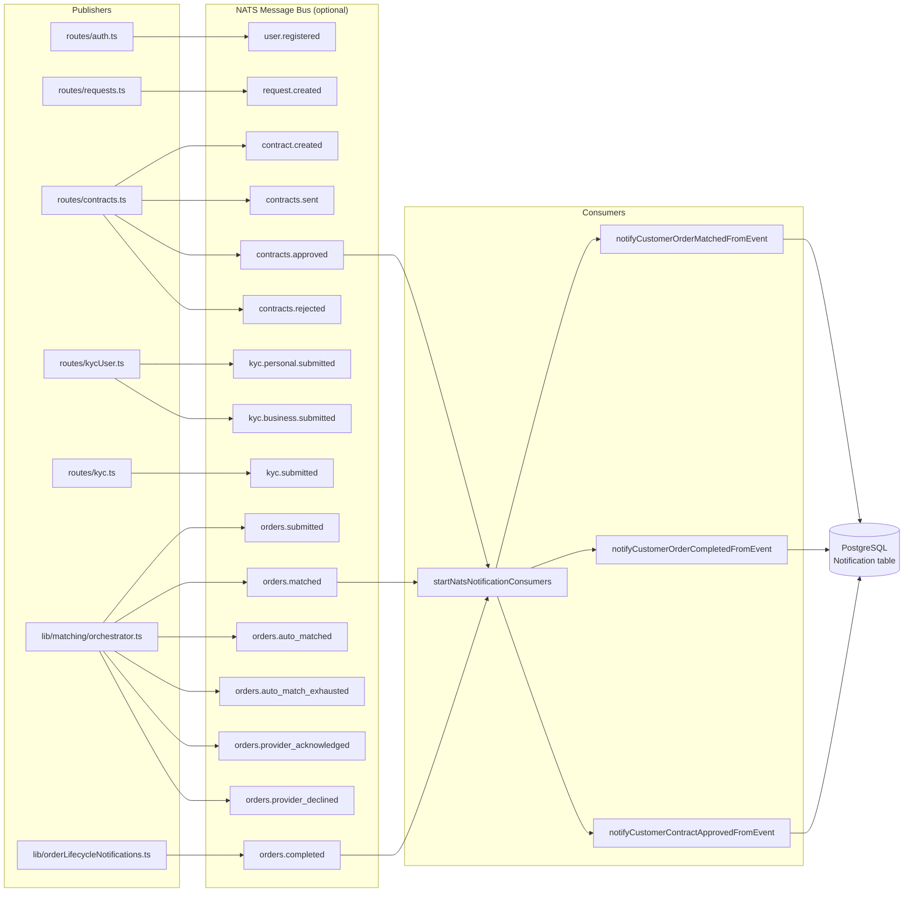

**Event subjects:**

| Subject | Publisher | Payload |
|---|---|---|
| `user.registered` | [`routes/auth.ts`](routes/auth.ts) | `{ userId, email }` |
| `request.created` | [`routes/requests.ts`](routes/requests.ts) | `{ requestId, customerId }` |
| `contract.created` | [`routes/contracts.ts`](routes/contracts.ts) | `{ contractId, ... }` |
| `contracts.sent` | [`routes/contracts.ts`](routes/contracts.ts) | `{ contractId, versionId }` |
| `contracts.approved` | [`routes/contracts.ts`](routes/contracts.ts) | `{ contractId, versionId }` |
| `contracts.rejected` | [`routes/contracts.ts`](routes/contracts.ts) | `{ contractId, versionId, reason }` |
| `orders.submitted` | [`lib/matching/orchestrator.ts`](lib/matching/orchestrator.ts) | `{ orderId }` |
| `orders.matched` | [`lib/matching/orchestrator.ts`](lib/matching/orchestrator.ts) | `{ orderId, attemptId, packageId, providerId, workspaceId, score }` |
| `orders.auto_matched` | [`lib/matching/orchestrator.ts`](lib/matching/orchestrator.ts) | Same as `orders.matched` |
| `orders.auto_match_exhausted` | [`lib/matching/orchestrator.ts`](lib/matching/orchestrator.ts) | `{ orderId, depth }` |
| `orders.provider_acknowledged` | Matching engine | Provider accepted match |
| `orders.provider_declined` | Matching engine | Provider declined match |
| `orders.completed` | Order lifecycle | `{ orderId }` |
| `kyc.personal.submitted` | [`routes/kycUser.ts`](routes/kycUser.ts) | `{ userId, submissionId }` |
| `kyc.business.submitted` | [`routes/kycUser.ts`](routes/kycUser.ts) | `{ userId, submissionId, companyId }` |
| `kyc.submitted` | [`routes/kyc.ts`](routes/kyc.ts) | `{ userId }` (legacy) |

**Notification consumers** (registered in [`lib/bus.ts`](lib/bus.ts)):
- `orders.matched` → `notifyCustomerOrderMatchedFromEvent`
- `orders.completed` → `notifyCustomerOrderCompletedFromEvent`
- `contracts.approved` → `notifyCustomerContractApprovedFromEvent`

These consumers create `Notification` rows in PostgreSQL for the relevant users.

---

## 6. Auth & RBAC

### Authentication Flow

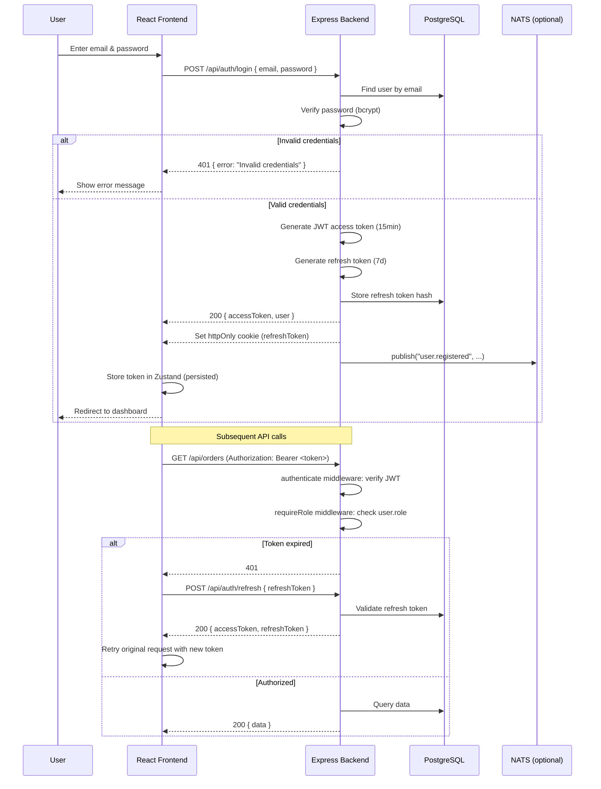

### Role-Based Access Control

The RBAC system uses two middleware functions from [`lib/auth.middleware.ts`](lib/auth.middleware.ts):

| Middleware | Purpose |
|---|---|
| `authenticate` | Verifies JWT from `Authorization: Bearer <token>` header. Attaches decoded payload to `req.user`. Returns 401 if missing/invalid. |
| `requireRole(...roles)` | Checks `req.user.role` against allowed roles. Returns 403 if role not permitted. |
| `isAdmin` | Pre-configured: `requireRole('owner', 'platform_admin', 'support', 'finance')` |

**UserRole enum** (from Prisma schema):

| Role | Description |
|---|---|
| `owner` | Platform owner — full access |
| `platform_admin` | Platform administrator |
| `developer` | Developer access |
| `support` | Customer support agent |
| `finance` | Finance operations |
| `customer` | End user requesting services |
| `provider` | Service professional |
| `staff` | Internal staff |

### Frontend Auth Integration

The frontend uses **Zustand** with `persist` middleware ([`frontend/src/store/authStore.ts`](frontend/src/store/authStore.ts)):

- **Token storage:** JWT access token persisted to `localStorage` under key `neighborly-auth`
- **Axios interceptor:** [`frontend/src/lib/api.ts`](frontend/src/lib/api.ts) automatically attaches `Authorization: Bearer <token>` header to all requests
- **Token refresh queue:** If a 401 response is received, the interceptor queues the failed request, calls `POST /api/auth/refresh`, and retries all queued requests with the new token
- **Route protection:** [`frontend/src/app/router.tsx`](frontend/src/app/router.tsx) uses `RequireAuth` wrapper component that checks token existence and role membership before rendering protected routes

---

## 7. Data Flows

### 7.1 Order Creation & Matching

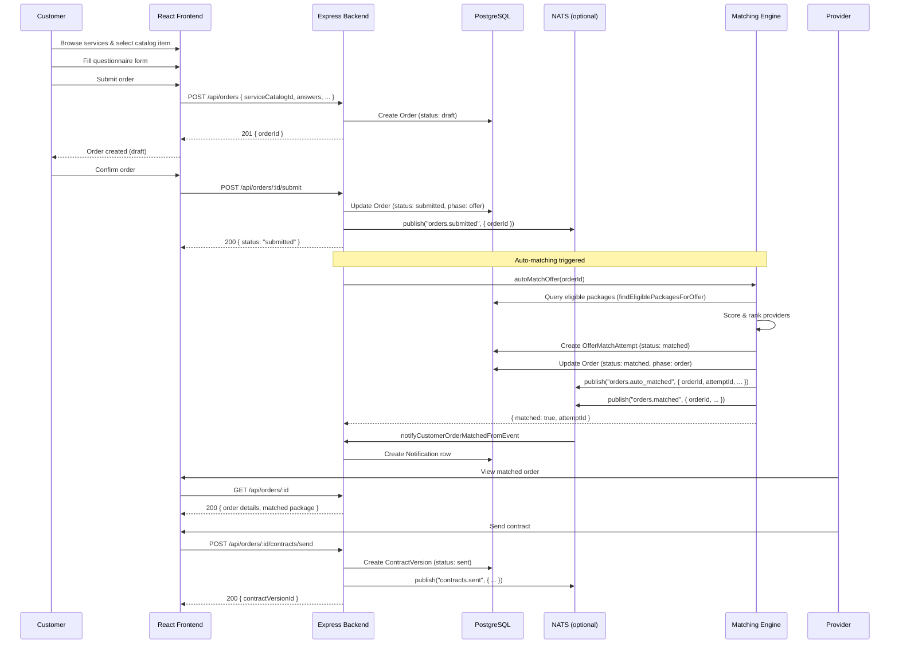

### 7.2 KYC Submission & Review

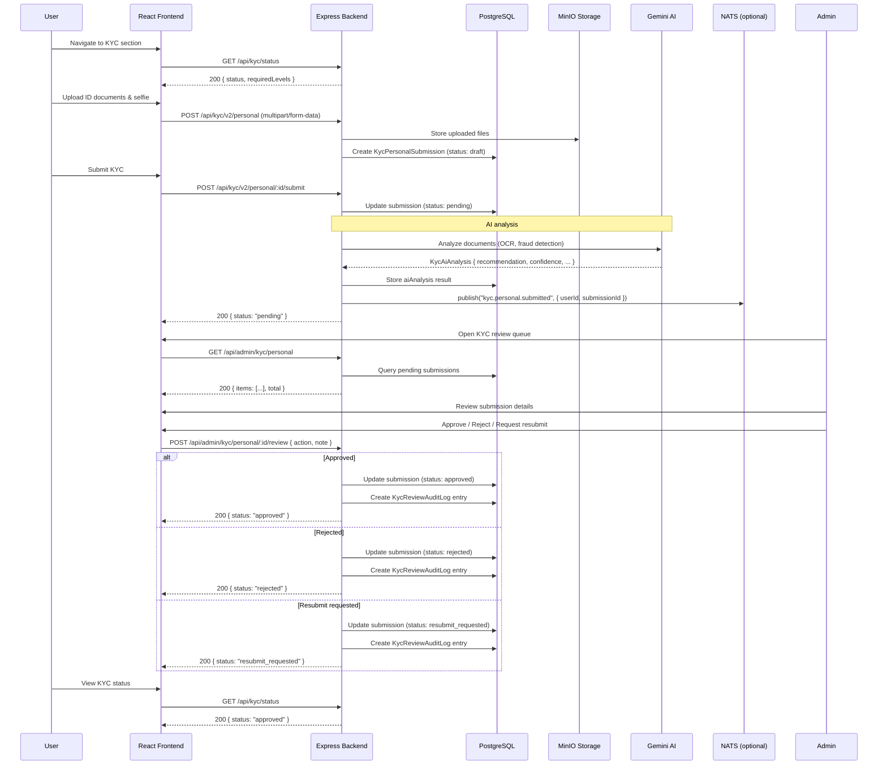

---

## 8. Infrastructure & Deployment

### Docker Compose Services

| Service | Image | Container Name | Purpose |
|---|---|---|---|
| `traefik` | `traefik:v3.3` | `neighborly_traefik` | Reverse proxy, TLS termination, routing |
| `postgres` | `postgres:16-alpine` | `neighborly_db` | Primary PostgreSQL database |
| `postgres-media` | `postgres:16-alpine` | `neighborly_media_db` | Dedicated media metadata database |
| `minio` | `minio/minio:latest` | `neighborly_minio` | S3-compatible object storage |
| `nats` | `nats:2.10-alpine` | `neighborly_bus` | Optional async message bus |
| `web-app` | Custom Dockerfile | `neighborly_web_app` | Express backend + built frontend |
| `frontend` | Custom Dockerfile | `neighborly_frontend` | Vite dev server (Docker mode) |
| `portainer` | `portainer/portainer-ce:latest` | `neighborly_portainer` | Container management UI |
| `dozzle` | `amir20/dozzle:latest` | `neighborly_dozzle` | Container log viewer |
| `metabase` | `metabase/metabase:latest` | `neighborly_metabase` | Analytics & BI dashboard |

### Traefik Routing Rules

| Path Prefix | Target Service | Port | Priority |
|---|---|---|---|
| `/flutter` | Flutter Web | `80` (nginx) | 20 |
| `/app`, `/auth`, `/business`, `/admin`, `/explore` | Vite Frontend | `5173` | 10 |
| `/dozzle` | Dozzle | `8080` | 25 |
| `/portainer` | Portainer | `9000` | 10 |
| `/metabase` | Metabase | `3000` | 10 |
| `/minio` | MinIO Console | `9001` | 10 |
| `/` (catch-all) | Express Backend | `8080` | 1 |

### Local Development vs Docker Mode

| Aspect | Local Dev | Docker |
|---|---|---|
| Backend | `npm run dev` on port **8080** | Container on port **3000** (host) |
| Admin API | Same process on port **9090** | Same container on port **9090** |
| Frontend | `npm run dev` on port **5173** | Container on port **5173** |
| Cache | Redis ([`lib/redis.ts`](lib/redis.ts)) + in-memory fallback ([`lib/cache.ts`](lib/cache.ts)) | Redis (container) |
| NATS | Optional (warning logged) | Optional (container available) |
| Database | Docker PostgreSQL on port **5432** | Docker PostgreSQL on port **5432** |
| Media DB | Docker PostgreSQL on port **5433** | Docker PostgreSQL on port **5433** |

> **Important:** Backend and frontend run in **separate processes** in local dev. Never combine them in one command.

---

## 9. Domain Models

### Core Marketplace Models

| Model | Table | Key Fields | Relations |
|---|---|---|---|
| [`User`](prisma/schema.prisma:139) | `User` | `id`, `email`, `role` (UserRole), `status` (Status) | Companies, Orders, KYC, Contracts |
| [`Company`](prisma/schema.prisma:221) | `Company` | `id`, `ownerId`, `name`, `kycStatus` | Owner, Members, Packages, Products |
| [`ServiceCatalog`](prisma/schema.prisma:265) | `ServiceCatalog` | `id`, `name`, `categoryId`, `isActive` | Services, Orders, Packages |
| [`Order`](prisma/schema.prisma:396) | `Order` | `id`, `customerId`, `status` (OrderStatus), `phase` (OrderPhase) | Customer, MatchAttempts, Contract, Review |
| [`ProviderServicePackage`](prisma/schema.prisma:295) | `ProviderServicePackage` | `id`, `providerId`, `workspaceId`, `finalPrice` | BOM, MatchAttempts, Orders |
| [`OfferMatchAttempt`](prisma/schema.prisma:323) | `OfferMatchAttempt` | `id`, `offerId`, `packageId`, `status` (MatchAttemptStatus), `score` | Offer, Package, Provider |

### Contract Models

| Model | Table | Key Fields | Relations |
|---|---|---|---|
| [`OrderContract`](prisma/schema.prisma:531) | `OrderContract` | `id`, `orderId`, `currentVersionId` | Order, Versions, Events |
| [`ContractVersion`](prisma/schema.prisma:545) | `ContractVersion` | `id`, `contractId`, `versionNumber`, `status` (ContractVersionStatus) | Contract, Events |
| [`ContractEvent`](prisma/schema.prisma:577) | `ContractEvent` | `id`, `contractId`, `versionId`, `actionType` (ContractActionType) | Contract, Version |

### KYC Models

| Model | Table | Key Fields | Relations |
|---|---|---|---|
| [`KycLevel0Profile`](prisma/schema.prisma:782) | `KycLevel0Profile` | `userId`, `emailVerifiedAt`, `phoneVerifiedAt` | User |
| [`KycPersonalSubmission`](prisma/schema.prisma:797) | `KycPersonalSubmission` | `userId`, `status` (KycStatus), `aiAnalysis` (Json) | User |
| [`BusinessKycSubmission`](prisma/schema.prisma:834) | `BusinessKycSubmission` | `userId`, `companyId`, `status` (KycStatus), `answers` (Json) | User, Company |
| [`BusinessKycFormSchema`](prisma/schema.prisma:822) | `BusinessKycFormSchema` | `id`, `version`, `schema` (Json) | — |
| [`KycReviewAuditLog`](prisma/schema.prisma:857) | `KycReviewAuditLog` | `id`, `submissionType`, `submissionId`, `toStatus` | — |

### Social & Communication Models

| Model | Table | Key Fields | Relations |
|---|---|---|---|
| [`Post`](prisma/schema.prisma:685) | `Post` | `id`, `authorId`, `type` (PostType), `mediaAssetId` | Author, Reactions, Comments |
| [`ChatRoom`](prisma/schema.prisma:884) | `ChatRoom` | `id`, `categoryId`, `name` | Messages |
| [`OrderChatThread`](prisma/schema.prisma:494) | `OrderChatThread` | `id`, `orderId`, `customerId`, `providerId` | Messages |
| [`Notification`](prisma/schema.prisma:728) | `Notification` | `id`, `userId`, `title`, `type`, `read` | User |

### Key Enums

| Enum | Values |
|---|---|
| `UserRole` | `owner`, `platform_admin`, `developer`, `support`, `finance`, `customer`, `provider`, `staff` |
| `OrderStatus` | `draft`, `submitted`, `cancelled`, `matching`, `matched`, `contracted`, `paid`, `in_progress`, `completed`, `disputed`, `closed` |
| `OrderPhase` | `offer`, `order`, `job` |
| `MatchAttemptStatus` | `invited`, `matched`, `accepted`, `declined`, `expired`, `superseded` |
| `ContractVersionStatus` | `draft`, `sent`, `approved`, `rejected`, `superseded` |
| `ContractActionType` | `provider_sent`, `customer_approved`, `customer_rejected`, `customer_requested_edit`, `provider_superseded`, `admin_override`, `admin_marked_reviewed`, `admin_internal_note` |
| `KycStatus` | `draft`, `pending`, `approved`, `rejected`, `resubmit_requested` |
| `KycSubmissionType` | `level0`, `personal`, `business` |
| `Status` (User) | `active`, `suspended`, `pending_verification` |
| `BookingMode` | `auto_appointment`, `negotiation`, `inherit_from_catalog` |
| `JobStatus` | `scheduled`, `in_progress`, `completed`, `disputed`, `cancelled` |
| `InvoiceStatus` | `DRAFT`, `SENT`, `PAID`, `OVERDUE`, `CANCELLED` |

---

## 10. Key File Reference (C4 Level 4)

### Backend Entry & Configuration

| File | Purpose |
|---|---|
| [`server.ts`](server.ts) | Express entry point — creates main (PORT) + admin (ADMIN_PORT) apps, mounts all routes, connects DB/cache/NATS |
| [`.env.example`](.env.example) | Environment variable template |
| [`docker-compose.yml`](docker-compose.yml) | Full Docker Compose stack definition |
| [`Dockerfile`](Dockerfile) | Multi-stage Docker build |
| [`package.json`](package.json) | Node.js dependencies & scripts |

### Backend Routes

| File | Purpose |
|---|---|
| [`routes/auth.ts`](routes/auth.ts) | Authentication endpoints (login, register, refresh, logout) |
| [`routes/orders.ts`](routes/orders.ts) | Order CRUD, my orders, cancel |
| [`routes/orderChat.ts`](routes/orderChat.ts) | Order-scoped chat messages |
| [`routes/orderContracts.ts`](routes/orderContracts.ts) | Contract operations per order |
| [`routes/orderPayments.ts`](routes/orderPayments.ts) | Payment operations per order |
| [`routes/kycUser.ts`](routes/kycUser.ts) | Multi-level KYC (v2) endpoints |
| [`routes/kyc.ts`](routes/kyc.ts) | Legacy KYC endpoints |
| [`routes/admin.ts`](routes/admin.ts) | Admin dashboard & user management |
| [`routes/adminKyc.ts`](routes/adminKyc.ts) | Admin KYC review endpoints |
| [`routes/adminOrders.ts`](routes/adminOrders.ts) | Admin order management |
| [`routes/adminContracts.ts`](routes/adminContracts.ts) | Admin contract queue |
| [`routes/adminPayments.ts`](routes/adminPayments.ts) | Admin payment management |

### Backend Shared Libraries

| File | Purpose |
|---|---|
| [`lib/auth.middleware.ts`](lib/auth.middleware.ts) | JWT authentication & RBAC middleware |
| [`lib/bus.ts`](lib/bus.ts) | NATS connection, publish, notification consumers |
| [`lib/redis.ts`](lib/redis.ts) | Redis connection manager (ioredis, graceful in-memory fallback) |
| [`lib/cache.ts`](lib/cache.ts) | In-memory cache fallback (used when Redis is unavailable) |
| [`lib/locationCache.ts`](lib/locationCache.ts) | Redis GEO-based location cache (provider proximity, Haversine debounce) |
| [`lib/db.ts`](lib/db.ts) | PrismaClient singleton |
| [`lib/orderPhase.ts`](lib/orderPhase.ts) | Order status → phase mapping |
| [`lib/orderLifecycleNotifications.ts`](lib/orderLifecycleNotifications.ts) | NATS-driven notification creation |
| [`lib/contractDraft.ts`](lib/contractDraft.ts) | AI contract drafting (Gemini + template fallback) |
| [`lib/contractEvents.ts`](lib/contractEvents.ts) | Contract event logging |
| [`lib/kycTypes.ts`](lib/kycTypes.ts) | KYC type definitions & validators |
| [`lib/matching/orchestrator.ts`](lib/matching/orchestrator.ts) | 🚫 Auto & manual matching engine |
| [`lib/matching/eligibility.ts`](lib/matching/eligibility.ts) | 🚫 Provider eligibility scoring |
| [`lib/matching/roundRobin.ts`](lib/matching/roundRobin.ts) | 🚫 Round-robin provider selection |

### Prisma

| File | Purpose |
|---|---|
| [`prisma/schema.prisma`](prisma/schema.prisma) | Full database schema (40+ models, 20+ enums) |
| [`prisma/seed.ts`](prisma/seed.ts) | Database seed script |
| [`prisma/seed-kyc.ts`](prisma/seed-kyc.ts) | KYC seed data |
| [`prisma/seed-provider-inventory.ts`](prisma/seed-provider-inventory.ts) | Provider inventory seed data |
| [`prisma/migrations/`](prisma/migrations/) | Migration history (30+ migrations) |

### Frontend

| File | Purpose |
|---|---|
| [`frontend/src/app/App.tsx`](frontend/src/app/App.tsx) | React app entry point |
| [`frontend/src/app/router.tsx`](frontend/src/app/router.tsx) | Route definitions with role-based guards |
| [`frontend/src/lib/api.ts`](frontend/src/lib/api.ts) | Axios instance with JWT interceptor & refresh queue |
| [`frontend/src/store/authStore.ts`](frontend/src/store/authStore.ts) | Zustand auth state (persisted) |
| [`frontend/src/store/uiStore.ts`](frontend/src/store/uiStore.ts) | Zustand UI state |
| [`frontend/src/services/orders.ts`](frontend/src/services/orders.ts) | Order API service |
| [`frontend/src/services/kyc.ts`](frontend/src/services/kyc.ts) | KYC API service |
| [`frontend/src/services/auth.ts`](frontend/src/services/auth.ts) | Auth API service |
| [`frontend/src/pages/admin/AdminDashboard.tsx`](frontend/src/pages/admin/AdminDashboard.tsx) | Admin dashboard page |
| [`frontend/src/pages/admin/AdminKyc.tsx`](frontend/src/pages/admin/AdminKyc.tsx) | Admin KYC review page |

### Flutter

| File | Purpose |
|---|---|
| [`flutter_project/lib/main.dart`](flutter_project/lib/main.dart) | Flutter app entry point |
| [`flutter_project/lib/services/api_service.dart`](flutter_project/lib/services/api_service.dart) | HTTP API client |
| [`flutter_project/lib/services/auth_service.dart`](flutter_project/lib/services/auth_service.dart) | Auth service |
| [`flutter_project/lib/screens/home_screen.dart`](flutter_project/lib/screens/home_screen.dart) | Home screen |
| [`flutter_project/lib/screens/auth_screen.dart`](flutter_project/lib/screens/auth_screen.dart) | Auth screen |
| [`flutter_project/lib/screens/dashboard_screen.dart`](flutter_project/lib/screens/dashboard_screen.dart) | Dashboard screen |

---

## Appendix: Architecture Decision Records

Key architectural decisions reflected in this document:

| Decision | Rationale | Reference |
|---|---|---|
| Dual-port Express (main + admin) | Separate admin API surface for security | [`server.ts`](server.ts:178) |
| Redis cache with in-memory fallback | Redis for production; graceful fallback to Map when Redis is down | [`lib/redis.ts`](lib/redis.ts:1), [`lib/cache.ts`](lib/cache.ts:1) |
| Redis GEO location cache | Real-time provider proximity via Redis GEO commands | [`lib/locationCache.ts`](lib/locationCache.ts:1) |
| NATS as optional bus | Non-fatal if unavailable; events silently dropped | [`lib/bus.ts`](lib/bus.ts:39) |
| `.js` import extension | Required for ESM compatibility with TypeScript | Project convention |
| Prisma 5.x (no upgrades) | Stable ORM; upgrades would require migration audit | [`prisma/schema.prisma`](prisma/schema.prisma:1) |
| Matching engine isolated | Sacred code — never modify | [`lib/matching/`](lib/matching/) |
| Zustand over Redux | Lightweight state management for React SPA | [`frontend/src/store/authStore.ts`](frontend/src/store/authStore.ts) |
| Gemini AI for contracts + KYC | Server-side AI integration for document analysis | [`lib/contractDraft.ts`](lib/contractDraft.ts), [`lib/kycTypes.ts`](lib/kycTypes.ts) |

---

> **Document maintainers:** Update this file whenever the architecture changes.
> **See also:** [`PORTS.md`](PORTS.md) — complete port registry | [`AGENTS.md`](AGENTS.md) — project intelligence for AI agents