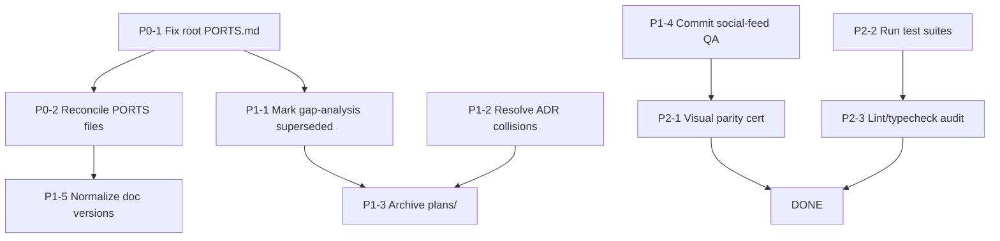

# Implementation Roadmap — Post-Audit

**Date:** 2026-08-12
**Input:** `docs/PLAN_STATUS.md` (this audit)
**Bottom line:** All 12 plans' **feature code** is already implemented. The roadmap below is therefore **cleanup + verification + documentation reconciliation**, not new feature construction.

---

## 1. Task List (P0 / P1 / P2)

### P0 — Correct misleading documentation (docs only, no code)

| ID | Task | Files | Owner | Notes |
|----|------|-------|-------|-------|
| P0-1 | Fix root `PORTS.md`: change "Redis removed / cache in-memory" → Redis active with in-memory fallback; correct Dozzle (8888→8899) and Traefik dashboard (8080→9191) to match `docs/PORTS.md` + `docker-compose.yml` | `PORTS.md` | docs | Highest value — `AGENTS.md` routes every agent here |
| P0-2 | Reconcile `PORTS.md` ↔ `docs/PORTS.md` so both are identical single-source-of-truth (or delete one and redirect) | `PORTS.md`, `docs/PORTS.md` | docs | Two files currently disagree |

### P1 — Reconcile stale artifacts & commit in-flight work

| ID | Task | Files | Owner | Notes |
|----|------|-------|-------|-------|
| P1-1 | Mark `docs/ORDER_FLOW_GAP_ANALYSIS.md` as superseded (or rewrite header to reflect 2026-08 code state); it still says "16 open" | `docs/ORDER_FLOW_GAP_ANALYSIS.md` | docs | Prevents re-fixing already-fixed bugs |
| P1-2 | Resolve ADR numbering collisions (C6): `ADR-0070` (MVP contract vs CI/CD) and `ADR-0072` (Stripe approval vs Rule #6) | `docs/adr/*.md`, `docs/DECISIONS.md` | docs | Traceability |
| P1-3 | Annotate `plans/` as "implemented (archive)" or move to `docs/archive/` so agents don't re-execute completed work | `plans/` | docs | Rule 7 in `docs/AGENTS.md` says old plans are obsolete, but they're not marked |
| P1-4 | Commit the in-flight social-feed QA work (currently untracked) | `scripts/test-social-feed.sh`, `docs/permanent/social-feed-full-test.md`, `docs/permanent/task-state/*` | qa | `git status` shows `??` entries |
| P1-5 | Normalize doc versions (`docs/AGENTS.md` 3.1.0 vs `docs/ROADMAP.md` 3.0.0) | `docs/AGENTS.md`, `docs/ROADMAP.md` | docs | Low risk |

### P2 — Verification & parity certification

| ID | Task | Files | Owner | Notes |
|----|------|-------|-------|-------|
| P2-1 | React↔Flutter visual-parity certification: Playwright side-by-side screenshots of the 7 shared screens; close the "Explore tab" / `BusinessProfile.tsx` naming drift | `frontend/src/pages/public/Explore.tsx`, `BusinessPage.tsx` | flutter+qa | Only **subjective** "visually identical" claim outstanding |
| P2-2 | Run backend + frontend test suites (requires local Postgres); capture pass/fail evidence | `npm test`, `cd frontend && npm test` | qa | Gated by stop conditions (§4) — do not run migrations |
| P2-3 | Confirm no `console.log` / `any` / `.js`-import violations in the newly-added routes | `routes/`, `lib/` | qa | Rule 13/15/16 |

---

## 2. Dependency Graph

**Ordering rationale:** P0 first (unblocks correct ops/agent behavior). P1 documentation reconciliation has no hard dependencies on P0 except P0-2 → P1-5. P2 verification is independent and can run in parallel, but requires the stop-condition checks first.

---

## 3. Risk Register

| Risk | Sev | Likelihood | Impact | Mitigation |
|------|-----|-----------|--------|------------|
| Agent follows stale root `PORTS.md` ("Redis removed") and misconfigures prod cache | 🔴 High | High | Wrong cache topology in deployment | P0-1 (fix immediately) |
| Re-execution of already-done plan work ("re-fix" order flow / social layer) | 🟡 Med | Med | Wasted effort, regressions | P1-1, P1-3 (mark superseded/archive) |
| ADR traceability breaks (two ADR-0070/0072) → wrong decision cited in future PR | 🟡 Med | Med | Audit/rollback confusion | P1-2 |
| Visual parity claim unverifiable → React/Flutter drift silently worsens | 🟡 Med | Med | Divergent UX | P2-1 (screenshots as baseline) |
| Running test suite requires DB/migration → violates stop conditions | 🔴 High | Med | Schema drift, data risk | P2-2 gated by §4; run against local dev DB only, never migrate prod |
| Stripe/payment regression from future edits | 🔴 High | Low | Funds/commission errors | ADR-0072 gate; no payment change without new ADR |
| Uncommitted QA files lost or overwritten | 🟢 Low | Low | Lost test coverage | P1-4 (commit now) |

---

## 4. Stop Conditions (non-negotiable — escalate to user before proceeding)

1. **Migration:** If any remaining task surfaces a need for `prisma migrate dev`/`deploy`, STOP and request approval. *(Current audit found **no** migration required — schema is already at target state.)*
2. **Production data:** If any task would write/backfill/delete prod data, STOP.
3. **Payments/Stripe:** If any task would change `lib/stripe.ts`, `lib/stripeService.ts`, `routes/stripeWebhook.ts`, commission, or escrow logic, STOP — new ADR + architect sign-off required.
4. **Secrets:** If any task requires changing `JWT_SECRET`, DB URLs, `REDIS_PASSWORD`, or Stripe keys, STOP — never rotate/commit without approval.
5. **ADR conflict:** If the roadmap reverses ADR-0070 (MVP scope) or ADR-0072 (Stripe), STOP and re-enter the Human Approval Gate.

---

## 5. QA Matrix

| Plan | Code evidence | Test evidence | Runtime verification | QA status |
|------|--------------|---------------|----------------------|-----------|
| 1 order-flow-bugfix | ✅ schema+8 routes+2 cron scripts | ✅ `orders.test.ts`, `quotes.test.ts`, `guestCheckout.test.ts`, `adminDisputes.test.ts`, `bookingMode.test.ts`, 12 `lib/*.test.ts` | ⚠️ not re-run (DB) | ✅ PASS (static) / ⚠️ runtime |
| 2 circumvention-prevention | ✅ `chatModeration.ts` in 4 routes | ⚠️ no dedicated moderation test file found | ⚠️ not re-run | ✅ PASS (static) |
| 3 monetization | ✅ `postId`, `Quote`, CRM/Finance routes+pages | ⚠️ `quotes.test.ts` (52 KB) covers quotes | ⚠️ not re-run | ✅ PASS (static) |
| 4 admin-separation | ✅ `frontend/admin/` + `mountAdminApiRoutes` | ✅ Playwright evidence referenced in AGENTS.md (login flow, 2026-05-23) | ⚠️ not re-run | ✅ PASS |
| 5 business-page-staff | ✅ 5 models + 5 routes + React/Flutter widgets | ⚠️ `routes/__tests__/businessPage.test.ts` | ⚠️ not re-run | ✅ PASS (static) |
| 6 staff-identity-display | ✅ `assignedStaffId`, `photoRequired`, `StaffIdentityCard.tsx` | ⚠️ no dedicated test found | ⚠️ not re-run | ✅ PASS (static) |
| 7 home-intelligence-admin-content | ✅ 9 models + 4 routes + `privacyThreshold.ts` | ⚠️ no dedicated test found | ⚠️ not re-run | ✅ PASS (static) |
| 8 social-layer | ✅ `Story`/`Follow` + 4 routes + Flutter feed | ✅ `routes/socialFeed.test.ts` + in-flight `test-social-feed.sh` (35 tasks) | ⚠️ in-flight (uncommitted) | ✅ PASS (static) / 🟡 QA in-flight |
| 9 react-flutter-visual-sync | ✅ `PhoneContainer`/`StatusBar`/`BottomNav` | ❌ no visual-regression artifact | ❌ not verified | 🟡 PARTIAL |
| 10 flutter-profile-redesign | ✅ `UserAddress`/`UserCar` + 2 routes + theme/nav | ⚠️ no dedicated test found | ⚠️ not re-run | ✅ PASS (static) |
| 11 redis-location-cache | ✅ `lib/redis.ts` + `locationCache.ts` + docker redis | ⚠️ no dedicated test found | ⚠️ not re-run | ✅ PASS (static) |
| 12 doc-fix + doc-update | ✅ `files/` deleted, `docs/PORTS.md` fixed, ROADMAP/FEATURES/GLOSSARY rewritten | n/a | n/a | 🟡 PARTIAL (root `PORTS.md` outstanding) |

**Legend:** ✅ = evidence present · ⚠️ = present but not re-run in this audit · ❌ = missing · 🟡 = partial

---

## 6. Recommended First Implementation Task

> **P0-1 — Fix root `PORTS.md`.**

**Why first:** It is the single file `AGENTS.md` points every agent to, and it currently asserts *"Redis removed — cache is in-memory"* — the exact opposite of the deployed reality (`lib/redis.ts`, `docker-compose.yml` redis service, `.env.example` `REDIS_*`). It also carries the wrong Dozzle (8888) and Traefik dashboard (8080) ports. Correcting it is:
- **zero-risk** (documentation only),
- **immediately unblocks** correct ops/agent behavior,
- **self-contained** (no dependencies), and
- **the direct cause** of contradictions C1/C2/C3.

**Exact change:** align root `PORTS.md` with `docs/PORTS.md` — Redis note → "Redis is actively used via `lib/redis.ts` (ioredis) and `lib/locationCache.ts` (GEO); `lib/cache.ts` is a drop-in in-memory fallback"; Dozzle `8899`; Traefik dashboard `9191`; local-dev note "cache is in-memory" → "in-memory fallback".

After P0-1, proceed P0-2 → P1-1 → P1-2 → P1-3 → P1-4 → P2-1 → P2-2 → P2-3.

---

## 7. Sign-off Gate

No item in this roadmap changes application code, schema, payments, secrets, or production data. The only task that touches the filesystem beyond docs is **P1-4** (committing already-written test files). All other tasks are documentation edits and test runs (test runs gated by §4 stop conditions). Confirm the P0/P1/P2 ordering, then toggle to Act mode to begin with **P0-1**.
