# 📘 Neighborly — راهنمای گردش کارها (Workflows)

**نسخه:** ۱.۰.۰ | **تاریخ:** ۲۰۲۶-۰۵-۲۷

> **این فایل برای کیه؟** برای هر کسی که میخواد بفهمه توی Neighborly چی به چیه.
> همه توضیحات به زبان ساده نوشته شدن. دیاگرام‌ها مسیر حرکت داده و کاربر رو نشون میدن.

---

## 🧭 فهرست

1. [کاربران و سطح دسترسی](#1-کاربران-و-سطح-دسترسی)
2. [نمای کلی سیستم](#2-نمای-کلی-سیستم)
3. [ترمینال‌ها و پردازش‌ها](#3-ترمینال‌ها-و-پردازش‌ها)
4. [Workflow ثبت‌نام و احراز هویت](#4-ثبت‌نام-و-احراز-هویت)
5. [Workflow احراز هویت KYC](#5-احراز-هویت-kyc)
6. [Workflow پست و استوری (شبکه اجتماعی)](#6-پست-و-استوری-شبکه-اجتماعی)
7. [Workflow سفارش خدمات](#7-سفارش-خدمات)
8. [Workflow مچینگ (پیدا کردن سرویس‌دهنده)](#8-مچینگ-پیدا-کردن-سرویس‌دهنده)
9. [Workflow چت و قرارداد](#9-چت-و-قرارداد)
10. [Workflow پرداخت](#10-پرداخت)
11. [Workflow بیزینس ورک‌اسپیس](#11-بیزینس-ورک‌اسپیس)
12. [Workflow پنل ادمین](#12-پنل-ادمین)
13. [نقشه کامل API ها](#13-نقشه-کامل-api-ها)

---

## ۱. کاربران و سطح دسترسی

### 👥 چهار نوع کاربر داریم:

| نوع کاربر | توضیح | چطور تشخیص داده میشه |
|-----------|-------|----------------------|
| **بازدیدکننده (Public)** | کسی که لاگین نکرده | بدون JWT token ← فیلتر `optionalAuth` |
| **مشتری (Client)** | کاربر عادی ثبت‌نام کرده | JWT با role=`customer` |
| **بیزینس (Business Client)** | مشتری که کسب‌وکار داره | JWT با role=`customer` + عضویت در `Company` (workspace) |
| **ادمین (Admin)** | کارمند داخلی پلتفرم | JWT با role=`platform_admin`, `support`, `finance`, `owner` |

### 🔐 چطور کاربر رو تشخیص میدیم؟

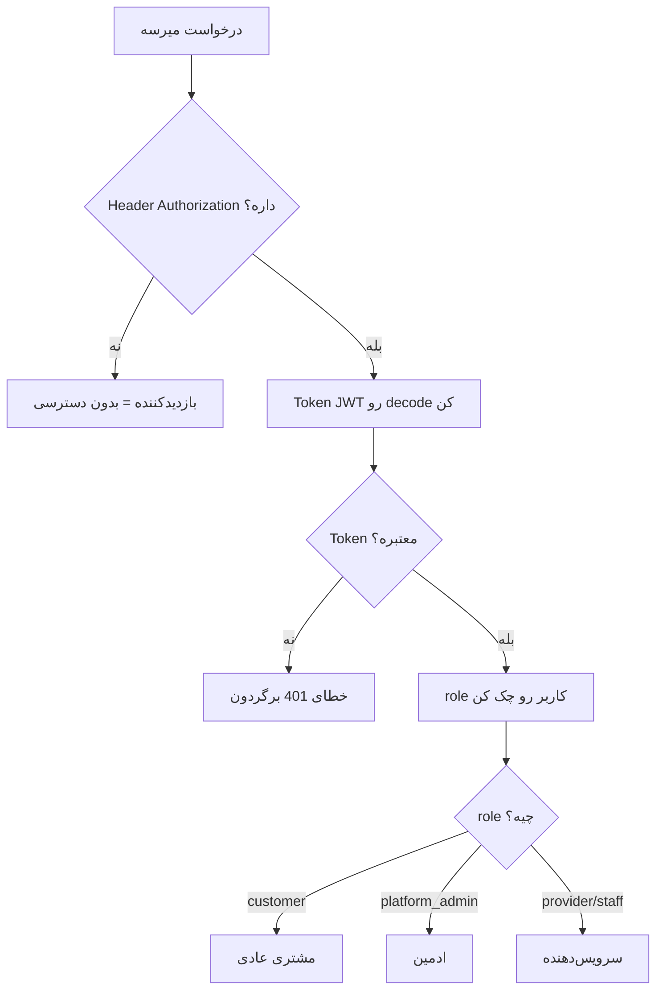

### 📊 جدول دسترسی‌ها:

| کار | بازدیدکننده | مشتری | بیزینس | ادمین |
|-----|------------|-------|--------|-------|
| دیدن فید عمومی | ✅ | ✅ | ✅ | ✅ |
| دیدن پروفایل بیزینس | ✅ | ✅ | ✅ | ✅ |
| ثبت‌نام | ✅ | - | - | - |
| ساختن پست | ❌ | ✅ | ✅ | ✅ |
| ثبت سفارش | ❌ | ✅ | ✅ | ❌ |
| چت در سفارش | ❌ | ✅ | ✅ | ❌ |
| مدیریت کارکنان | ❌ | ❌ | ✅ | ❌ |
| تأیید KYC | ❌ | ❌ | ❌ | ✅ |
| مدیریت کاربران | ❌ | ❌ | ❌ | ✅ |

---

## ۲. نمای کلی سیستم

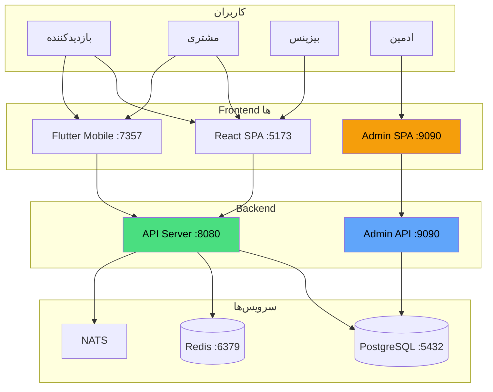

---

## ۳. ترمینال‌ها و پردازش‌ها

هر ترمینال رو جداگانه اجرا کن:

| ترمینال | دستور | پورت | کارش چیه |
|---------|-------|------|----------|
| **Backend** | `npx tsx server.ts` | `8080` + `9090` | API اصلی + API ادمین + سرو صفحات SPA |
| **React Frontend** | `cd frontend && npm run dev` | `5173` | رابط کاربری وب |
| **Flutter Web** | `cd flutter_project && flutter run -d web-server --web-port 7357` | `7357` | اپ موبایل/وب |
| **Flutter Mobile** | `cd flutter_project && flutter run` | دستگاه | اپ روی گوشی |

### 🔄 پشت صحنه (Background Jobs):

وقتی `server.ts` اجرا میشه، این کارها اتوماتیک انجام میشن:

```
server.ts startup:
├── 🔌 وصل شدن به PostgreSQL
├── 📡 وصل شدن به Redis (اگه در دسترس باشه)
├── 📨 وصل شدن به NATS (اگه در دسترس باشه)
├── 🗄️ آماده‌سازی Media DB Schema
├── 📍 شروع Location Flusher (هر ۵ دقیقه موقعیت‌ها رو ذخیره میکنه)
├── 💰 شروع Escrow Auto-Release (هر ۱۰ دقیقه)
└── ⏰ شروع Matching Window Expiry (هر ۵ دقیقه)
```

---

## ۴. ثبت‌نام و احراز هویت

### 📝 workflow ثبت‌نام:

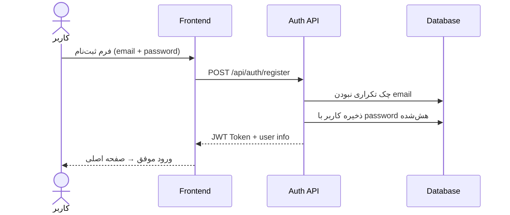

### 🔑 workflow لاگین:

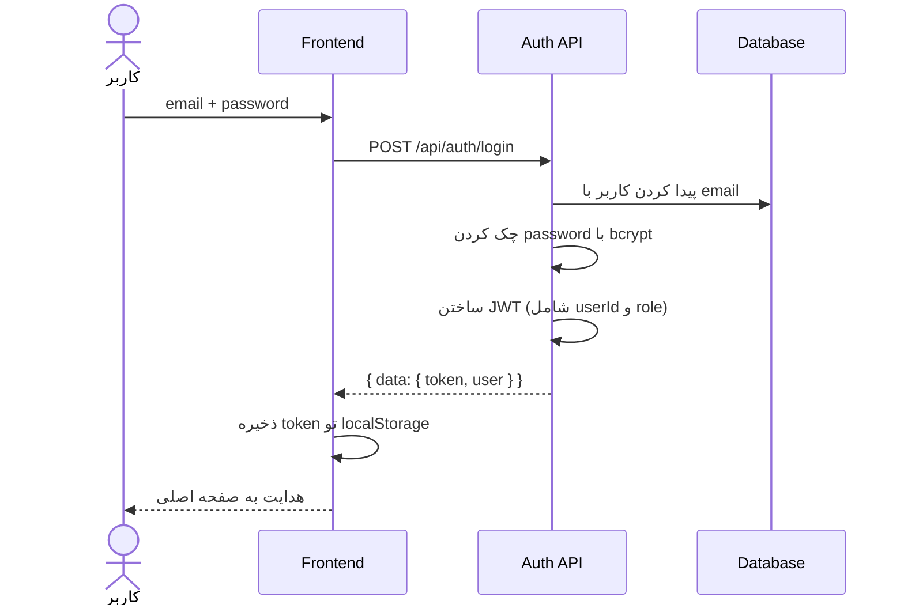

### 🧠 JWT Token چیه؟

JWT یه رشته رمزنگاری‌شده‌س که داخلش این اطلاعات هست:
```json
{
  "userId": "clx...",
  "role": "customer",
  "email": "user@example.com"
}
```

**هر درخواست API** که نیاز به احراز هویت داره، باید این token رو تو Header بفرسته:
```
Authorization: Bearer eyJhbGciOi...
```

---

## ۵. احراز هویت KYC

### 🪪 workflow تأیید هویت (KYC):

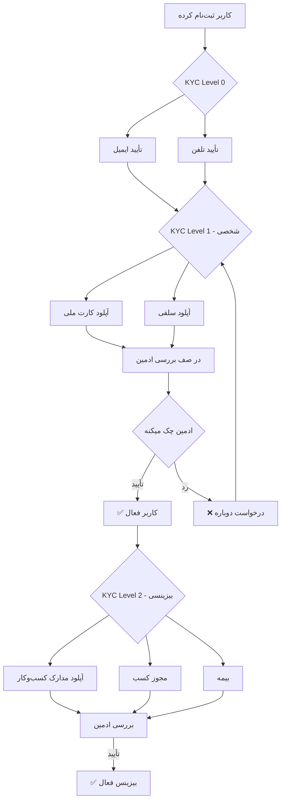

---

## ۶. پست و استوری (شبکه اجتماعی)

### 📸 workflow ساختن پست:

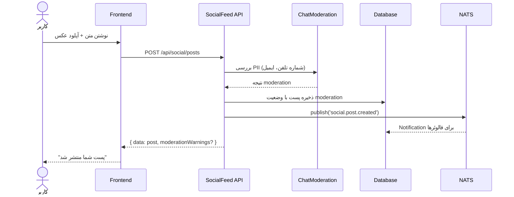

### 👀 workflow دیدن فید:

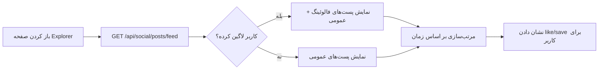

---

## ۷. سفارش خدمات

### 🛒 workflow کامل سفارش:

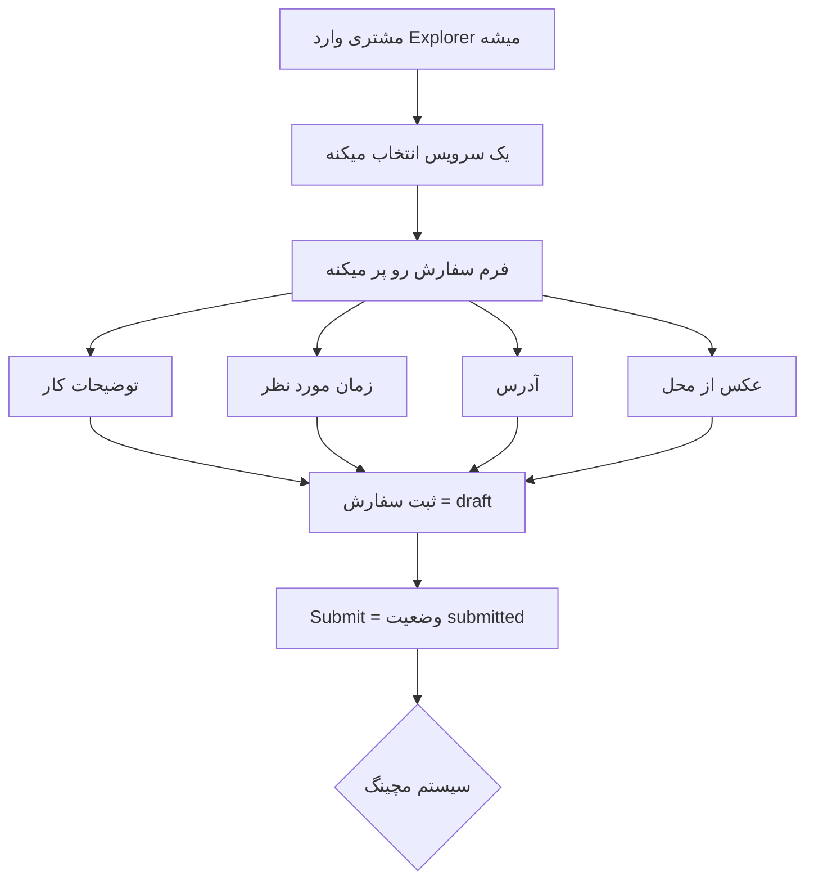

### 📋 وضعیت‌های یک سفارش:

```
draft → submitted → matching → matched → contracted → paid → in_progress → completed
  ↓         ↓          ↓
cancelled  expired   disputed → closed
```

---

## ۸. مچینگ (پیدا کردن سرویس‌دهنده)

### 🎯 workflow مچینگ:

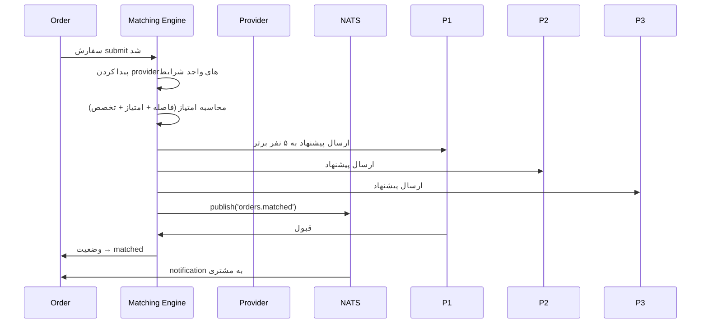

---

## ۹. چت و قرارداد

### 💬 workflow چت و قرارداد:

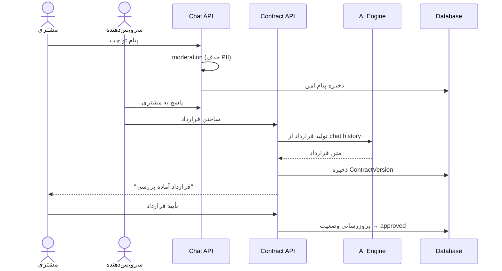

---

## ۱۰. پرداخت

### 💳 workflow پرداخت:

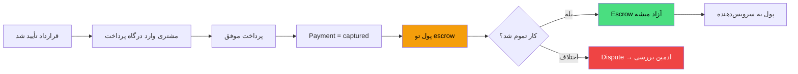

---

## ۱۱. بیزینس ورک‌اسپیس

### 🏢 workflow مدیریت کسب‌وکار:

```mermaid
flowchart TD
    A[بیزینس کلاینت] --> B[پنل workspace]
    B --> C1[👥 کارکنان]
    B --> C2[🛠️ خدمات]
    B --> C3[📦 محصولات]
    B --> C4[💰 مالی]
    B --> C5[📊 CRM مشتریان]
    B --> C6[📋 برنامه‌ریزی]
    
    C1 --> D1[اضافه/حذف کارمند]
    C1 --> D2[تخصیص نقش]
    C2 --> E1[تعریف پکیج]
    C2 --> E2[قیمت‌گذاری]
    C2 --> E3[BOM (مواد مصرفی)]
    C4 --> F1[مشاهده درآمد]
    C4 --> F2[صدور فاکتور]
    C4 --> F3[تنظیمات پرداخت]
```

### 📍 API های workspace:

| مسیر | کاربرد |
|------|--------|
| `/api/workspace/crm` | مدیریت مشتریان |
| `/api/workspace/invoices` | فاکتورها |
| `/api/workspace/finance` | مالی و تراکنش‌ها |
| `/api/workspace/social` | دسترسی شبکه اجتماعی |
| `/api/workspaces` | مدیریت خود workspace |

---

## ۱۲. پنل ادمین

### 🛡️ workflow ادمین:

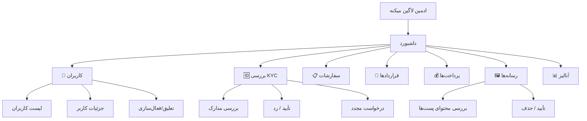

---

## ۱۳. نقشه کامل API ها

### 🌐 API های عمومی (Port 8080):

```
/api/health               → سلامت سرور
/api/auth/*               → لاگین، ثبت‌نام، refresh
/api/users/*              → پروفایل کاربران
/api/feed                 → فید عمومی
/api/social/*             → پست، استوری، کامنت، فالو
/api/categories/*         → دسته‌بندی‌ها
/api/service-catalog/*    → کاتالوگ سرویس‌ها
/api/orders/*             → سفارشات
/api/workspace/*          → workspace (CRM, مالی, فاکتور)
/api/home-screen           → صفحه اصلی
/api/home                 → محتوای صفحه اصلی
/api/kyc/*                → احراز هویت
/api/chat/*               → چت
/api/guest/*              → خرید مهمان
```

### 🔒 API های ادمین (Port 9090):

```
/api/auth/*               → لاگین ادمین
/api/admin/*              → داشبورد مدیریت
/api/admin/kyc/*          → بررسی KYC
/api/admin/orders/*       → مدیریت سفارشات
/api/admin/contracts/*    → بررسی قراردادها
/api/admin/payments/*     → مدیریت پرداخت‌ها
/api/admin/chat/*         → مدیریت چت‌ها
/api/admin/media/*        → مدیریت رسانه‌ها
/api/admin/analytics/*    → آمار و گزارشات
/api/admin/disputes/*     → مدیریت اختلافات
```

---

## 📌 نکات مهم

1. **هر سرویس جداگانه اجرا میشه** — backend، frontend، Flutter هر کدوم ترمینال خودشون رو دارن
2. **همیشه اول backend رو اجرا کن** — بعد frontend و Flutter
3. **پورت ۸۰۸۰ برای API اصلیه** — پورت ۳۰۰۰ فقط تو Docker استفاده میشه
4. **برای دیدن لاگ‌ها** از Dozzle (پورت ۸۸۹۹ تو Docker) یا `npm run dev` استفاده کن
5. **برای مدیریت دیتابیس** از `npx prisma studio` (پورت ۵۵۵۵) استفاده کن
6. **فایل‌های lib/matching/** رو هرگز تغییر نده — الگوریتم مچینگ مقدسه
7. **فایل‌های chat** رو هرگز تغییر نده — سیستم چت کامله

---

> **آخرین بروزرسانی:** ۲۰۲۶-۰۵-۲۷
> **نگارنده:** Amir Farhadian + AI Agents