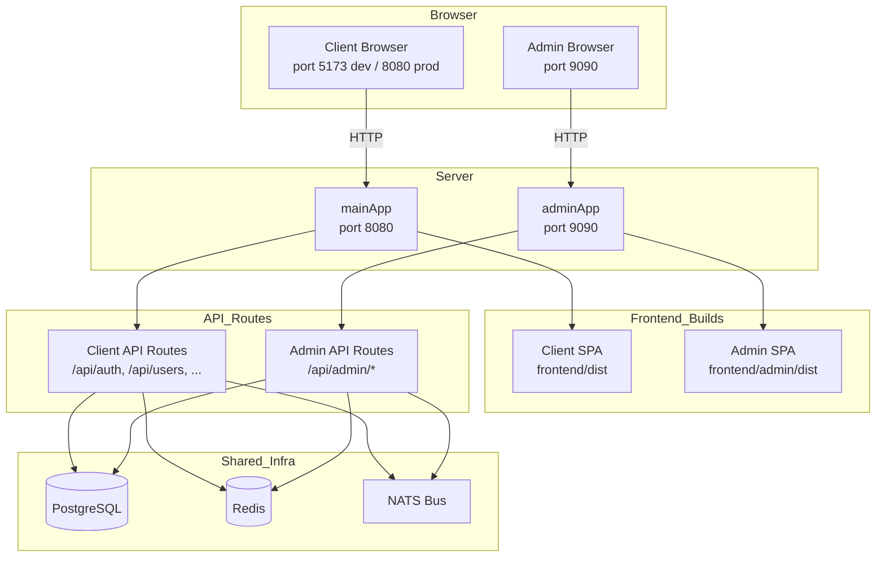

# Admin Separation Architecture Plan

## 1. Current Architecture Analysis

### What's Shared

#### Backend ([`server.ts`](server.ts))
- **`mainApp`** (port 8080) and **`adminApp`** (port 9090) are both created via the same [`createWebApp()`](server.ts:111) factory function
- Both share **all middleware**: `morgan`, `cookieParser`, `express.json`, `cors`, `helmet`, uploads static serving, and the `rpID`/`origin` request middleware
- Both share **all API routes** via [`mountApiRoutes(app)`](server.ts:63) — meaning `adminApp` also mounts client routes like `/api/auth`, `/api/users`, `/api/orders`, etc.
- Both share the same database connections (Prisma, Redis, NATS, Media DB)
- In **dev mode**: `mainApp` is API-only; `adminApp` serves the built frontend from `frontend/dist/` as a SPA
- In **production mode**: both serve the same `dist/` folder as a SPA

#### Frontend ([`frontend/src/app/router.tsx`](frontend/src/app/router.tsx))
- **Single React SPA** with a single `createBrowserRouter` containing ALL routes:
  - Public routes (`/`, `/explore`, `/auth/login`)
  - Customer routes (`/app/home`, `/app/activity`)
  - Business routes (`/business/:workspaceId`)
  - Admin routes (`/admin`, `/admin/users`, `/admin/kyc`, etc.)
- **Single build output** (`frontend/dist/`) serves both client and admin
- **Shared auth store** ([`authStore.ts`](frontend/src/store/authStore.ts)) — uses `zustand` with `persist` middleware, stores JWT token
- **Shared API client** ([`api.ts`](frontend/src/lib/api.ts)) — axios instance with interceptors for token injection and refresh
- **Shared UI components** — `AdminLayout` imports `AccountAvatarBadge`, `cn` utility, `lucide-react` icons, `motion` animations

#### API Routes ([`routes/admin.ts`](routes/admin.ts))
- All admin routes are prefixed with `/api/admin/...` and mounted on BOTH `mainApp` and `adminApp`
- Admin routes use `authenticate` + `isAdmin` middleware for auth
- Admin routes are **not** separated from client routes at the server level

### What's Already Separate

- **Ports**: `mainApp` on 8080, `adminApp` on 9090
- **Admin API routes** are prefixed with `/api/admin/` (but still mounted on both apps)
- **Admin login** is email+password only (phone OTP removed per AGENTS.md)
- **Admin frontend pages** are in a separate directory (`frontend/src/pages/admin/`)

---

## 2. What Needs to Change

### Core Problem
The current architecture has a **single frontend build** (`frontend/dist/`) that contains both client and admin routes. The admin panel is served on port 9090 by serving the same SPA build. This means:
- Client code (public pages, customer pages, business pages) is downloaded by admin users unnecessarily
- Admin code is downloaded by client users unnecessarily
- The admin app on port 9090 still mounts all client API routes
- No clear separation of concerns

### Solution: Separate Vite Build for Admin

We need **two separate Vite builds**:
1. **`frontend/`** — Client SPA (public + customer + business pages), served by `mainApp` on port 8080
2. **`frontend/admin/`** — Admin SPA (login + admin pages), served by `adminApp` on port 9090

---

## 3. File-by-File Changes

### 3.1 Create [`frontend/admin/`](frontend/admin/) — New Admin SPA

This is a **separate Vite project** within the `frontend/` directory. It shares the same `node_modules` but has its own entry point, router, and build output.

#### New Files to Create

| File | Purpose |
|------|---------|
| [`frontend/admin/index.html`](frontend/admin/index.html) | Admin SPA entry HTML |
| [`frontend/admin/vite.config.ts`](frontend/admin/vite.config.ts) | Vite config for admin build (outputs to `frontend/admin/dist/`, proxies `/api` to `localhost:9090`) |
| [`frontend/admin/tsconfig.json`](frontend/admin/tsconfig.json) | TypeScript config for admin |
| [`frontend/admin/src/main.tsx`](frontend/admin/src/main.tsx) | Admin entry point |
| [`frontend/admin/src/App.tsx`](frontend/admin/src/App.tsx) | Admin root component |
| [`frontend/admin/src/router.tsx`](frontend/admin/src/router.tsx) | Admin-only routes (login + admin pages) |
| [`frontend/admin/src/store/authStore.ts`](frontend/admin/src/store/authStore.ts) | Admin auth store (simplified, admin-only) |
| [`frontend/admin/src/lib/api.ts`](frontend/admin/src/lib/api.ts) | Admin API client (base URL points to `/api` on port 9090) |
| [`frontend/admin/src/pages/Login.tsx`](frontend/admin/src/pages/Login.tsx) | Admin login page (copy from existing, email+password only) |
| [`frontend/admin/src/pages/Dashboard.tsx`](frontend/admin/src/pages/Dashboard.tsx) | Copy of `AdminDashboard.tsx` |
| [`frontend/admin/src/pages/Users.tsx`](frontend/admin/src/pages/Users.tsx) | Copy of `AdminUsers.tsx` |
| [`frontend/admin/src/pages/UserDetail.tsx`](frontend/admin/src/pages/UserDetail.tsx) | Copy of `AdminUserDetail.tsx` |
| [`frontend/admin/src/pages/Kyc.tsx`](frontend/admin/src/pages/Kyc.tsx) | Copy of `AdminKyc.tsx` |
| [`frontend/admin/src/pages/Orders.tsx`](frontend/admin/src/pages/Orders.tsx) | Copy of `AdminOrders.tsx` |
| [`frontend/admin/src/pages/Contracts.tsx`](frontend/admin/src/pages/Contracts.tsx) | Copy of `AdminContracts.tsx` |
| [`frontend/admin/src/pages/Payments.tsx`](frontend/admin/src/pages/Payments.tsx) | Copy of `AdminPayments.tsx` |
| [`frontend/admin/src/pages/Media.tsx`](frontend/admin/src/pages/Media.tsx) | Copy of `AdminMedia.tsx` |
| [`frontend/admin/src/pages/Settings.tsx`](frontend/admin/src/pages/Settings.tsx) | Copy of `AdminSettings.tsx` |
| [`frontend/admin/src/components/AdminLayout.tsx`](frontend/admin/src/components/AdminLayout.tsx) | Copy of `AdminLayout.tsx` |
| [`frontend/admin/src/components/AccountAvatarBadge.tsx`](frontend/admin/src/components/AccountAvatarBadge.tsx) | Copy of shared UI component |
| [`frontend/admin/src/lib/cn.ts`](frontend/admin/src/lib/cn.ts) | Copy of `cn` utility |
| [`frontend/admin/src/index.css`](frontend/admin/src/index.css) | Copy of global CSS |

### 3.2 Modify [`server.ts`](server.ts)

#### Changes:

1. **Remove `mountApiRoutes(app)` from `adminApp`** — admin API routes should still be mounted, but client routes should NOT be mounted on `adminApp`

2. **Create a separate `mountAdminApiRoutes(app)` function** that only mounts admin-prefixed routes:
   ```typescript
   function mountAdminApiRoutes(app: Express) {
     app.use("/api/admin", adminRoutes);
     app.use("/api/admin/kyc", adminKycRoutes);
     app.use("/api/admin/service-definitions", adminServiceDefinitionsRoutes);
     app.use("/api/admin/categories-tree", adminCategoriesTreeRoutes);
     app.use("/api/admin/orders", adminOrdersRoutes);
     app.use("/api/admin/contracts", adminContractsRoutes);
     app.use("/api/admin/payments", adminPaymentsRoutes);
     app.use("/api/admin/chat", adminChatRoutes);
     app.use("/api/admin/service-packages", adminServicePackagesRoutes);
     app.use("/api/admin/products", adminProductsRoutes);
     app.use("/api/admin/media", adminMediaRoutes);
     app.use("/api/admin/utility-links", adminUtilityLinksRoutes);
     // Also mount /api/auth/login on adminApp so admin login works
     app.use("/api/auth", authRoutes);
     // Mount /api/system/config for admin config page
     app.use("/api/system", systemRoutes);
   }
   ```

3. **Update dev mode static serving** — serve `frontend/admin/dist/` instead of `frontend/dist/` on `adminApp`:
   ```typescript
   const adminDistPath = path.join(process.cwd(), "frontend", "admin", "dist");
   ```

4. **Update production mode** — serve `frontend/dist/` on `mainApp` and `frontend/admin/dist/` on `adminApp`

5. **Update the root route** — `mainApp.get("/")` stays as API status page; `adminApp.get("/")` redirects to `/login`

### 3.3 Modify [`frontend/vite.config.ts`](frontend/vite.config.ts)

No changes needed — the client Vite config stays as-is. The admin gets its own `vite.config.ts`.

### 3.4 Modify [`frontend/package.json`](frontend/package.json)

Add a build script for the admin:
```json
{
  "scripts": {
    "dev": "vite",
    "build": "tsc && vite build",
    "build:admin": "cd admin && tsc && vite build",
    "dev:admin": "cd admin && vite",
    ...
  }
}
```

### 3.5 Remove Admin Routes from Client Router

In [`frontend/src/app/router.tsx`](frontend/src/app/router.tsx), **remove** the admin routes section (lines 83-98). The client SPA should no longer contain:
- `/admin` → `AdminDashboard`
- `/admin/users` → `AdminUsers`
- `/admin/kyc` → `AdminKyc`
- etc.

Also remove the `AdminLayout` import and the `RequireAuth` role check for admin roles.

---

## 4. Route Architecture After Separation

### Port 8080 — Client App (`mainApp`)

```
GET  /                    → API status page (HTML)
GET  /api/health          → Health check
GET  /api/auth/*          → Auth routes (login, register, etc.)
GET  /api/users/*         → User routes
GET  /api/orders/*        → Order routes
... (all client API routes)
GET  /*                   → Client SPA (frontend/dist/index.html)
```

### Port 9090 — Admin App (`adminApp`)

```
GET  /                    → Redirect to /login
GET  /api/auth/login      → Admin login endpoint
GET  /api/auth/refresh    → Token refresh
GET  /api/auth/logout     → Logout
GET  /api/admin/*         → All admin API routes
GET  /api/system/config   → System config
GET  /*                   → Admin SPA (frontend/admin/dist/index.html)
```

---

## 5. Shared Dependencies & Code Duplication

### What Gets Duplicated (Intentionally)

The admin SPA will duplicate some code from the client SPA:
- `authStore.ts` — simplified for admin-only use
- `api.ts` — axios instance with admin-specific base URL
- `cn.ts` — utility function
- `AccountAvatarBadge.tsx` — UI component
- `index.css` — global styles

This is **intentional** to achieve true separation. The admin SPA should be independently deployable.

### What Stays Shared

- **`node_modules`** — both SPAs share the same dependency installation
- **Backend routes** — admin API routes remain in `routes/admin.ts` etc.
- **Database** — both apps connect to the same PostgreSQL

---

## 6. Risks & Dependencies

### Risks

| Risk | Mitigation |
|------|------------|
| **Duplicate code maintenance** — changes to shared components (e.g., `cn.ts`, `AccountAvatarBadge`) need to be made in both places | Create a shared `frontend/shared/` package in the future, or use a monorepo tool |
| **Auth token sharing** — admin and client currently share the same `localStorage` key (`neighborly-auth`) | Admin SPA uses a different storage key (`neighborly-admin-auth`) to avoid conflicts when both are open |
| **CORS issues** — admin SPA on port 9090 calling admin API on port 9090 should be fine (same origin) | Verify `cors` config allows same-origin requests |
| **Build complexity** — two separate builds to maintain | Add npm scripts to build both in sequence |
| **Login redirect** — after login, admin currently redirects to `/admin` | Admin SPA router handles this internally |

### Dependencies

- **No new npm packages** — admin SPA uses the same dependencies as the client SPA
- **No database changes** — admin API routes remain unchanged
- **No Prisma changes** — schema stays the same

---

## 7. Implementation Order

1. **Create `frontend/admin/` directory structure** with its own `index.html`, `vite.config.ts`, `tsconfig.json`
2. **Copy admin pages** from `frontend/src/pages/admin/` to `frontend/admin/src/pages/`
3. **Copy shared components** (`AdminLayout`, `AccountAvatarBadge`, `cn`, `api`, `authStore`, `index.css`)
4. **Create admin-specific router** with only login + admin routes
5. **Modify `server.ts`** to:
   - Create `mountAdminApiRoutes()` function
   - Serve `frontend/admin/dist/` on `adminApp`
   - Remove client routes from `adminApp`
6. **Remove admin routes** from client router (`frontend/src/app/router.tsx`)
7. **Add build scripts** to `frontend/package.json`
8. **Build and test** both SPAs
9. **Update AGENTS.md** with new architecture

---

## 8. Mermaid Diagram: Architecture After Separation



---

## 9. Key Design Decisions

### Why a Separate Vite Build Instead of Code Splitting?

1. **True independence** — admin SPA can be deployed, scaled, and updated independently
2. **Smaller bundles** — admin users don't download client code and vice versa
3. **Separate auth domains** — admin auth store uses a different localStorage key, preventing conflicts
4. **Cleaner server code** — `adminApp` only mounts admin-relevant routes
5. **Future-proof** — admin could eventually move to a different subdomain (e.g., `admin.neighborly.com`)

### Why Duplicate Code Instead of a Shared Package?

For the current phase, duplicating a small amount of utility code (`cn.ts`, `api.ts`, `authStore.ts`) is simpler than setting up a monorepo workspace. If the project grows, these can be extracted into a shared package later.
