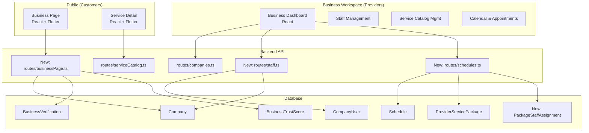
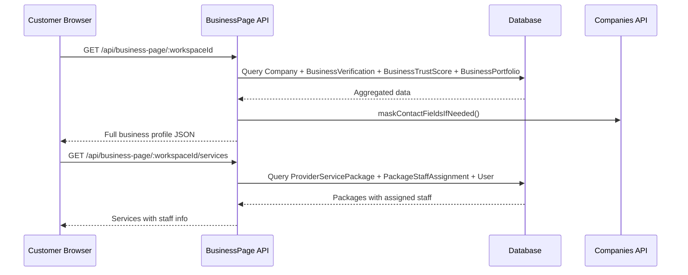
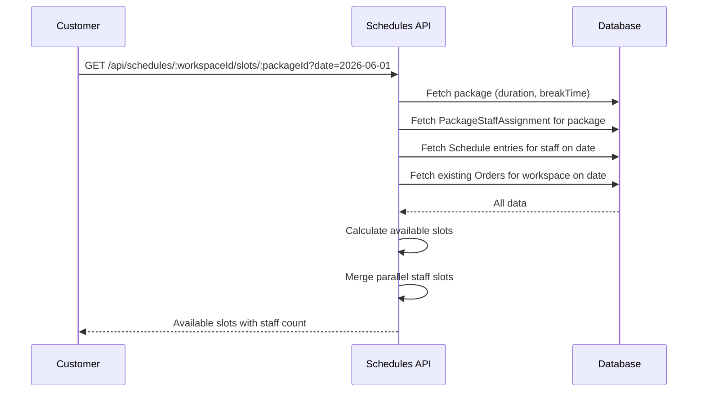
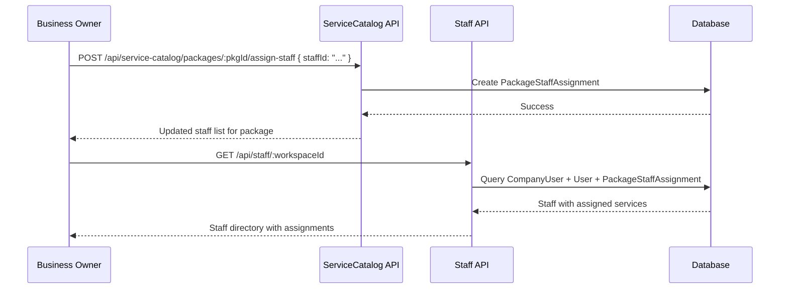

# Business Page + Staff Assignment Implementation Plan

## Overview

This plan covers two major feature areas for Neighborly:

1. **C. Business Page / Trust Layer** — Public-facing business profile with trust indicators (license, insurance, experience, KYC status)
2. **D. Service Catalog / Staff Assignment / Scheduling** — Service-to-staff assignment, calendar management, slot calculation

---

## Architecture Overview



---

## Part 1: Prisma Schema Changes

### 1.1 New Model: `PackageStaffAssignment`

This is the core model linking services (packages) to specific staff members.

```prisma
/// Links a ProviderServicePackage to specific staff members who can perform it.
/// Enables parallel slots when multiple staff offer the same service.
model PackageStaffAssignment {
  id        String   @id @default(cuid())
  packageId String
  package   ProviderServicePackage @relation(fields: [packageId], references: [id], onDelete: Cascade)
  staffId   String
  staff     User     @relation(fields: [staffId], references: [id])
  isPrimary Boolean  @default(false)  // primary assignee for this service
  createdAt DateTime @default(now())

  @@unique([packageId, staffId])
  @@index([staffId])
  @@index([packageId])
}
```

### 1.2 New Model: `BusinessPortfolio`

Supplementary content that the business can edit (not KYC-critical fields).

```prisma
/// Business-editable supplementary content for the public business page.
/// KYC-critical fields (legal name, license, insurance) remain READ ONLY on Company/BusinessVerification.
model BusinessPortfolio {
  id              String   @id @default(cuid())
  workspaceId     String   @unique
  workspace       Company  @relation(fields: [workspaceId], references: [id], onDelete: Cascade)
  history         String?  // Business history / story
  mission         String?  // Mission statement
  portfolioImages Json?    // Array of { url, caption } — portfolio/gallery images
  serviceAreas    String[] // Cities or regions served
  tags            String[] // Service tags / specialties
  businessHours   Json?    // Weekly schedule: { monday: { open: "09:00", close: "17:00" }, ... }
  createdAt       DateTime @default(now())
  updatedAt       DateTime @updatedAt
}
```

### 1.3 Add `staffRole` to `CompanyUser`

The existing [`CompanyUser`](prisma/schema.prisma:264) model has a generic `role` field (`owner | admin | member | staff | client`). We need to add a `staffRole` for finer-grained staff categorization.

```prisma
model CompanyUser {
  companyId String
  userId    String
  role      String   @default("member") // 'owner' | 'admin' | 'member' | 'staff' | 'client'
  staffRole String?  // 'handyman' | 'technician' | 'specialist' | 'apprentice' | null
  joinedAt  DateTime @default(now())
  company   Company @relation(fields: [companyId], references: [id], onDelete: Cascade)
  user      User    @relation(fields: [userId], references: [id], onDelete: Cascade)
  @@id([companyId, userId])
}
```

### 1.4 Add `breakTimeMinutes` to `ProviderServicePackage`

For slot calculation — the gap needed between appointments for the same staff member.

```prisma
model ProviderServicePackage {
  // ... existing fields ...
  durationMinutes   Int?
  breakTimeMinutes  Int?     @default(15)  // Buffer between appointments
  // ... rest of existing fields ...
}
```

### 1.5 Add `isActive` to `Schedule`

```prisma
model Schedule {
  // ... existing fields ...
  isActive  Boolean  @default(true)  // Soft-delete / toggle availability
  // ... rest of existing fields ...
}
```

---

## Part 2: Backend API Changes

### 2.1 New Route: [`routes/businessPage.ts`](routes/businessPage.ts)

Public-facing business profile endpoint. **No auth required** for read operations.

| Method | Path | Description |
|--------|------|-------------|
| `GET` | `/api/business-page/:workspaceId` | Full public business profile |
| `GET` | `/api/business-page/:workspaceId/trust` | Trust layer data (license, insurance, score) |
| `GET` | `/api/business-page/:workspaceId/services` | Services with staff assignments |
| `GET` | `/api/business-page/:workspaceId/staff` | Staff directory with profiles |
| `GET` | `/api/business-page/:workspaceId/reviews` | Customer reviews |
| `PUT` | `/api/business-page/:workspaceId/portfolio` | Update portfolio (auth: owner/admin) |

**Response shape for `GET /api/business-page/:workspaceId`:**

```json
{
  "company": {
    "id": "string",
    "name": "string",
    "slug": "string",
    "slogan": "string",
    "about": "string",
    "logoUrl": "string",
    "coverImageUrl": "string",
    "address": "string",
    "phone": "string (masked if no contract)",
    "website": "string",
    "type": "solo | business",
    "kycStatus": "string"
  },
  "trust": {
    "licenseNumber": "string | null",
    "licenseVerified": "boolean",
    "hasLiabilityInsurance": "boolean",
    "insuranceVerified": "boolean",
    "experienceYears": "number (calculated from experienceDate)",
    "avgRating": "number",
    "totalScore": "number",
    "kycVerified": "boolean"
  },
  "portfolio": {
    "history": "string | null",
    "mission": "string | null",
    "portfolioImages": "array | null",
    "serviceAreas": "string[]",
    "tags": "string[]",
    "businessHours": "object | null"
  },
  "stats": {
    "totalServices": "number",
    "totalStaff": "number",
    "totalReviews": "number",
    "totalOrders": "number"
  }
}
```

**Key logic:**
- Trust data comes from [`BusinessVerification`](prisma/schema.prisma:1033) and [`BusinessTrustScore`](prisma/schema.prisma:1048)
- Portfolio data comes from [`BusinessPortfolio`](#12-new-model-businessportfolio)
- Contact fields (phone, address) are masked via existing [`maskContactFieldsIfNeeded()`](routes/companies.ts:17) logic
- Experience years calculated from [`Company.experienceDate`](prisma/schema.prisma:241)

### 2.2 New Route: [`routes/staff.ts`](routes/staff.ts)

Staff management for business workspace (auth required).

| Method | Path | Description |
|--------|------|-------------|
| `GET` | `/api/staff/:workspaceId` | List staff with profiles, roles, assignments |
| `POST` | `/api/staff/:workspaceId/invite` | Invite a user to join as staff |
| `PUT` | `/api/staff/:workspaceId/:userId` | Update staff role, permissions |
| `DELETE` | `/api/staff/:workspaceId/:userId` | Remove staff member |
| `GET` | `/api/staff/:workspaceId/availability/:staffId` | Get staff availability for a date range |
| `PUT` | `/api/staff/:workspaceId/availability/:staffId` | Set staff availability (schedule blocks) |

**Response shape for `GET /api/staff/:workspaceId`:**

```json
{
  "staff": [
    {
      "id": "string",
      "displayName": "string",
      "firstName": "string",
      "lastName": "string",
      "avatarUrl": "string",
      "role": "string",
      "staffRole": "string | null",
      "email": "string",
      "phone": "string",
      "isActive": "boolean",
      "assignedServices": ["packageId: string"],
      "upcomingAppointments": "number",
      "joinedAt": "datetime"
    }
  ]
}
```

### 2.3 New Route: [`routes/schedules.ts`](routes/schedules.ts)

Calendar management and slot calculation.

| Method | Path | Description |
|--------|------|-------------|
| `GET` | `/api/schedules/:workspaceId` | List all schedules for a workspace |
| `POST` | `/api/schedules/:workspaceId` | Create a schedule block |
| `PUT` | `/api/schedules/:workspaceId/:scheduleId` | Update schedule block |
| `DELETE` | `/api/schedules/:workspaceId/:scheduleId` | Delete schedule block |
| `GET` | `/api/schedules/:workspaceId/slots` | Calculate available slots for a date |
| `GET` | `/api/schedules/:workspaceId/slots/:packageId` | Calculate available slots for a specific service |

**Slot calculation algorithm (`GET /api/schedules/:workspaceId/slots/:packageId`):**

```
Input: workspaceId, packageId, date (query param)
Output: Array of available time slots

Algorithm:
1. Fetch the package with durationMinutes, breakTimeMinutes
2. Fetch all staff assigned to this package via PackageStaffAssignment
3. Fetch all Schedule entries for these staff on the given date where isActive=true
4. Fetch all existing Order records for this workspace on the given date (to exclude booked slots)
5. For each staff member:
   a. For each schedule block (startTime, endTime):
      - Calculate slots: from startTime, step by (duration + breakTime)
      - Skip slots that overlap with existing orders
      - Add to available slots list
6. Merge slots across staff (parallel slots = multiple staff available at same time)
7. Return sorted by time, with staff count per slot
```

**Response shape:**

```json
{
  "date": "2026-06-01",
  "packageId": "string",
  "packageName": "string",
  "durationMinutes": 60,
  "breakTimeMinutes": 15,
  "slots": [
    {
      "startTime": "09:00",
      "endTime": "10:00",
      "availableStaff": 2,
      "staff": [
        { "id": "string", "displayName": "string", "avatarUrl": "string" }
      ]
    }
  ]
}
```

### 2.4 Modify [`routes/serviceCatalog.ts`](routes/serviceCatalog.ts)

Add staff assignment endpoints to the existing service catalog route.

| Method | Path | Description |
|--------|------|-------------|
| `POST` | `/api/service-catalog/packages/:packageId/assign-staff` | Assign staff to a package |
| `DELETE` | `/api/service-catalog/packages/:packageId/assign-staff/:staffId` | Remove staff assignment |
| `GET` | `/api/service-catalog/packages/:packageId/staff` | Get staff assigned to a package |

### 2.5 Modify [`routes/companies.ts`](routes/companies.ts)

Add business portfolio update endpoint (supplementary content only — NOT KYC fields).

| Method | Path | Description |
|--------|------|-------------|
| `PUT` | `/api/companies/:id/portfolio` | Update portfolio (history, mission, images, tags, hours) |

**Guard logic:** This endpoint must explicitly reject updates to KYC-critical fields:
- `licenseNumber` — READ ONLY from KYC
- `name` (legal name) — READ ONLY from KYC
- `kycStatus` — system-managed

Only these fields are editable: `slogan`, `about`, `logoUrl`, `coverImageUrl`, `website`, `socialLinks`, plus the new `BusinessPortfolio` fields.

---

## Part 3: Frontend (React) Changes

### 3.1 New Page: [`frontend/src/pages/public/BusinessPage.tsx`](frontend/src/pages/public/BusinessPage.tsx)

A public-facing business profile page (no auth required). This replaces the hardcoded mock data in [`ServiceDetail.tsx`](frontend/src/pages/public/ServiceDetail.tsx) with real API data.

**Sections:**
1. **Cover + Logo** — From `company.coverImageUrl`, `company.logoUrl`
2. **Business Info** — Name, slogan, category, address, rating
3. **Trust Badges** — Verified badge, license display, insurance, experience years
4. **About / History** — From `portfolio.history`, `portfolio.mission`
5. **Services Tab** — List of packages with prices, durations, staff avatars
6. **Staff Tab** — Staff directory with photos, roles, bio
7. **Reviews Tab** — Customer reviews with ratings
8. **Portfolio/Gallery Tab** — Images from `portfolio.portfolioImages`

**Route:** `/biz/:workspaceId` (added to [`router.tsx`](frontend/src/app/router.tsx))

### 3.2 Update: [`frontend/src/pages/public/ServiceDetail.tsx`](frontend/src/pages/public/ServiceDetail.tsx)

Refactor to fetch real data from the API instead of hardcoded mock data. The existing component already has the right UI structure (cover, logo, business info, package cards with staff avatars, tabs). Changes needed:

1. Replace hardcoded `PACKAGES` constant with API fetch from `/api/service-catalog/:id/packages`
2. Replace hardcoded business info with API data from `/api/business-page/:workspaceId`
3. Add trust badge data from API
4. Keep the existing UI layout (it matches the Flutter design)

### 3.3 New Page: [`frontend/src/pages/business/StaffManagement.tsx`](frontend/src/pages/business/StaffManagement.tsx)

Staff management page within the Business Workspace.

**Features:**
- List staff members with avatars, roles, contact info
- Invite new staff (email-based invitation)
- Edit staff roles and permissions
- Remove staff members
- View staff availability calendar

### 3.4 New Page: [`frontend/src/pages/business/ServiceCatalogManager.tsx`](frontend/src/pages/business/ServiceCatalogManager.tsx)

Service-to-staff assignment page within the Business Workspace.

**Features:**
- List all packages for the workspace
- For each package, show assigned staff with avatars
- Drag-and-drop or multi-select to assign/unassign staff
- Set primary assignee per package
- View which staff are assigned to which services

### 3.5 New Page: [`frontend/src/pages/business/CalendarManager.tsx`](frontend/src/pages/business/CalendarManager.tsx)

Calendar and appointment management.

**Features:**
- Monthly/weekly/daily calendar view
- Staff schedule blocks (working hours)
- Appointment list with status
- Slot preview (see available slots for a given service + date)
- Block time off / breaks

### 3.6 Update Router: [`frontend/src/app/router.tsx`](frontend/src/app/router.tsx)

Add new routes:

```tsx
// Public routes
{ path: '/biz/:workspaceId', element: <BusinessPage /> }

// Business workspace routes (under /business/:workspaceId)
{ path: 'staff', element: <StaffManagement /> }
{ path: 'services', element: <ServiceCatalogManager /> }
{ path: 'calendar', element: <CalendarManager /> }
```

---

## Part 4: Flutter Changes

### 4.1 Update: [`flutter_project/lib/screens/business_profile_screen.dart`](flutter_project/lib/screens/business_profile_screen.dart)

Refactor to fetch real data from the API. The existing Flutter screen already has the correct visual design matching the React version. Changes needed:

1. Replace hardcoded `_packages` list with API call to `/api/business-page/:workspaceId/services`
2. Replace hardcoded business info with API data
3. Add trust badges from API trust data
4. Add staff avatars to package cards (already in React version, missing in Flutter)
5. Add loading/error states
6. Add pull-to-refresh

### 4.2 New Screen: [`flutter_project/lib/screens/staff_directory_screen.dart`](flutter_project/lib/screens/staff_directory_screen.dart)

Staff directory view for the public business page.

### 4.3 New Screen: [`flutter_project/lib/screens/reviews_screen.dart`](flutter_project/lib/screens/reviews_screen.dart)

Reviews list view for the public business page.

---

## Part 5: File-by-File Change List

### Prisma / Database

| File | Change |
|------|--------|
| [`prisma/schema.prisma`](prisma/schema.prisma) | Add `PackageStaffAssignment` model |
| [`prisma/schema.prisma`](prisma/schema.prisma) | Add `BusinessPortfolio` model |
| [`prisma/schema.prisma`](prisma/schema.prisma) | Add `staffRole` field to `CompanyUser` |
| [`prisma/schema.prisma`](prisma/schema.prisma) | Add `breakTimeMinutes` to `ProviderServicePackage` |
| [`prisma/schema.prisma`](prisma/schema.prisma) | Add `isActive` to `Schedule` |
| New migration | Create migration for all schema changes |

### Backend Routes

| File | Change |
|------|--------|
| **New:** [`routes/businessPage.ts`](routes/businessPage.ts) | Public business profile API (5 GET + 1 PUT endpoint) |
| **New:** [`routes/staff.ts`](routes/staff.ts) | Staff management API (6 endpoints) |
| **New:** [`routes/schedules.ts`](routes/schedules.ts) | Calendar + slot calculation API (6 endpoints) |
| [`routes/serviceCatalog.ts`](routes/serviceCatalog.ts) | Add 3 staff-assignment endpoints |
| [`routes/companies.ts`](routes/companies.ts) | Add `PUT /:id/portfolio` endpoint |
| [`server.ts`](server.ts) | Register new route modules |

### React Frontend (Client SPA)

| File | Change |
|------|--------|
| **New:** [`frontend/src/pages/public/BusinessPage.tsx`](frontend/src/pages/public/BusinessPage.tsx) | Public business profile page |
| **New:** [`frontend/src/pages/business/StaffManagement.tsx`](frontend/src/pages/business/StaffManagement.tsx) | Staff management page |
| **New:** [`frontend/src/pages/business/ServiceCatalogManager.tsx`](frontend/src/pages/business/ServiceCatalogManager.tsx) | Service-to-staff assignment page |
| **New:** [`frontend/src/pages/business/CalendarManager.tsx`](frontend/src/pages/business/CalendarManager.tsx) | Calendar management page |
| [`frontend/src/pages/public/ServiceDetail.tsx`](frontend/src/pages/public/ServiceDetail.tsx) | Refactor to use real API data |
| [`frontend/src/app/router.tsx`](frontend/src/app/router.tsx) | Add new routes |

### Flutter

| File | Change |
|------|--------|
| [`flutter_project/lib/screens/business_profile_screen.dart`](flutter_project/lib/screens/business_profile_screen.dart) | Refactor to use real API data, add staff avatars |
| **New:** [`flutter_project/lib/screens/staff_directory_screen.dart`](flutter_project/lib/screens/staff_directory_screen.dart) | Staff directory view |
| **New:** [`flutter_project/lib/screens/reviews_screen.dart`](flutter_project/lib/screens/reviews_screen.dart) | Reviews list view |

---

## Part 6: Data Flow Diagrams

### 6.1 Business Page Data Flow



### 6.2 Slot Calculation Flow



### 6.3 Staff Assignment Flow



---

## Part 7: Implementation Order

The work should be done in this order to minimize blocking dependencies:

### Phase 1: Schema & Backend Foundation
1. Add Prisma models (`PackageStaffAssignment`, `BusinessPortfolio`, field additions)
2. Run migration
3. Implement [`routes/businessPage.ts`](routes/businessPage.ts) — public business profile API
4. Implement [`routes/staff.ts`](routes/staff.ts) — staff management API
5. Implement [`routes/schedules.ts`](routes/schedules.ts) — calendar + slot calculation API
6. Add staff-assignment endpoints to [`routes/serviceCatalog.ts`](routes/serviceCatalog.ts)
7. Add portfolio endpoint to [`routes/companies.ts`](routes/companies.ts)
8. Register all new routes in [`server.ts`](server.ts)

### Phase 2: React Frontend
9. Create [`BusinessPage.tsx`](frontend/src/pages/public/BusinessPage.tsx) — public business profile
10. Refactor [`ServiceDetail.tsx`](frontend/src/pages/public/ServiceDetail.tsx) — real API data
11. Create [`StaffManagement.tsx`](frontend/src/pages/business/StaffManagement.tsx)
12. Create [`ServiceCatalogManager.tsx`](frontend/src/pages/business/ServiceCatalogManager.tsx)
13. Create [`CalendarManager.tsx`](frontend/src/pages/business/CalendarManager.tsx)
14. Update [`router.tsx`](frontend/src/app/router.tsx) with new routes

### Phase 3: Flutter
15. Refactor [`business_profile_screen.dart`](flutter_project/lib/screens/business_profile_screen.dart)
16. Create [`staff_directory_screen.dart`](flutter_project/lib/screens/staff_directory_screen.dart)
17. Create [`reviews_screen.dart`](flutter_project/lib/screens/reviews_screen.dart)

### Phase 4: Verification
18. Test all API endpoints
19. Verify React components render correctly
20. Verify Flutter screens render correctly
21. Push to git

---

## Part 8: Key Design Decisions

### 8.1 Trust Layer: READ ONLY vs Editable Fields

| Field | Source | Editable by Business? |
|-------|--------|----------------------|
| Legal name | [`Company.name`](prisma/schema.prisma:234) | ❌ (from KYC) |
| License number | [`BusinessVerification.licenseNumber`](prisma/schema.prisma:1037) | ❌ (from KYC/admin) |
| License document | [`BusinessVerification.licenseDocUrl`](prisma/schema.prisma:1038) | ❌ (from KYC/admin) |
| Insurance status | [`BusinessVerification.hasLiabilityInsurance`](prisma/schema.prisma:1040) | ❌ (from KYC/admin) |
| Insurance document | [`BusinessVerification.insuranceDocUrl`](prisma/schema.prisma:1041) | ❌ (from KYC/admin) |
| KYC status | [`Company.kycStatus`](prisma/schema.prisma:247) | ❌ (system-managed) |
| Slogan | [`Company.slogan`](prisma/schema.prisma:236) | ✅ |
| About | [`Company.about`](prisma/schema.prisma:237) | ✅ |
| Logo | [`Company.logoUrl`](prisma/schema.prisma:238) | ✅ |
| Cover image | [`Company.coverImageUrl`](prisma/schema.prisma:239) | ✅ |
| Website | [`Company.website`](prisma/schema.prisma:244) | ✅ |
| Social links | [`Company.socialLinks`](prisma/schema.prisma:245) | ✅ |
| History/mission | [`BusinessPortfolio`](#12-new-model-businessportfolio) | ✅ |
| Portfolio images | [`BusinessPortfolio`](#12-new-model-businessportfolio) | ✅ |
| Service areas | [`BusinessPortfolio`](#12-new-model-businessportfolio) | ✅ |
| Tags | [`BusinessPortfolio`](#12-new-model-businessportfolio) | ✅ |
| Business hours | [`BusinessPortfolio`](#12-new-model-businessportfolio) | ✅ |

### 8.2 Staff Assignment Model

Using a separate `PackageStaffAssignment` join table (rather than a JSON array on `ProviderServicePackage`) provides:
- Proper referential integrity via foreign keys
- Efficient querying: "find all packages for staff member X" and "find all staff for package Y"
- Easy addition/removal without updating a JSON blob
- Ability to add per-assignment metadata (e.g., `isPrimary`, commission split)

### 8.3 Slot Calculation

The slot calculation is done server-side to ensure consistency. The algorithm:
1. Respects each staff member's schedule blocks (working hours)
2. Accounts for break time between appointments
3. Excludes already-booked time slots
4. Reports parallel availability (multiple staff available at same time = more slots)
5. Returns staff identities so the client can show "Book with [Staff Name]"

### 8.4 Contact Field Masking

The existing [`maskContactFieldsIfNeeded()`](routes/companies.ts:17) logic is reused for the business page. Phone and address are hidden from users who don't have a contracted order with the business.

---

## Part 9: Open Questions / Clarifications

1. **Staff invitation flow:** Should staff invitations be email-based (send email → user registers → joins company) or direct (admin adds existing users by ID)?
2. **Business hours vs Schedule:** Should `BusinessPortfolio.businessHours` be the default working hours template, with `Schedule` entries being exceptions/vacations? Or should `Schedule` be the source of truth?
3. **Review system:** Does the existing `OrderReview` model suffice for the Reviews tab on the business page, or do we need a separate review system for businesses (not tied to orders)?
4. **Flutter API client:** Does the Flutter app have an API client configured, or does one need to be created for these new endpoints?
