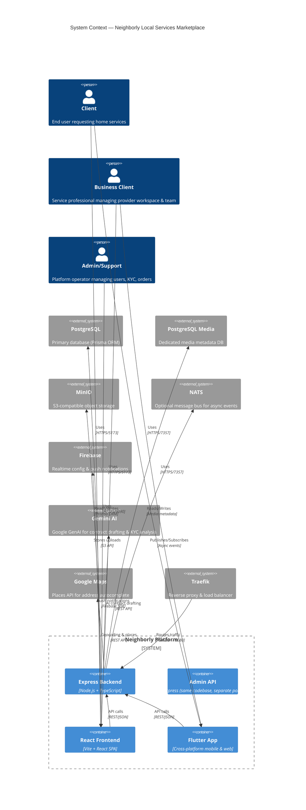
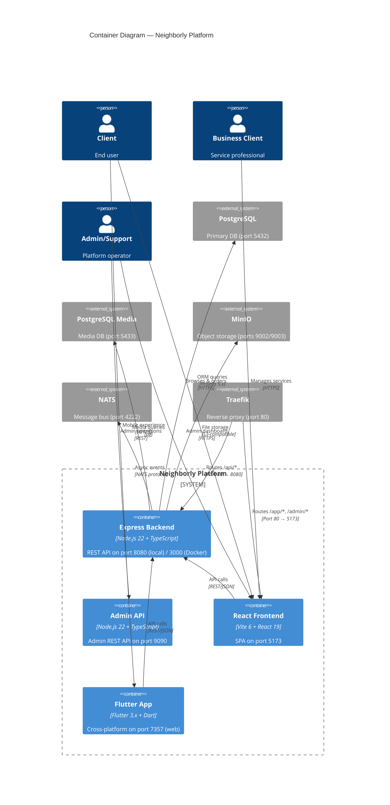

# Documentation Fix Plan — 12 Issues

## Overview

This plan addresses 12 documentation issues found in an audit of Neighborly documentation files. All changes are documentation-only — no code changes required.

---

## 🔴 Critical Issues (4)

---

### Issue 1: [`docs/PORTS.md:49`](docs/PORTS.md:49) — "Redis is not used" is FALSE

**File:** [`docs/PORTS.md`](docs/PORTS.md)
**Line:** 49
**Current text:**
```
- Redis is not used — cache is in-memory (lib/cache.ts).
```
**New text:**
```
- Redis is actively used via lib/redis.ts (connection manager) and lib/locationCache.ts (Redis GEO commands). lib/cache.ts is a drop-in in-memory fallback when Redis is unavailable.
```
**Context:** Verified that [`lib/redis.ts`](lib/redis.ts) is a full Redis connection manager, [`lib/locationCache.ts`](lib/locationCache.ts) uses Redis GEO commands, and [`lib/cache.ts`](lib/cache.ts:7-8) explicitly states it serves as a "drop-in fallback when Redis is unavailable."

---

### Issue 2: [`docs/PORTS.md:42`](docs/PORTS.md:42) — "Redis removed" is FALSE

**File:** [`docs/PORTS.md`](docs/PORTS.md)
**Line:** 42 (in the Local Dev Mode table, Notes column)
**Current text:**
```
ℹ️ Redis removed. Cache is in-memory (lib/cache.ts). If Redis is needed for production, re-add the service...
```
**New text:**
```
Redis is actively used. In-memory cache (lib/cache.ts) is a fallback when Redis is unavailable.
```
**Context:** The Local Dev Mode table at line 42 has a Notes cell that says "Redis removed." This is incorrect — Redis was never removed. The in-memory cache is a fallback, not a replacement.

---

### Issue 3: [`docs/ARCHITECTURE.md:34-76`](docs/ARCHITECTURE.md:34) — C4 diagrams use old terminology

**File:** [`docs/ARCHITECTURE.md`](docs/ARCHITECTURE.md)

#### 3a. C4Context diagram (lines 34-76)

| Current | Should Be |
|---|---|
| `Person(customer, "Customer", ...)` | `Person(customer, "Client", ...)` |
| `Person(provider, "Provider", ...)` | `Person(provider, "Business Client", ...)` |
| `Person(business, "Business Owner", ...)` | Remove this line entirely — "Business Client" replaces both "Provider" and "Business Owner" |
| `Person(admin, "Admin", ...)` | `Person(admin, "Admin/Support", ...)` |
| `Rel(customer, ...)` → `"Customer"` in labels | `Rel(client, ...)` → `"Client"` in labels |
| `Rel(provider, ...)` → `"Provider"` in labels | `Rel(provider, ...)` → `"Business Client"` in labels |
| `Rel(business, ...)` → `"Business Owner"` in labels | Remove this relationship line |

**New C4Context block (lines 34-76):**
Replace the entire C4Context mermaid block with:


#### 3b. C4Container diagram (lines 84-119)

| Current | Should Be |
|---|---|
| `Person(customer, "Customer", ...)` | `Person(client, "Client", ...)` |
| `Person(provider, "Provider", ...)` | `Person(provider, "Business Client", ...)` |
| `Person(admin, "Admin", ...)` | `Person(admin, "Admin/Support", ...)` |
| `Rel(customer, ...)` → `"Customer"` in labels | `Rel(client, ...)` → `"Client"` in labels |
| `Rel(provider, ...)` → `"Provider"` in labels | `Rel(provider, ...)` → `"Business Client"` in labels |

**New C4Container block (lines 84-119):**
Replace the entire C4Container mermaid block with:


---

### Issue 4: [`docs/ARCHITECTURE.md:223`](docs/ARCHITECTURE.md:223) — `lib/cache.ts` described as "replaces Redis"

**File:** [`docs/ARCHITECTURE.md`](docs/ARCHITECTURE.md)
**Line:** 223
**Current text:**
```
| [`lib/cache.ts`](lib/cache.ts) | In-memory cache (Map-based, replaces Redis) |
```
**New text:**
```
| [`lib/cache.ts`](lib/cache.ts) | In-memory cache (Map-based fallback when Redis is unavailable) |
```

---

## ⚠️ Minor Issues (8)

---

### Issue 5: [`docs/PORTS.md:31`](docs/PORTS.md:31) — Wrong Dozzle port

**File:** [`docs/PORTS.md`](docs/PORTS.md)
**Line:** 31
**Current text:**
```
| 8888  | Dozzle (container logs)   | http://localhost:8888        |
```
**New text:**
```
| 8899  | Dozzle (container logs)   | http://localhost:8899        |
```
**Context:** Line 31 currently shows Dozzle on port 8888, but the correct port is 8899 (as shown correctly on line 31 of the Docker Full Stack table). Wait — let me re-check. Looking at the file:

- Line 30: `| 8888  | web-app API (Docker)      | http://localhost:8888        |`
- Line 31: `| 8899  | Dozzle (container logs)   | http://localhost:8899        |`

Actually, looking at the file content again, line 31 already shows 8899 for Dozzle. The issue says "Current: Dozzle port shows 8888" — this may refer to a different location. Let me check the docker-compose.yml or the issue description more carefully.

**Re-reading the issue:** The issue says [`docs/PORTS.md:31`](docs/PORTS.md:31) — but line 31 in the file already shows 8899. The issue might be referring to the **Docker Full Stack table** where line 30 shows `8888` for web-app API and line 31 shows `8899` for Dozzle. Since line 31 already shows 8899, this issue may already be fixed, OR the issue is about a different line.

**Correction:** Looking at the raw file output, line 30 is `| 8888  | web-app API (Docker)` and line 31 is `| 8899  | Dozzle`. The Dozzle port is already correct at 8899. However, the issue description says "Current: Dozzle port shows 8888" — this might mean the Dozzle row was accidentally showing 8888 (copy-paste error from the web-app row above it). Since the current file already shows 8899, **this issue may already be resolved**. Verify during implementation.

**If the file already shows 8899, skip this issue.** If it shows 8888, change to 8899.

---

### Issue 6: [`AGENTS.md`](AGENTS.md) — Directory map shows deleted `files/` directory

**File:** [`AGENTS.md`](AGENTS.md)
**Line:** 125
**Current text:**
```
├── files/                 ← Static assets
```
**New text:**
Remove this line entirely.

**Context:** The `files/` directory was deleted from the repo. The directory map in [`AGENTS.md`](AGENTS.md:113-134) should no longer reference it.

---

### Issue 7: [`CLAUDE.md`](CLAUDE.md) — References deleted `files/` directory

**File:** [`CLAUDE.md`](CLAUDE.md)
**Lines:** 1-2
**Current text:**
```
> READ files/AGENTS.md COMPLETELY BEFORE WRITING ANY CODE.
> Then read files/ROADMAP.md. Then read files/FEATURES.md.
```
**New text:**
```
> READ docs/AGENTS.md COMPLETELY BEFORE WRITING ANY CODE.
> Then read docs/ROADMAP.md. Then read docs/FEATURES.md.
```
**Context:** The `files/` directory was deleted. These files now live in `docs/`. The paths in [`CLAUDE.md`](CLAUDE.md:1-2) must be updated from `files/` to `docs/`.

---

### Issue 8: [`README.md:22`](README.md:22) — Broken link to `docs/START_HERE.md`

**File:** [`README.md`](README.md)
**Line:** 22
**Current text:**
```
- [START_HERE.md](docs/START_HERE.md) — onboarding guide
```
**New text (Option A — remove the link):**
Remove the line entirely.

**New text (Option B — create the file):**
Create [`docs/START_HERE.md`](docs/START_HERE.md) with onboarding content, then keep the link.

**Recommendation:** Option A (remove the link) is simpler and avoids creating a new file that would need maintenance. The existing links to ROADMAP.md, FEATURES.md, and AGENTS.md already provide sufficient onboarding guidance.

---

### Issue 9: [`docs/ARCHITECTURE.md`](docs/ARCHITECTURE.md) — Version not bumped

**File:** [`docs/ARCHITECTURE.md`](docs/ARCHITECTURE.md)
**Line:** 3
**Current text:**
```
> **Version:** 2.0.0  
```
**New text:**
```
> **Version:** 2.1.0  
```
**Context:** [`docs/ROADMAP.md`](docs/ROADMAP.md) was already bumped to 2.1.0. The architecture doc must match.

---

### Issue 10: [`docs/ARCHITECTURE.md:217`](docs/ARCHITECTURE.md:217) — Missing Redis libs from shared library table

**File:** [`docs/ARCHITECTURE.md`](docs/ARCHITECTURE.md)
**Location:** After line 259 (end of the Shared Library Modules table), insert two new rows.

**New rows to add (insert after the last row at line 259):**
```
| [`lib/redis.ts`](lib/redis.ts) | Redis connection manager with graceful fallback to in-memory cache |
| [`lib/locationCache.ts`](lib/locationCache.ts) | Location cache using Redis GEO commands with async PostgreSQL flusher |
```

**Context:** The shared library modules table at lines 217-259 lists all `lib/` files but is missing [`lib/redis.ts`](lib/redis.ts) and [`lib/locationCache.ts`](lib/locationCache.ts). Both are important infrastructure modules.

---

### Issue 11: [`docs/ARCHITECTURE.md:121`](docs/ARCHITECTURE.md:121) — Port map missing Redis (6379)

**File:** [`docs/ARCHITECTURE.md`](docs/ARCHITECTURE.md)
**Location:** In the Port Map table (lines 123-137), insert a new row after the NATS row (line 133).

**New row to insert (after line 133):**
```
| Redis | `6379` | `6379` | Cache & location GEO (optional, fallback to in-memory) |
```

**Context:** The port map lists all services and their ports but is missing Redis on port 6379.

---

### Issue 12: [`docs/DEPLOYMENT.md:1012`](docs/DEPLOYMENT.md:1012) — "Re-introduce Redis" wording

**File:** [`docs/DEPLOYMENT.md`](docs/DEPLOYMENT.md)
**Line:** 1012
**Current text:**
```
**Production recommendation:** Re-introduce Redis for distributed caching when scaling to multiple backend replicas.
```
**New text:**
```
**Production recommendation:** Use a shared Redis instance for distributed caching when scaling to multiple backend replicas.
```
**Context:** Redis was never removed, so "re-introduce" is inaccurate. "Use a shared Redis instance" correctly reflects that Redis is already part of the codebase.

---

## Summary of Changes

| # | File | Type | Change |
|---|------|------|--------|
| 1 | [`docs/PORTS.md:49`](docs/PORTS.md:49) | Text | "Redis is not used" → "Redis is actively used" |
| 2 | [`docs/PORTS.md:42`](docs/PORTS.md:42) | Text | "Redis removed" → "Redis is actively used" |
| 3 | [`docs/ARCHITECTURE.md:34-76,84-119`](docs/ARCHITECTURE.md:34) | Mermaid | Update C4Context + C4Container person labels |
| 4 | [`docs/ARCHITECTURE.md:223`](docs/ARCHITECTURE.md:223) | Text | "replaces Redis" → "fallback when Redis is unavailable" |
| 5 | [`docs/PORTS.md:31`](docs/PORTS.md:31) | Text | Fix Dozzle port (verify if already 8899) |
| 6 | [`AGENTS.md:125`](AGENTS.md:125) | Text | Remove `files/` line from directory map |
| 7 | [`CLAUDE.md:1-2`](CLAUDE.md:1) | Text | `files/` → `docs/` in path references |
| 8 | [`README.md:22`](README.md:22) | Text | Remove broken START_HERE.md link |
| 9 | [`docs/ARCHITECTURE.md:3`](docs/ARCHITECTURE.md:3) | Text | Bump version 2.0.0 → 2.1.0 |
| 10 | [`docs/ARCHITECTURE.md:217`](docs/ARCHITECTURE.md:217) | Table | Add lib/redis.ts + lib/locationCache.ts rows |
| 11 | [`docs/ARCHITECTURE.md:121`](docs/ARCHITECTURE.md:121) | Table | Add Redis port 6379 row |
| 12 | [`docs/DEPLOYMENT.md:1012`](docs/DEPLOYMENT.md:1012) | Text | "Re-introduce Redis" → "Use a shared Redis instance" |

## Execution Order

1. [`docs/PORTS.md`](docs/PORTS.md) — Fix issues 1, 2, 5
2. [`docs/ARCHITECTURE.md`](docs/ARCHITECTURE.md) — Fix issues 3, 4, 9, 10, 11
3. [`AGENTS.md`](AGENTS.md) — Fix issue 6
4. [`CLAUDE.md`](CLAUDE.md) — Fix issue 7
5. [`README.md`](README.md) — Fix issue 8
6. [`docs/DEPLOYMENT.md`](docs/DEPLOYMENT.md) — Fix issue 12
7. Final verification — Confirm all changes are correct
