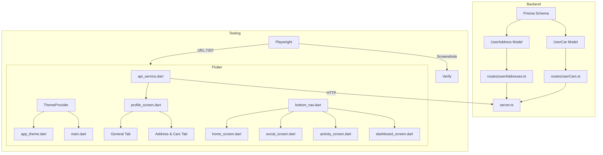

# Flutter Profile Redesign & Bottom Nav Enhancement Plan

## Overview

Redesign the Flutter profile screen (`/profile`) with a new tabbed layout (General, Address & Cars), add a floating glassmorphic bottom navigation bar, implement dark/light mode toggle, and create backend APIs for managing user addresses and cars.

---

## 1. Backend Changes

### 1.1 Prisma Schema — Add `UserCar` Model

**File:** [`prisma/schema.prisma`](prisma/schema.prisma) (after line 948, before `BusinessVerification`)

Add a new model for user cars/vehicles:

```prisma
model UserCar {
  id        String   @id @default(cuid())
  userId    String
  user      User     @relation(fields: [userId], references: [id], onDelete: Cascade)
  label     String   // e.g. "My Honda Civic", "Family Car"
  make      String   // e.g. "Honda"
  model     String   // e.g. "Civic"
  year      Int?
  color     String?
  plate     String?
  isDefault Boolean  @default(false)
  createdAt DateTime @default(now())
  archivedAt DateTime?
}
```

Also add relation to User model:
```prisma
cars                 UserCar[]
```

### 1.2 New Route: `routes/userAddresses.ts`

Create a CRUD route for user addresses:

| Method | Endpoint | Description |
|--------|----------|-------------|
| `GET` | `/user-addresses` | List all addresses for current user |
| `POST` | `/user-addresses` | Create a new address |
| `PUT` | `/user-addresses/:id` | Update an address |
| `DELETE` | `/user-addresses/:id` | Soft-delete (archive) an address |
| `PUT` | `/user-addresses/:id/default` | Set as default address |

### 1.3 New Route: `routes/userCars.ts`

Create a CRUD route for user cars:

| Method | Endpoint | Description |
|--------|----------|-------------|
| `GET` | `/user-cars` | List all cars for current user |
| `POST` | `/user-cars` | Create a new car |
| `PUT` | `/user-cars/:id` | Update a car |
| `DELETE` | `/user-cars/:id` | Soft-delete (archive) a car |
| `PUT` | `/user-cars/:id/default` | Set as default car |

### 1.4 Register Routes in `server.ts`

Add the two new route files to the server.

### 1.5 Prisma Migration

Run `npx prisma migrate dev --name add_user_car` to generate the migration.

---

## 2. Flutter Changes

### 2.1 Add Dependencies

**File:** [`flutter_project/pubspec.yaml`](flutter_project/pubspec.yaml)

Add `provider` package for state management (theme mode).

### 2.2 Theme System — Dark/Light Mode

**File:** [`flutter_project/lib/theme/app_theme.dart`](flutter_project/lib/theme/app_theme.dart)

- Add `lightTheme` to `AppTheme` class
- Add `AppColorsLight` class with light color values
- Create a `ThemeProvider` (ChangeNotifier) that persists the theme preference via SharedPreferences

### 2.3 API Service — Add Address & Car Methods

**File:** [`flutter_project/lib/services/api_service.dart`](flutter_project/lib/services/api_service.dart)

Add methods:
- `getAddresses()` → `GET /api/user-addresses`
- `createAddress(body)` → `POST /api/user-addresses`
- `updateAddress(id, body)` → `PUT /api/user-addresses/:id`
- `deleteAddress(id)` → `DELETE /api/user-addresses/:id`
- `setDefaultAddress(id)` → `PUT /api/user-addresses/:id/default`
- `getCars()` → `GET /api/user-cars`
- `createCar(body)` → `POST /api/user-cars`
- `updateCar(id, body)` → `PUT /api/user-cars/:id`
- `deleteCar(id)` → `DELETE /api/user-cars/:id`
- `setDefaultCar(id)` → `PUT /api/user-cars/:id/default`

### 2.4 Profile Screen Redesign

**File:** [`flutter_project/lib/screens/profile_screen.dart`](flutter_project/lib/screens/profile_screen.dart)

Complete rewrite with:

#### Layout Structure:
```
┌─────────────────────────┐
│      StatusBar          │
├─────────────────────────┤
│  ← Profile              │
├─────────────────────────┤
│  [Avatar]               │
│  Display Name           │
│  @username              │
├─────────────────────────┤
│  [General] [Addr&Cars]  │  ← TabBar
├─────────────────────────┤
│                         │
│  TAB CONTENT:           │
│                         │
│  GENERAL TAB:           │
│  ┌───────────────────┐  │
│  │ 👤 Display Name   │  │
│  │ 📧 Email          │  │
│  │ 📞 Phone          │  │
│  │ 🔒 Change Password│  │
│  │ 🔐 Authenticator  │  │
│  │ 🌙 Dark Mode      │  │ ← Switch
│  │ ☀️ Light Mode     │  │ ← Switch
│  └───────────────────┘  │
│                         │
│  ADDRESS & CARS TAB:    │
│  ┌─ Addresses ────────┐ │
│  │ ➕ Add Address      │ │
│  │ 🏠 Home: 123 Main  │ │
│  │ 🏢 Work: 456 Oak   │ │
│  └────────────────────┘ │
│  ┌─ Cars ─────────────┐ │
│  │ ➕ Add Car          │ │
│  │ 🚗 Honda Civic     │ │
│  │ 🚙 Toyota Camry    │ │
│  └────────────────────┘ │
└─────────────────────────┘
```

#### General Tab Items:
1. **Display Name** — tap to edit (existing dialog)
2. **Email** — tap to edit (existing dialog)
3. **Phone** — tap to edit (existing dialog)
4. **Change Password** — tap to change (existing dialog)
5. **Authenticator (2FA)** — toggle switch (existing)
6. **Dark Mode** — switch toggle (NEW)
7. **Light Mode** — switch toggle (NEW)
8. **Logout** — button at bottom

#### Address & Cars Tab:
- **Addresses Section:**
  - "Add Address" button
  - List of saved addresses with label, street, city
  - Each item: edit/delete actions, set as default
  - Add/Edit dialog: label (Home/Work/Custom), street, city, province, postal code
  
- **Cars Section:**
  - "Add Car" button
  - List of saved cars with label, make, model, year
  - Each item: edit/delete actions, set as default
  - Add/Edit dialog: label, make, model, year, color, plate

### 2.5 Floating Glassmorphic Bottom Nav

**File:** [`flutter_project/lib/widgets/bottom_nav.dart`](flutter_project/lib/widgets/bottom_nav.dart)

Complete rewrite with:
- **Floating** — positioned above the bottom edge, not edge-to-edge
- **Glassmorphism** — semi-transparent background with blur effect (`BackdropFilter`)
- **Centered** — horizontally centered with fixed width
- **Rounded** — large border radius (pill shape)
- **Same items** — Home, Social, Activity (no "My Activity" since it's in footer), Business (conditional)

The bottom nav should be rendered as a `Positioned` widget at the bottom of each screen's `Stack`, or wrapped in a container with padding.

**Important:** The bottom nav is currently rendered INSIDE the scrollable content of each screen (e.g., inside `SingleChildScrollView` in HomeScreen). This needs to be moved OUTSIDE the scrollable area, into a `Stack` or `Column` layout where the nav is fixed at the bottom.

### 2.6 Update All Screens Using BottomNav

**Files:**
- [`flutter_project/lib/screens/home_screen.dart`](flutter_project/lib/screens/home_screen.dart)
- [`flutter_project/lib/screens/social_screen.dart`](flutter_project/lib/screens/social_screen.dart)
- [`flutter_project/lib/screens/activity_screen.dart`](flutter_project/lib/screens/activity_screen.dart)
- [`flutter_project/lib/screens/dashboard_screen.dart`](flutter_project/lib/screens/dashboard_screen.dart)
- [`flutter_project/lib/screens/profile_screen.dart`](flutter_project/lib/screens/profile_screen.dart)

Each screen needs to:
1. Remove BottomNav from inside scrollable content
2. Wrap the entire screen in a `Stack`
3. Add BottomNav as a `Positioned` widget at the bottom
4. Add bottom padding to scrollable content to avoid overlap

### 2.7 Update Main App for Theme Provider

**File:** [`flutter_project/lib/main.dart`](flutter_project/lib/main.dart)

- Wrap the app with `ChangeNotifierProvider<ThemeProvider>`
- Use `Consumer<ThemeProvider>` to switch between `darkTheme` and `lightTheme`

---

## 3. Testing & Verification Plan

### 3.1 Backend API Testing (via MCP/Playwright)

1. **Create test user** via `POST /auth/register`
2. **Test Address CRUD:**
   - `POST /api/user-addresses` with valid data → 200
   - `POST /api/user-addresses` with missing fields → 400
   - `GET /api/user-addresses` → returns list
   - `PUT /api/user-addresses/:id` → updates
   - `DELETE /api/user-addresses/:id` → archives
   - `PUT /api/user-addresses/:id/default` → sets default
3. **Test Car CRUD:**
   - Same pattern as addresses
4. **Test edge cases:**
   - Unauthenticated requests → 401
   - Invalid IDs → 404
   - Duplicate labels → handled gracefully

### 3.2 Flutter UI Testing (via Playwright on port 7357)

1. **Profile page loads** at `http://localhost:7357/#/profile`
2. **Tab switching** — tap General, tap Address & Cars
3. **General tab items visible:**
   - Display Name, Email, Phone, Change Password, Authenticator, Dark Mode, Light Mode
4. **Dark/Light mode toggle** — switch changes theme
5. **Address & Cars tab:**
   - Add Address button visible
   - Add Car button visible
   - Form validation (empty fields → error)
   - Successful add → appears in list
   - Edit → updates
   - Delete → removes
6. **Bottom Nav:**
   - Floating, centered, glassmorphic
   - All nav items functional
   - Active state correct

### 3.3 Screenshots

Take screenshots at each verification step:
- Profile page initial load
- General tab with all items
- Address & Cars tab with data
- Dark mode active
- Light mode active
- Bottom nav on home screen
- Mobile viewport

---

## 4. Implementation Order

| Step | Task | Files |
|------|------|-------|
| 1 | Add `UserCar` model to Prisma schema | `prisma/schema.prisma` |
| 2 | Create `routes/userAddresses.ts` | New file |
| 3 | Create `routes/userCars.ts` | New file |
| 4 | Register routes in `server.ts` | `server.ts` |
| 5 | Run Prisma migration | CLI |
| 6 | Add `provider` dependency to Flutter | `flutter_project/pubspec.yaml` |
| 7 | Add light theme + ThemeProvider | `flutter_project/lib/theme/app_theme.dart` |
| 8 | Add address/car API methods | `flutter_project/lib/services/api_service.dart` |
| 9 | Rewrite bottom nav (floating glass) | `flutter_project/lib/widgets/bottom_nav.dart` |
| 10 | Rewrite profile screen | `flutter_project/lib/screens/profile_screen.dart` |
| 11 | Update all screens using BottomNav | home, social, activity, dashboard, profile |
| 12 | Update main.dart for theme provider | `flutter_project/lib/main.dart` |
| 13 | Run Playwright UI verification | CLI |
| 14 | Fix any issues found | Various |
| 15 | Commit and push | Git |

---

## 5. Architecture Diagram



## 6. Key Design Decisions

1. **UserCar model** — separate from any existing vehicle/workspace models; belongs to User directly
2. **Soft delete** — both Address and Car use `archivedAt` for safe deletion
3. **Glassmorphism** — use `BackdropFilter` with `ImageFilter.blur` for the frosted glass effect
4. **Theme persistence** — save dark/light preference in SharedPreferences
5. **Bottom nav outside scroll** — use `Stack` layout so nav is always visible at bottom
6. **No "My Activity" tab** — removed from profile since Activity is already in the bottom nav
