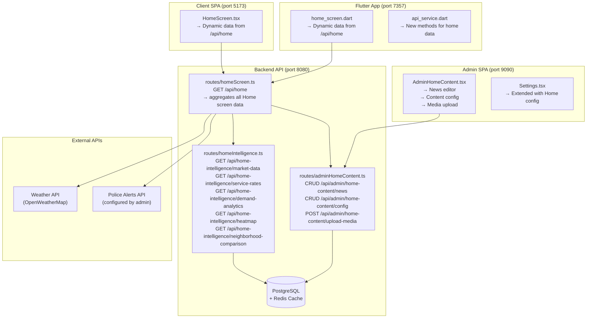

# Home Intelligence + Admin Content Management — Implementation Plan

## Overview

This plan covers **two feature groups** (G and H) for the Neighborly platform:

- **G. Home Intelligence / Local Insights** — aggregate market data, service rates by city/neighborhood, demand analytics, heatmaps, neighborhood comparison, privacy boundaries
- **H. Admin Home Content Management** — admin-managed news articles, external links, media uploads for news, external API integration (weather, police alerts), display priority and categorization

---

## Architecture Diagram



---

## Prisma Schema Changes

### New Models

```prisma
// ─── NewsArticle ──────────────────────────────────────────────────────
model NewsArticle {
  id            String     @id @default(cuid())
  title         String
  content       String?                    // Rich text / HTML body
  summary       String?                    // Short excerpt for cards
  sourceUrl     String?                    // External link if republished
  mediaUrl      String?                    // Featured image / video URL
  mediaCaption  String?
  category      String     @default("general") // general | weather | police | event | market
  priority      Int        @default(0)     // Higher = shows first
  isPublished   Boolean    @default(false)
  publishedAt   DateTime?
  createdAt     DateTime   @default(now())
  updatedAt     DateTime   @updatedAt
  archivedAt    DateTime?

  @@index([category, isPublished, priority])
  @@index([publishedAt])
  @@map("news_articles")
}

// ─── HomeContentConfig ─────────────────────────────────────────────────
model HomeContentConfig {
  id            String   @id @default(cuid())
  key           String   @unique           // e.g. "weather_api_key", "police_api_url", "featured_news_ids"
  value         Json                       // Flexible JSON value
  description   String?
  updatedAt     DateTime @updatedAt

  @@map("home_content_config")
}

// ─── ServiceRateByLocation ─────────────────────────────────────────────
model ServiceRateByLocation {
  id            String   @id @default(cuid())
  city          String
  neighborhood  String?
  categoryId    String
  category      Category @relation(fields: [categoryId], references: [id])
  serviceName   String                     // e.g. "Plumbing", "Electrical"
  avgPrice      Float                      // Average price in CAD
  minPrice      Float?
  maxPrice      Float?
  sampleCount   Int      @default(0)       // Number of orders/posts sampled
  currency      String   @default("CAD")
  computedAt    DateTime @default(now())   // When this aggregate was computed

  @@unique([city, neighborhood, categoryId, serviceName])
  @@index([city, neighborhood])
  @@index([categoryId])
  @@map("service_rates_by_location")
}

// ─── DemandAnalytics ───────────────────────────────────────────────────
model DemandAnalytics {
  id            String   @id @default(cuid())
  city          String
  neighborhood  String?
  categoryId    String
  category      Category @relation(fields: [categoryId], references: [id])
  requestCount  Int      @default(0)       // Number of service requests in period
  providerCount Int      @default(0)       // Number of active providers
  matchRate     Float?                     // Percentage of requests matched
  avgResponseTime Float?                   // Average hours to first response
  periodStart   DateTime                   // Start of aggregation period
  periodEnd     DateTime                   // End of aggregation period
  computedAt    DateTime @default(now())

  @@unique([city, neighborhood, categoryId, periodStart])
  @@index([city, neighborhood, periodStart])
  @@map("demand_analytics")
}

// ─── NeighborhoodComparison ────────────────────────────────────────────
model NeighborhoodComparison {
  id            String   @id @default(cuid())
  city          String
  neighborhood  String
  metric        String                     // e.g. "avg_service_price", "provider_density", "request_volume"
  value         Float
  rank          Int?                       // Rank within city
  percentile    Float?                     // Percentile within city
  computedAt    DateTime @default(now())

  @@unique([city, neighborhood, metric])
  @@index([city, metric])
  @@map("neighborhood_comparisons")
}
```

### Modified Models

```prisma
// Add to existing User model:
model User {
  // ... existing fields ...
  homeCity         String?    // Derived from location data for aggregation
  homeNeighborhood String?   // Derived from location data for aggregation
  privacyConsent   Boolean   @default(true) // Opt-in to aggregate analytics
}
```

---

## Backend Routes

### 1. [`routes/homeIntelligence.ts`](routes/homeIntelligence.ts) — Public Home Intelligence API

All endpoints use **optional auth** (like [`routes/feed.ts`](routes/feed.ts)) — authenticated users get personalized data, unauthenticated get city-level defaults.

| Endpoint | Method | Description | Auth |
|---|---|---|---|
| `GET /api/home-intelligence/market-data` | GET | Aggregate market overview for a city/neighborhood | Optional |
| `GET /api/home-intelligence/service-rates` | GET | Service rates by city/neighborhood with category filter | Optional |
| `GET /api/home-intelligence/demand-analytics` | GET | Demand metrics with privacy thresholds | Optional |
| `GET /api/home-intelligence/heatmap` | GET | GeoJSON heatmap data for interests/behaviors | Optional |
| `GET /api/home-intelligence/neighborhood-comparison` | GET | Compare neighborhoods on key metrics | Optional |

**Privacy Boundary Logic** (in [`lib/privacyThreshold.ts`](lib/privacyThreshold.ts)):
- Minimum 5 data points before any aggregate is displayed
- Minimum 3 unique providers before service rate is shown
- No individual-identifiable data ever returned
- All coordinates rounded to 3 decimal places (~111m precision) for heatmaps
- Users can opt out via `privacyConsent` field

### 2. [`routes/adminHomeContent.ts`](routes/adminHomeContent.ts) — Admin Content Management API

All endpoints require `platform_admin` role (same pattern as [`routes/adminUtilityLinks.ts`](routes/adminUtilityLinks.ts)).

| Endpoint | Method | Description |
|---|---|---|
| `GET /api/admin/home-content/news` | GET | List all news articles (paginated, filterable) |
| `POST /api/admin/home-content/news` | POST | Create a news article |
| `PUT /api/admin/home-content/news/:id` | PUT | Update a news article |
| `POST /api/admin/home-content/news/:id/publish` | POST | Publish/unpublish a news article |
| `POST /api/admin/home-content/news/:id/archive` | POST | Soft-delete a news article |
| `POST /api/admin/home-content/news/:id/restore` | POST | Restore archived article |
| `GET /api/admin/home-content/config` | GET | Get Home content configuration |
| `PUT /api/admin/home-content/config` | PUT | Update Home content configuration |
| `POST /api/admin/home-content/upload-media` | POST | Upload media for news articles |

### 3. [`routes/homeScreen.ts`](routes/homeScreen.ts) — Aggregated Home Screen API

This is the **key endpoint** that both React and Flutter Home Screens will call instead of hardcoded data.

| Endpoint | Method | Description |
|---|---|---|
| `GET /api/home` | GET | Returns all Home screen data in one call |

**Response shape:**
```json
{
  "location": { "city": "Vaughan", "neighborhood": "Maple", "shortLocation": "Vaughan, ON" },
  "weather": { "temp": 13, "condition": "Sunny", "icon": "..." },
  "policeAlerts": [ { "title": "...", "severity": "advisory", "time": "45m ago" } ],
  "news": [ { "id": "...", "title": "...", "summary": "...", "category": "general", "color": "...", "time": "2h ago" } ],
  "events": [ { "name": "...", "date": "...", "gradient": ["...", "..."] } ],
  "marketData": {
    "avgServicePrice": 125.00,
    "activeProviders": 42,
    "topCategories": [ { "name": "Building", "count": 18 } ]
  },
  "serviceRates": [ { "serviceName": "Plumbing", "avgPrice": 150, "sampleCount": 12 } ],
  "utilityLinks": [ { "title": "TD Bank", "url": "...", "logoUrl": "..." } ]
}
```

### 4. Server Route Mounting

In [`server.ts`](server.ts):

```typescript
// In mountApiRoutes():
import homeIntelligenceRoutes from './routes/homeIntelligence.js';
import homeScreenRoutes from './routes/homeScreen.js';
app.use('/api/home-intelligence', homeIntelligenceRoutes);
app.use('/api/home', homeScreenRoutes);

// In mountAdminApiRoutes():
import adminHomeContentRoutes from './routes/adminHomeContent.js';
app.use('/api/admin/home-content', adminHomeContentRoutes);
```

---

## Frontend Changes

### React Client SPA ([`frontend/src/pages/public/HomeScreen.tsx`](frontend/src/pages/public/HomeScreen.tsx))

**Replace all hardcoded data** with API calls to `GET /api/home`:

1. Add a `useEffect` + loading state to fetch `/api/home` on mount
2. Replace `NEWS` constant → dynamic from API response
3. Replace `EVENTS` constant → dynamic from API response
4. Replace `SERVICES` constant → dynamic `utilityLinks` from API response
5. Add market data section (avg prices, active providers) from `marketData`
6. Add service rates section from `serviceRates`
7. Keep the "Photo of the Week" card but make weather/police alerts dynamic
8. Add loading skeleton while data fetches
9. Add error state with retry button

### Flutter App ([`flutter_project/lib/screens/home_screen.dart`](flutter_project/lib/screens/home_screen.dart))

**Replace all hardcoded data** with API calls to `GET /api/home`:

1. Add `_fetchHomeData()` method in `_HomeScreenState`
2. Replace `_news` static list → dynamic from API
3. Replace `_events` static list → dynamic from API
4. Replace `_services` static list → dynamic `utilityLinks`
5. Add market data widgets
6. Add service rates widgets
7. Add loading/error states
8. Add new methods to [`flutter_project/lib/services/api_service.dart`](flutter_project/lib/services/api_service.dart):
   - `Future<Map<String, dynamic>> getHomeData()`
   - `Future<Map<String, dynamic>> getMarketData(String city, {String? neighborhood})`
   - `Future<Map<String, dynamic>> getServiceRates(String city, {String? neighborhood, String? categoryId})`
   - `Future<Map<String, dynamic>> getDemandAnalytics(String city, {String? neighborhood})`

### Admin SPA ([`frontend/admin/src/pages/Settings.tsx`](frontend/admin/src/pages/Settings.tsx))

**Extend with Home Content Management tabs:**

1. Add tab navigation: "System Settings" | "Home Content" | "External APIs"
2. "Home Content" tab:
   - News articles list with create/edit/publish/archive
   - Media upload for news
   - Display priority ordering (drag or numeric input)
   - Category assignment
3. "External APIs" tab:
   - Weather API key input (OpenWeatherMap)
   - Police alerts API URL/endpoint config
   - Test connection button for each

### New Admin Page: [`frontend/admin/src/pages/HomeContent.tsx`](frontend/admin/src/pages/HomeContent.tsx)

New page for comprehensive Home content management:

- **News Articles Table**: List all articles with status, category, priority, publish date
- **Create/Edit Modal**: Title, content (rich text), summary, source URL, media upload, category, priority
- **Bulk Actions**: Publish/unpublish/archive selected
- **Preview**: See how the article will appear on the Home screen

Register in [`frontend/admin/src/router.tsx`](frontend/admin/src/router.tsx):
```tsx
{ path: '/admin/home-content', element: <AdminHomeContent /> }
```

---

## External API Integration

### Weather ([`lib/weatherApi.ts`](lib/weatherApi.ts))

```typescript
// lib/weatherApi.ts
// Fetches weather from OpenWeatherMap (free tier)
// API key stored in HomeContentConfig (key: "weather_api_key")
// Cached in Redis for 30 minutes

export async function getWeatherForCity(city: string): Promise<WeatherData> {
  const apiKey = await getConfigValue('weather_api_key');
  // Fetch from OpenWeatherMap
  // Cache result
  // Return { temp, condition, icon, humidity, windSpeed }
}
```

### Police Alerts ([`lib/policeAlertsApi.ts`](lib/policeAlertsApi.ts))

```typescript
// lib/policeAlertsApi.ts
// Fetches police alerts from configurable RSS/API endpoint
// URL stored in HomeContentConfig (key: "police_api_url")
// Cached in Redis for 5 minutes

export async function getPoliceAlerts(city: string): Promise<PoliceAlert[]> {
  const apiUrl = await getConfigValue('police_api_url');
  // Fetch from configured endpoint
  // Parse and filter by city
  // Cache result
  // Return [{ title, description, severity, time, location }]
}
```

---

## Data Aggregation Logic

### Service Rates Computation ([`lib/computeServiceRates.ts`](lib/computeServiceRates.ts))

- Runs as a **scheduled job** (cron or manual trigger via admin)
- Aggregates from `Order` and `Post` data grouped by city/neighborhood/category
- Computes avg/min/max prices and sample counts
- Respects privacy threshold (min 5 data points)
- Stores results in `ServiceRateByLocation` table
- Can also be triggered on-demand via admin API

### Demand Analytics Computation ([`lib/computeDemandAnalytics.ts`](lib/computeDemandAnalytics.ts))

- Runs as a **scheduled job** (daily)
- Aggregates `Order` data (requests, matches, completions) by location
- Computes request count, provider count, match rate, avg response time
- Respects privacy threshold (min 5 data points)
- Stores results in `DemandAnalytics` table

### Neighborhood Comparison ([`lib/computeNeighborhoodComparison.ts`](lib/computeNeighborhoodComparison.ts))

- Runs after service rates and demand analytics are computed
- Compares neighborhoods within the same city
- Computes rank and percentile for each metric
- Stores results in `NeighborhoodComparison` table

---

## File-by-File Change List

### New Files to Create

| # | File | Purpose |
|---|---|---|
| 1 | [`prisma/migrations/XXX_add_home_intelligence_models`](prisma/migrations/) | Migration for new models |
| 2 | [`routes/homeIntelligence.ts`](routes/homeIntelligence.ts) | Public Home Intelligence API endpoints |
| 3 | [`routes/adminHomeContent.ts`](routes/adminHomeContent.ts) | Admin Home Content CRUD API |
| 4 | [`routes/homeScreen.ts`](routes/homeScreen.ts) | Aggregated Home screen data endpoint |
| 5 | [`lib/privacyThreshold.ts`](lib/privacyThreshold.ts) | Privacy boundary logic |
| 6 | [`lib/weatherApi.ts`](lib/weatherApi.ts) | Weather API integration |
| 7 | [`lib/policeAlertsApi.ts`](lib/policeAlertsApi.ts) | Police alerts API integration |
| 8 | [`lib/computeServiceRates.ts`](lib/computeServiceRates.ts) | Service rate aggregation logic |
| 9 | [`lib/computeDemandAnalytics.ts`](lib/computeDemandAnalytics.ts) | Demand analytics computation |
| 10 | [`lib/computeNeighborhoodComparison.ts`](lib/computeNeighborhoodComparison.ts) | Neighborhood comparison computation |
| 11 | [`frontend/admin/src/pages/HomeContent.tsx`](frontend/admin/src/pages/HomeContent.tsx) | Admin Home Content management page |

### Files to Modify

| # | File | Changes |
|---|---|---|
| 1 | [`prisma/schema.prisma`](prisma/schema.prisma) | Add 5 new models + User fields |
| 2 | [`server.ts`](server.ts) | Import and mount new routes in `mountApiRoutes()` and `mountAdminApiRoutes()` |
| 3 | [`frontend/src/pages/public/HomeScreen.tsx`](frontend/src/pages/public/HomeScreen.tsx) | Replace hardcoded data with API calls to `/api/home` |
| 4 | [`flutter_project/lib/screens/home_screen.dart`](flutter_project/lib/screens/home_screen.dart) | Replace hardcoded data with API calls to `/api/home` |
| 5 | [`flutter_project/lib/services/api_service.dart`](flutter_project/lib/services/api_service.dart) | Add new API methods for home data |
| 6 | [`frontend/admin/src/pages/Settings.tsx`](frontend/admin/src/pages/Settings.tsx) | Add Home Content and External API tabs |
| 7 | [`frontend/admin/src/router.tsx`](frontend/admin/src/router.tsx) | Add route for `/admin/home-content` |

---

## Implementation Order

```mermaid
flowchart LR
    A["1. Prisma Schema + Migration"] --> B["2. lib/privacyThreshold.ts"]
    B --> C["3. lib/weatherApi.ts + lib/policeAlertsApi.ts"]
    C --> D["4. routes/homeIntelligence.ts"]
    D --> E["5. lib/computeServiceRates.ts"]
    E --> F["6. lib/computeDemandAnalytics.ts"]
    F --> G["7. lib/computeNeighborhoodComparison.ts"]
    G --> H["8. routes/homeScreen.ts"]
    H --> I["9. routes/adminHomeContent.ts"]
    I --> J["10. server.ts route mounting"]
    J --> K["11. React HomeScreen.tsx update"]
    K --> L["12. Flutter home_screen.dart + api_service.dart update"]
    L --> M["13. Admin SPA - HomeContent.tsx"]
    M --> N["14. Admin SPA - Settings.tsx extension"]
    N --> O["15. Admin SPA - router.tsx update"]
```



---

## Key Design Decisions

1. **Single `/api/home` endpoint**: Both React and Flutter call one endpoint that aggregates all Home screen data. This keeps client logic simple and allows backend to optimize.

2. **Privacy by default**: The [`lib/privacyThreshold.ts`](lib/privacyThreshold.ts) module enforces minimum data thresholds before any aggregate is returned. No individual-identifiable data is ever exposed.

3. **Cached aggregates**: Service rates and demand analytics are pre-computed and stored in DB, not computed on-the-fly. This ensures fast responses and consistent data.

4. **Configurable external APIs**: Weather and police alert endpoints are stored in `HomeContentConfig` so admins can change them without code deploys.

5. **Admin content takes priority**: Admin-published news articles with `priority > 0` show before auto-generated content. This gives admins full control over the Home screen narrative.

6. **Follows existing patterns**: All new routes follow the same patterns as [`routes/adminUtilityLinks.ts`](routes/adminUtilityLinks.ts) (admin auth, pagination, soft-delete) and [`routes/feed.ts`](routes/feed.ts) (optional auth, filtering).

---

## Verification Checklist

- [ ] `GET /api/home` returns correct aggregated data for authenticated and unauthenticated users
- [ ] Privacy thresholds enforced: no data shown for locations with < 5 data points
- [ ] Admin can create, edit, publish, archive news articles
- [ ] Admin can configure weather API key and police alert URL
- [ ] React HomeScreen shows dynamic data instead of hardcoded
- [ ] Flutter HomeScreen shows dynamic data instead of hardcoded
- [ ] Service rates computed correctly from order/post data
- [ ] Demand analytics computed correctly with privacy boundaries
- [ ] Neighborhood comparison shows rank and percentile
- [ ] All new routes mounted correctly on both mainApp (8080) and adminApp (9090)
- [ ] Admin SPA builds successfully with new HomeContent page
