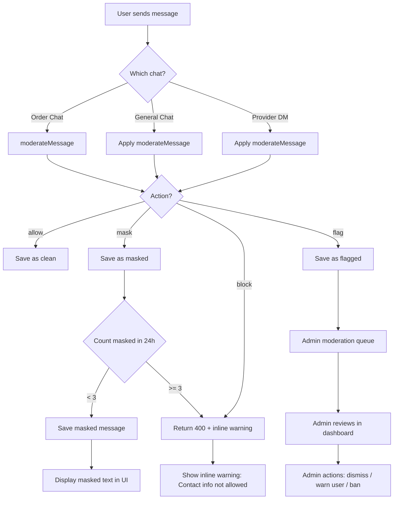
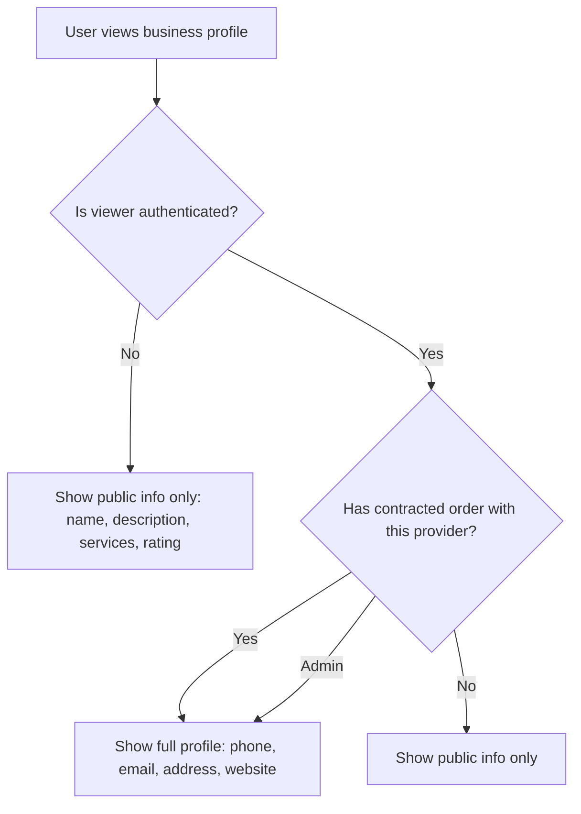
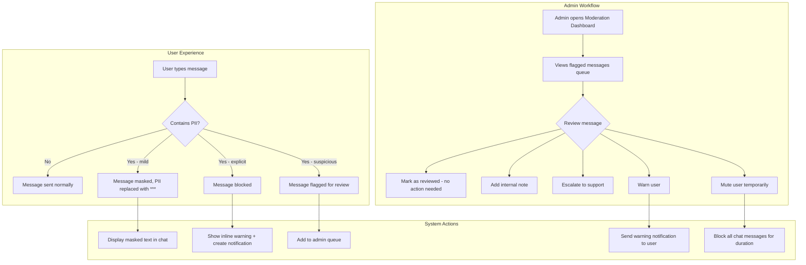

# Platform Circumvention Prevention Plan (P0 - Critical)

## 1. Current State Analysis

### 1.1 What Already Works

| Component | Status | Details |
|-----------|--------|---------|
| [`lib/chatModeration.ts`](lib/chatModeration.ts) | ✅ Working | PII detection regex for email, phone, links, handles, platform names, contact-exchange phrases. Returns `ModerationResult` with action (`allow`/`mask`/`block`/`flag`) and masked `displayText`. |
| [`routes/orderChat.ts`](routes/orderChat.ts) | ✅ Working | Order-scoped chat with full moderation integration. Masks PII in `displayText`, blocks after 3 masked attempts in 24h, stores `moderationStatus` and `moderationReasons`. |
| [`routes/adminChat.ts`](routes/adminChat.ts) | ✅ Working | Admin endpoints for viewing threads, listing flagged messages (`GET /flags`), reviewing (`POST /flags/:id/review`), adding notes (`POST /flags/:id/note`), escalating (`POST /flags/:id/escalate`). |
| [`prisma/schema.prisma`](prisma/schema.prisma) | ✅ Working | `ChatModerationStatus` enum (`clean`, `masked`, `blocked`, `flagged`), `OrderChatMessage` model with `moderationStatus`, `moderationReasons`, `originalText`, `displayText` fields. |

### 1.2 What's Missing / Needs Improvement

| Gap | Severity | Details |
|-----|----------|---------|
| **General chat (`routes/chat.ts`) has NO moderation** | 🔴 Critical | The `/api/chat/rooms/:id/messages` and `/api/chat/provider/:providerId` endpoints have a basic `detectContactInfo()` function that blocks messages entirely (hard reject), but it's inconsistent with the moderation system. No masking, no flagging, no admin review. |
| **Business profiles expose contact info** | 🔴 Critical | [`routes/companies.ts`](routes/companies.ts) returns `phone`, `address`, `website`, `socialLinks` on `GET /api/companies/:id` and `GET /api/companies/by-slug/:slug` — these are visible to ANY user before a contract is signed. |
| **User model exposes email/phone** | 🟡 High | [`User`](prisma/schema.prisma:139) model has `email`, `phone`, `address` fields. Provider listing at [`routes/providers.ts`](routes/providers.ts) doesn't expose these, but other endpoints might. |
| **No inline warning to sender when PII is blocked** | 🟡 High | When a message is blocked in [`orderChat.ts`](routes/orderChat.ts:251-256), the API returns an error but the frontend doesn't show an inline warning in the chat UI. |
| **No moderation dashboard in admin SPA** | 🟡 High | [`routes/adminChat.ts`](routes/adminChat.ts) has the API endpoints, but there's no admin SPA page at [`frontend/admin/src/pages/`](frontend/admin/src/pages/) for viewing/acting on flagged messages. |
| **No notification to sender when PII is blocked** | 🟡 Medium | The sender gets a 400 error but no persistent notification or inline warning in the chat UI explaining *why* the message was blocked. |
| **No contract-status check on business profile visibility** | 🟡 Medium | Contact info in business profiles should only be visible after an order reaches `contracted` status between the viewer and the provider. |
| **`routes/chat.ts` uses ticket-based messaging** | 🟡 Medium | The provider-customer chat at [`routes/chat.ts`](routes/chat.ts:229-333) uses the `Ticket` model instead of `OrderChatMessage`. This is a separate, unmoderated channel. |

---

## 2. Architecture & Workflow

### 2.1 Moderation Flow (Current + Proposed)



### 2.2 Business Profile Visibility Flow



---

## 3. Detailed Implementation Plan

### 3.1 Backend Changes

#### 3.1.1 Enhance [`lib/chatModeration.ts`](lib/chatModeration.ts)

**What:** Improve PII detection with better regex, address detection, and a new `block` action for explicit contact sharing.

**Changes:**
1. Add address detection regex (street addresses, PO boxes)
2. Add `address_detected` reason
3. Strengthen phone regex to catch more international formats
4. Add `isExplicitContactShare()` helper that returns `block` instead of `flag` for obvious contact-sharing patterns (e.g., "call me at 555-1234" vs "I use Telegram for work")
5. Export a `getBlockedReasonMessage()` function that returns user-friendly text for inline warnings

#### 3.1.2 Add Moderation to [`routes/chat.ts`](routes/chat.ts)

**What:** Apply `moderateMessage()` to all chat endpoints in the general chat router.

**Changes:**
1. Import `moderateMessage` from [`lib/chatModeration.ts`](lib/chatModeration.ts)
2. In `POST /api/chat/rooms/:id/messages` (line 104): Apply moderation, mask `displayText`, store moderation status in the `ChatMessage` model (or add a `moderationStatus` field if missing)
3. In `POST /api/chat/provider/:providerId` (line 230): Replace the basic `detectContactInfo()` with `moderateMessage()`. Instead of hard-rejecting, mask the text and save with moderation status. Only block if repeated offenses.
4. Add `moderationStatus` and `moderationReasons` fields to the `ChatMessage` model in Prisma (if not already present — check schema)

#### 3.1.3 Add Inline Warning Support to [`routes/orderChat.ts`](routes/orderChat.ts)

**What:** Return structured error responses that the frontend can use to show inline warnings.

**Changes:**
1. Modify the blocked message response (line 251-256) to include:
   - `code: 'MESSAGE_BLOCKED'`
   - `reasons`: array of detected PII types
   - `warningText`: user-friendly explanation
   - `suggestion`: alternative phrasing suggestion
2. Add a new endpoint `GET /api/orders/:orderId/chat/moderation-status` that returns the user's current moderation status (e.g., "You have 2/3 masked messages in the last 24h")

#### 3.1.4 Add Contract-Check Middleware for Business Profiles

**What:** Create middleware that checks if the requesting user has a `contracted` order with the provider before exposing contact info.

**New file:** [`lib/profileVisibility.ts`](lib/profileVisibility.ts)

**Changes:**
1. Create `hasContractedOrder(userId: string, providerId: string): Promise<boolean>` — checks if any order exists where `customerId = userId` AND `matchedProviderId = providerId` AND `status = contracted` (or beyond)
2. Create `hasContractedOrderWithWorkspace(userId: string, workspaceId: string): Promise<boolean>` — same but for workspace-level matching

#### 3.1.5 Modify [`routes/companies.ts`](routes/companies.ts) to Mask Contact Info

**What:** Conditionally expose `phone`, `address`, `website`, `socialLinks` based on contract status.

**Changes:**
1. Import `hasContractedOrderWithWorkspace` from [`lib/profileVisibility.ts`](lib/profileVisibility.ts)
2. In `GET /api/companies/:id` (line 31): After fetching the company, check if the requesting user has a contracted order with this workspace. If not, mask/null out `phone`, `address`, `website`, `socialLinks` in the response.
3. In `GET /api/companies/by-slug/:slug` (line 48): Same treatment.
4. For unauthenticated requests: always mask contact info.

#### 3.1.6 Add Admin Endpoint for User Moderation Actions

**New endpoint in [`routes/adminChat.ts`](routes/adminChat.ts):**

1. `POST /api/admin/chat/users/:userId/warn` — Log a warning to the user about PII sharing, creates a notification
2. `POST /api/admin/chat/users/:userId/mute` — Temporarily mute a user from sending chat messages (add a `chatMutedUntil` field to User model or use metadata)
3. `GET /api/admin/chat/stats` — Return moderation stats (total flagged today, most common PII types, top offenders)

#### 3.1.7 Prisma Schema Changes

**New migration needed:**

1. Add `chatMutedUntil` field to [`User`](prisma/schema.prisma:139) model:
   ```prisma
   chatMutedUntil DateTime?
   ```
2. Add `moderationStatus` and `moderationReasons` to `ChatMessage` model (if not already present — check the existing schema for the general chat model)
3. Add index on `OrderChatMessage.moderationStatus` for faster admin queries (already exists at line 536)

---

### 3.2 Frontend Changes (Client SPA)

#### 3.2.1 Update [`frontend/src/services/chat.ts`](frontend/src/services/chat.ts)

**What:** Add proper typing and moderation-aware methods.

**Changes:**
1. Add TypeScript types for `ModerationResult`, `OrderChatMessage` with moderation fields
2. Update `sendMessage` to handle moderation errors and return structured responses
3. Add `getModerationStatus(orderId: string)` method
4. Add `getBlockedReasonText(reasons: string[]): string` utility

#### 3.2.2 Add Inline Warning Component

**New file:** [`frontend/src/components/chat/ModerationWarning.tsx`](frontend/src/components/chat/ModerationWarning.tsx)

**What:** A dismissible inline warning banner that appears in the chat UI when a message is blocked.

**Props:**
- `reasons: string[]` — detected PII types
- `warningText: string` — user-friendly explanation
- `onDismiss: () => void`
- `suggestion?: string` — alternative phrasing

**Behavior:**
- Shows at the top of the chat input area
- Auto-dismisses after 10 seconds or on user dismiss
- Animated entry/exit
- Red/orange color scheme for urgency

#### 3.2.3 Update Chat UI to Show Masked Messages

**What:** Ensure the chat UI properly renders `displayText` (masked) instead of `originalText` for messages with `moderationStatus = 'masked'`.

**Changes:**
- In the chat message component, check `moderationStatus` and render `displayText` with a subtle visual indicator (e.g., italic, muted color, small "masked" badge)
- Show a tooltip on hover: "This message was modified for safety"

---

### 3.3 Frontend Changes (Admin SPA)

#### 3.3.1 Create Moderation Dashboard Page

**New file:** [`frontend/admin/src/pages/Moderation.tsx`](frontend/admin/src/pages/Moderation.tsx)

**What:** Full moderation dashboard for viewing, filtering, and acting on flagged messages.

**Features:**
1. **Flagged Messages List** — Table showing:
   - Message preview (truncated)
   - Sender name + role
   - Order ID (linked)
   - Detected PII types (badges: email, phone, address, etc.)
   - Timestamp
   - Status (flagged / reviewed / escalated)
   - Action buttons (Review, Escalate, Dismiss)

2. **Filters:**
   - By status: flagged, reviewed, escalated, all
   - By PII type: email, phone, address, link, platform, contact-exchange
   - By date range
   - By sender
   - Search by message content

3. **Detail Drawer/Modal:**
   - Full message content (original + display)
   - Thread context (previous messages)
   - Order details
   - Review history
   - Internal notes
   - Actions: Mark reviewed, Add note, Escalate to support, Warn user, Mute user

4. **Stats Cards:**
   - Total flagged today
   - Most common PII type
   - Top offenders (users with most flags)
   - Average response time

#### 3.3.2 Add Moderation to Admin Sidebar

**Changes to [`frontend/admin/src/components/AdminLayout.tsx`](frontend/admin/src/components/AdminLayout.tsx):**

1. Add `ShieldAlert` icon import
2. Add new sidebar link:
   ```ts
   { label: 'Moderation', icon: ShieldAlert, path: 'moderation' }
   ```
3. Add badge count next to "Moderation" showing number of unreviewed flagged messages

#### 3.3.3 Add Moderation Route

**Changes to [`frontend/admin/src/router.tsx`](frontend/admin/src/router.tsx):**

1. Import `Moderation` from `./pages/Moderation`
2. Add route:
   ```ts
   { path: 'admin/moderation', element: <Moderation /> }
   ```

---

### 3.4 Notification System

#### 3.4.1 Inline Warning in Chat (Client SPA)

**What:** When a message is blocked, show an inline warning in the chat UI instead of just a toast/alert.

**Flow:**
1. User types and sends message
2. API returns 400 with `{ code: 'MESSAGE_BLOCKED', reasons: [...], warningText: '...', suggestion: '...' }`
3. Frontend catches the error and renders [`ModerationWarning`](frontend/src/components/chat/ModerationWarning.tsx) component above the chat input
4. The blocked message text remains in the input field (not cleared) so the user can edit it
5. A subtle animation draws attention to the warning

#### 3.4.2 Backend Notification on Block

**What:** When a message is blocked, create a notification for the sender.

**Changes to [`routes/orderChat.ts`](routes/orderChat.ts):**
- When a message is blocked (line 251), also create a notification:
  ```ts
  await prisma.notification.create({
    data: {
      userId: req.user!.userId,
      title: 'Message Blocked',
      message: 'Your message was blocked because it contains contact information. Please keep communication in-app.',
      type: 'system',
      link: `/orders/${orderId}/chat`,
    },
  });
  ```

---

### 3.5 File-by-File Change List

| # | File | Action | Description |
|---|------|--------|-------------|
| 1 | [`lib/chatModeration.ts`](lib/chatModeration.ts) | **Modify** | Add address regex, `isExplicitContactShare()`, `getBlockedReasonMessage()` |
| 2 | [`lib/profileVisibility.ts`](lib/profileVisibility.ts) | **Create** | Contract-check middleware for business profile visibility |
| 3 | [`routes/chat.ts`](routes/chat.ts) | **Modify** | Apply `moderateMessage()` to all chat endpoints, replace basic `detectContactInfo()` |
| 4 | [`routes/orderChat.ts`](routes/orderChat.ts) | **Modify** | Add structured error response with `warningText`, `suggestion`; add notification on block; add `GET /moderation-status` endpoint |
| 5 | [`routes/adminChat.ts`](routes/adminChat.ts) | **Modify** | Add `POST /users/:userId/warn`, `POST /users/:userId/mute`, `GET /stats` endpoints |
| 6 | [`routes/companies.ts`](routes/companies.ts) | **Modify** | Mask `phone`, `address`, `website`, `socialLinks` unless viewer has contracted order |
| 7 | [`prisma/schema.prisma`](prisma/schema.prisma) | **Modify** | Add `chatMutedUntil` to User model; add moderation fields to `ChatMessage` model if missing |
| 8 | [`frontend/src/services/chat.ts`](frontend/src/services/chat.ts) | **Modify** | Add types, moderation-aware methods, `getModerationStatus()` |
| 9 | [`frontend/src/components/chat/ModerationWarning.tsx`](frontend/src/components/chat/ModerationWarning.tsx) | **Create** | Inline warning component for blocked messages |
| 10 | Frontend chat UI components | **Modify** | Render `displayText` for masked messages, show moderation badges |
| 11 | [`frontend/admin/src/pages/Moderation.tsx`](frontend/admin/src/pages/Moderation.tsx) | **Create** | Full moderation dashboard with filters, detail drawer, actions |
| 12 | [`frontend/admin/src/components/AdminLayout.tsx`](frontend/admin/src/components/AdminLayout.tsx) | **Modify** | Add "Moderation" sidebar link with badge count |
| 13 | [`frontend/admin/src/router.tsx`](frontend/admin/src/router.tsx) | **Modify** | Add `/admin/moderation` route |

---

## 4. Moderation Workflow



---

## 5. Edge Cases & Considerations

### 5.1 Edge Cases

| Edge Case | Handling |
|-----------|----------|
| **User types PII in multiple messages** | After 3 masked messages in 24h, subsequent messages are blocked entirely. Counter resets daily. |
| **User edits a masked message** | Re-moderation on edit — the new text is re-scanned. |
| **False positives (e.g., "email me the document" vs "my email is...")** | The `contact_exchange_pattern` regex catches explicit sharing. `isExplicitContactShare()` distinguishes between benign mentions and actual sharing. |
| **Unicode/emoji obfuscation (e.g., "5̶5̶5̶-̶1̶2̶3̶4̶")** | Current regex won't catch this. Future enhancement: normalize unicode before scanning. For now, admin can manually flag. |
| **Image-based PII (screenshot of contact info)** | Out of scope for this phase. Future: OCR-based image moderation. |
| **Provider and customer already have a contract** | Once order status is `contracted`, moderation is relaxed (PII is expected for service delivery). The chat should still mask but allow with a notice. |
| **Admin viewing business profiles** | Admins always see full contact info regardless of contract status. |

### 5.2 Privacy Considerations

- **Masked messages** store the `originalText` in the database for admin review, but only `displayText` is sent to the other chat participant.
- **Business profile masking** only affects non-contracted viewers. The provider's own contact info is always visible to them.
- **Admin moderation data** (notes, reviews) is stored in `metadata` JSON field and only accessible to admins.

### 5.3 Performance Considerations

- The moderation regex is lightweight and runs synchronously — no significant overhead.
- Admin moderation queries use the existing index on `[moderationStatus, createdAt]` (line 536).
- The `hasContractedOrder()` check adds one DB query per profile view. Consider caching with Redis if this becomes a bottleneck.

---

## 6. Verification Checklist

- [ ] All chat endpoints (order chat, general chat, provider DM) apply `moderateMessage()`
- [ ] PII is masked in `displayText` for all chat types
- [ ] Messages with explicit contact sharing are blocked with inline warning
- [ ] Flagged messages appear in admin moderation queue
- [ ] Admin can review, escalate, warn, and mute users
- [ ] Business profiles hide contact info until order is contracted
- [ ] Sender receives notification when message is blocked
- [ ] Inline warning component renders correctly in chat UI
- [ ] Admin moderation dashboard loads and filters work
- [ ] All changes pass TypeScript compilation
- [ ] Playwright UI verification for admin moderation dashboard
