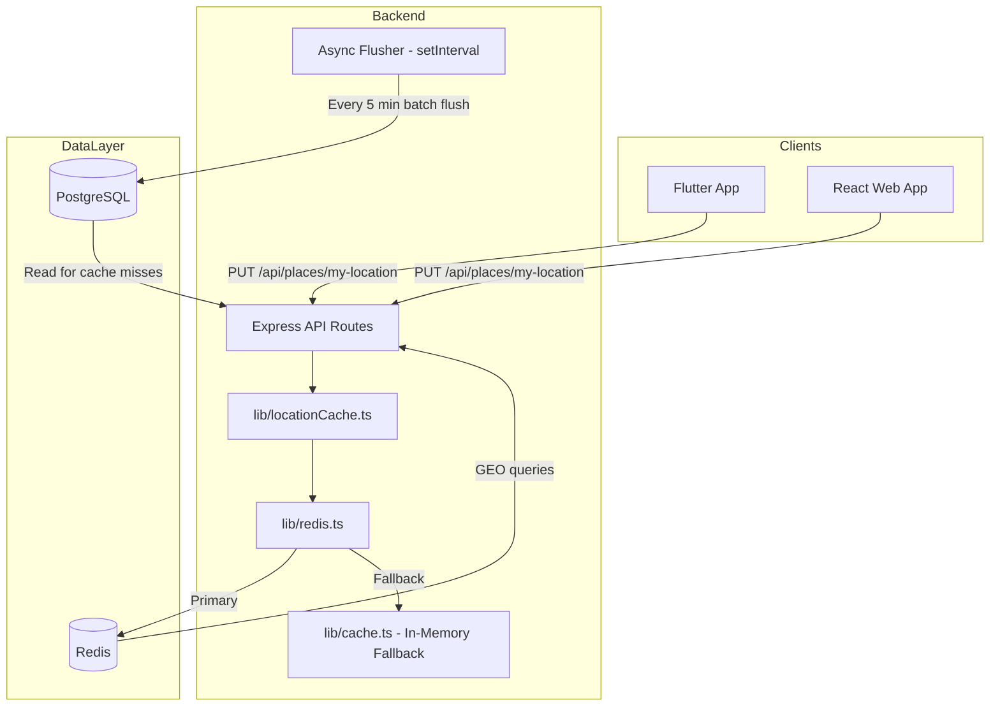
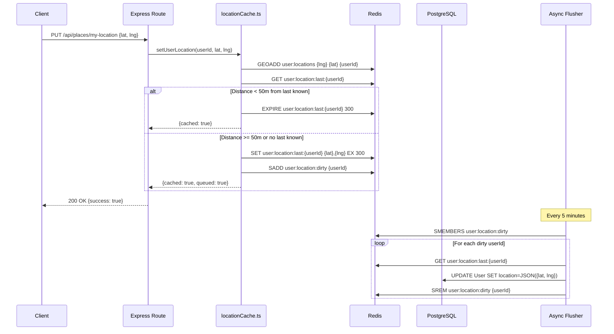

# Redis Location Cache — Implementation Plan

**Based on:** [`docs/redis-location-cache-plan.md`](docs/redis-location-cache-plan.md)
**Date:** 2026-05-23
**Status:** Ready for Implementation

---

## Overview

Implement a Redis caching layer for high-frequency location updates. The plan covers:
- Redis connection manager with in-memory fallback
- Location cache with debounce logic (50m threshold)
- Async flusher to PostgreSQL (every 5 minutes)
- Redis GEO for nearby provider queries
- Cache integration across 5 route files + server startup

### Key Observations from Codebase Audit

| Finding | Detail |
|---------|--------|
| `ioredis` | ✅ Already in `package.json` at `^5.3.2` |
| `lib/cache.ts` | Currently an in-memory Map-based cache. Was previously Redis but was removed. Exports `getRedis()` function. |
| `server.ts` line 13 | Already imports `getRedis` from `./lib/cache.js` and pings it on startup |
| `User` model (Prisma) | Has `location` field (String) but **no** `locationLat`/`locationLng` Float fields |
| `routes/places.ts` | `PUT /my-location` only accepts a `location` string, writes directly to DB |
| `routes/providers.ts` | `GET /nearby` accepts `lat`/`lng` params but ignores them — returns all providers sorted by rating |
| `routes/users.ts` | `PUT /me` accepts `location` string, writes directly to DB |
| `docker-compose.yml` | No Redis service defined; comment on line 112 says "REDIS_URL removed" |
| `.env.example` | No Redis or location cache env vars |

---

## Implementation Steps

### Step 1: Create `lib/redis.ts` — Redis Connection Manager

**File:** [`lib/redis.ts`](lib/redis.ts) (NEW)

**What to do:**
- Create Redis client using `ioredis` with the config from the plan (Section 3.1)
- Implement graceful fallback: if Redis is unavailable, fall back to the in-memory cache from [`lib/cache.ts`](lib/cache.ts)
- Export `getRedis()`, `isRedisAvailable()`, `pingRedis()`
- Handle events: `connect`, `error`, `close`, `reconnecting`
- Use `lazyConnect: true` so connection is deferred

**Key design decision:** The existing [`lib/cache.ts`](lib/cache.ts) exports `getRedis()` which returns an in-memory Map. The new [`lib/redis.ts`](lib/redis.ts) will export `getRedis()` that returns either an `ioredis` client or falls back to the in-memory cache. This means the import in [`server.ts`](server.ts) (`import { getRedis } from "./lib/cache.js"`) will need to be updated to import from `./lib/redis.js`.

**Dependency:** `ioredis` (already in `package.json`)

---

### Step 2: Update `lib/cache.ts` — Add GEO and Set Methods

**File:** [`lib/cache.ts`](lib/cache.ts) (MODIFY)

**What to do:**
- Add these methods to the `memoryCache` object to match the ioredis subset needed:
  - `geoadd(key, lng, lat, member)` — store in an internal Map<string, Map<string, {lat, lng}>>
  - `georadius(key, lng, lat, radius, unit, order?, options?)` — calculate Haversine in-memory
  - `geodist(key, member1, member2, unit)` — calculate distance between two members
  - `sadd(key, ...members)` — add to a Set
  - `smembers(key)` — get all members of a Set
  - `srem(key, ...members)` — remove from a Set
  - `expire(key, seconds)` — set TTL on a key
  - `multi()` / `exec()` — basic chaining support (optional, may not be needed)

**Why:** The in-memory cache acts as the fallback when Redis is down. It needs to support the same operations that [`lib/locationCache.ts`](lib/locationCache.ts) will use.

---

### Step 3: Create `lib/locationCache.ts` — Core Location Cache Logic

**File:** [`lib/locationCache.ts`](lib/locationCache.ts) (NEW)

**What to do:**
- Implement `setUserLocation(userId, lat, lng)` with debounce logic:
  1. Read last position from Redis (`user:location:last:{userId}`)
  2. Calculate Haversine distance
  3. If distance < 50m → just renew TTL, return `{cached: true, skipped: true}`
  4. If distance >= 50m → store new position, GEOADD, SADD to dirty set
- Implement `getUserLocation(userId)` — read from Redis, fallback to DB
- Implement `startLocationFlusher()` — setInterval that calls `flushDirtyLocations()`
- Implement `stopLocationFlusher()` — clearInterval
- Implement `flushDirtyLocations()` — batch update PostgreSQL from dirty set
- Implement `getNearbyProviders(lat, lng, radius, limit)` — GEORADIUS query
- Implement `cacheReverseGeocode(lat, lng, data)` — cache reverse geocode results
- Implement `getCachedReverseGeocode(lat, lng)` — read cached reverse geocode
- Export all functions

**Config constants** (from env vars with defaults):
- `LOCATION_DEBOUNCE_METERS` = 50
- `LOCATION_FLUSH_INTERVAL_MS` = 300000 (5 min)
- `LOCATION_CACHE_TTL_SECONDS` = 300 (5 min)
- `LOCATION_DIRTY_SET_TTL_SECONDS` = 600 (10 min)

---

### Step 4: Update `routes/places.ts` — Use Location Cache for `PUT /my-location`

**File:** [`routes/places.ts`](routes/places.ts) (MODIFY)

**Changes:**
1. **`PUT /api/places/my-location`** (line 242-256):
   - Accept new body format: `{ lat: number, lng: number, location?: string }`
   - If `lat` and `lng` are provided → use `locationCache.setUserLocation()`
   - If only `location` string is provided → write directly to DB (backward compat)
   - If both are provided → use cache path AND update the `location` string in DB

2. **`GET /api/places/current-location`** (line 17-114):
   - Before calling Nominatim/Google, check Redis cache (`geocode:reverse:{lat}:{lng}`)
   - After getting result, cache it in Redis with TTL 3600s
   - This reduces external API calls significantly

---

### Step 5: Update `routes/users.ts` — Update Cache on Profile Change

**File:** [`routes/users.ts`](routes/users.ts) (MODIFY)

**Changes:**
1. **`PUT /api/users/me`** (line 149-185):
   - If `location` is in the request body, after DB update, also update Redis cache
   - If `lat`/`lng` are also provided (new fields), store them in Redis GEO as well
   - This ensures profile updates also refresh the location cache

---

### Step 6: Update `routes/providers.ts` — Real GEO-Based Nearby Query

**File:** [`routes/providers.ts`](routes/providers.ts) (MODIFY)

**Changes:**
1. **`GET /api/providers/nearby`** (line 40-97):
   - Use `locationCache.getNearbyProviders(lat, lng, radius, limit)` when `lat`/`lng` are provided
   - Cache the result in `provider:nearby:{lat}:{lng}:{limit}` with TTL 60s
   - If `lat`/`lng` are not provided, fall back to current behavior (all providers)
   - Return real `distance` field instead of `null`
   - This is the biggest functional improvement — currently the endpoint ignores lat/lng entirely

---

### Step 7: Update `routes/orders.ts` — Cache Order Locations

**File:** [`routes/orders.ts`](routes/orders.ts) (MODIFY)

**Changes:**
1. In the order creation/draft endpoints:
   - After setting `locationLat`/`locationLng` in the DB, also cache in Redis (`order:location:{orderId}`)
   - Use a Hash with fields: `lat`, `lng`, `address`
   - Set TTL until order is submitted (max 24h)

**Note:** This is a large file (1691 lines). The changes are surgical — only modify the specific lines where location data is written.

---

### Step 8: Update `routes/workspaces.ts` — Cache Workspace Locations

**File:** [`routes/workspaces.ts`](routes/workspaces.ts) (MODIFY)

**Changes:**
1. In the workspace update endpoints:
   - If `location` is in the body, after DB update, also update Redis cache
   - Update the workspace location in Redis GEO as well
   - Use key `workspace:location:{workspaceId}` as a Hash

**Note:** This is also a large file (2287 lines). Changes are surgical.

---

### Step 9: Update `server.ts` — Start the Flusher

**File:** [`server.ts`](server.ts) (MODIFY)

**Changes:**
1. Import `startLocationFlusher` from `./lib/locationCache.js`
2. Change the Redis import from `./lib/cache.js` to `./lib/redis.js`
3. Call `startLocationFlusher()` after the Redis ping check (around line 203)
4. Add `stopLocationFlusher()` to the SIGTERM handler (around line 291-296)

---

### Step 10: Update `.env.example` — Add Redis and Location Cache Config

**File:** [`.env.example`](.env.example) (MODIFY)

**Add:**
```bash
# ─── Redis Configuration ────────────────────────────────────────────────
REDIS_HOST=localhost
REDIS_PORT=6379
REDIS_PASSWORD=
REDIS_DB=0

# ─── Location Cache Configuration ───────────────────────────────────────
LOCATION_DEBOUNCE_METERS=50
LOCATION_FLUSH_INTERVAL_MS=300000
LOCATION_CACHE_TTL_SECONDS=300
LOCATION_DIRTY_SET_TTL_SECONDS=600
```

---

### Step 11: Update `docker-compose.yml` — Add Redis Service

**File:** [`docker-compose.yml`](docker-compose.yml) (MODIFY)

**Add Redis service** (between `nats` and `web-app`):
```yaml
  redis:
    image: redis:7-alpine
    container_name: neighborly_redis
    command: redis-server --appendonly yes --save 60 1
    volumes:
      - redis_data:/data
    networks:
      - neighborly_network
    restart: unless-stopped
    ports:
      - "6379:6379"
    healthcheck:
      test: ["CMD", "redis-cli", "ping"]
      interval: 10s
      timeout: 3s
      retries: 5
```

**Add volume:**
```yaml
volumes:
  redis_data: {}
```

**Update `web-app` environment** to include `REDIS_HOST=redis`.

---

### Step 12: (Optional) Prisma Migration — Add `locationLat`/`locationLng` to User

**File:** [`prisma/schema.prisma`](prisma/schema.prisma) (MODIFY)

**Add to User model** (around line 166-167):
```prisma
  locationLat         Float?      // NEW: latitude for geo queries
  locationLng         Float?      // NEW: longitude for geo queries
```

**Note:** This is optional. The plan suggests storing location as JSON in the existing `location` string field as a first step. If we add the Prisma fields, we need a migration.

---

## Architecture Diagram



## Write Path Flow



## File Change Summary

| File | Status | Est. Lines | Complexity |
|------|--------|-----------|------------|
| [`lib/redis.ts`](lib/redis.ts) | **NEW** | ~100 | Medium |
| [`lib/locationCache.ts`](lib/locationCache.ts) | **NEW** | ~300 | High |
| [`lib/cache.ts`](lib/cache.ts) | MODIFY | +~100 | Medium |
| [`routes/places.ts`](routes/places.ts) | MODIFY | ~50 | Medium |
| [`routes/users.ts`](routes/users.ts) | MODIFY | ~20 | Low |
| [`routes/providers.ts`](routes/providers.ts) | MODIFY | ~100 | High |
| [`routes/orders.ts`](routes/orders.ts) | MODIFY | ~30 | Low |
| [`routes/workspaces.ts`](routes/workspaces.ts) | MODIFY | ~20 | Low |
| [`server.ts`](server.ts) | MODIFY | ~10 | Low |
| [`.env.example`](.env.example) | MODIFY | ~10 | Low |
| [`docker-compose.yml`](docker-compose.yml) | MODIFY | ~20 | Low |
| [`prisma/schema.prisma`](prisma/schema.prisma) | OPTIONAL | ~3 | Low |

## Execution Order

The steps should be executed **in order** since each builds on the previous:

1. **Step 1** → `lib/redis.ts` (connection manager)
2. **Step 2** → `lib/cache.ts` (add GEO/Set methods to fallback)
3. **Step 3** → `lib/locationCache.ts` (core logic)
4. **Step 4** → `routes/places.ts` (my-location + reverse geocode cache)
5. **Step 5** → `routes/users.ts` (profile update cache)
6. **Step 6** → `routes/providers.ts` (GEO nearby query)
7. **Step 7** → `routes/orders.ts` (order location cache)
8. **Step 8** → `routes/workspaces.ts` (workspace location cache)
9. **Step 9** → `server.ts` (start flusher)
10. **Step 10** → `.env.example` (config vars)
11. **Step 11** → `docker-compose.yml` (Redis service)
12. **Step 12** → `prisma/schema.prisma` (optional migration)

## Rollback Strategy

```bash
# 1. Stop Redis
docker compose stop redis

# 2. Revert route changes
git checkout routes/places.ts routes/users.ts routes/providers.ts
git checkout routes/orders.ts routes/workspaces.ts server.ts

# 3. Remove new files
rm lib/redis.ts lib/locationCache.ts

# 4. Revert cache.ts
git checkout lib/cache.ts

# 5. Restart backend
# (Ctrl+C then npm run dev)
```
