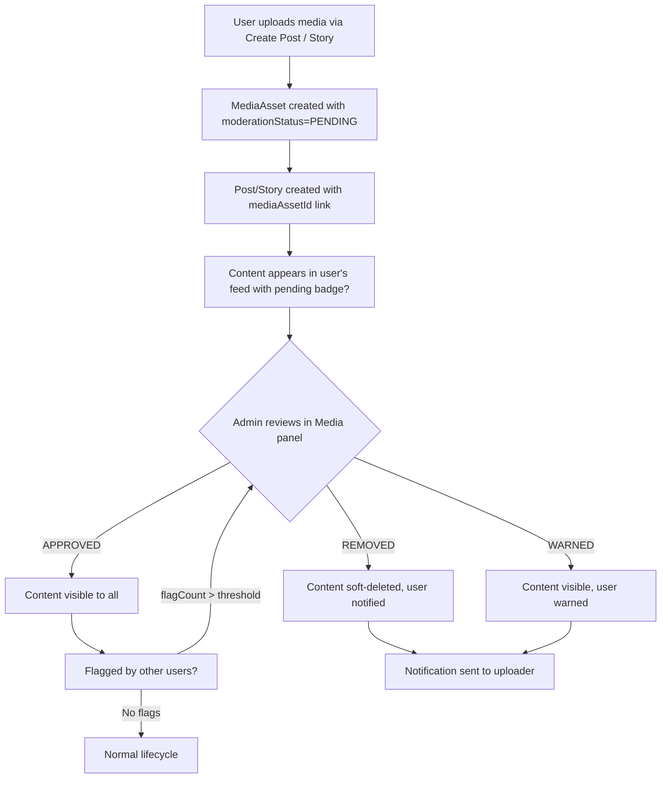
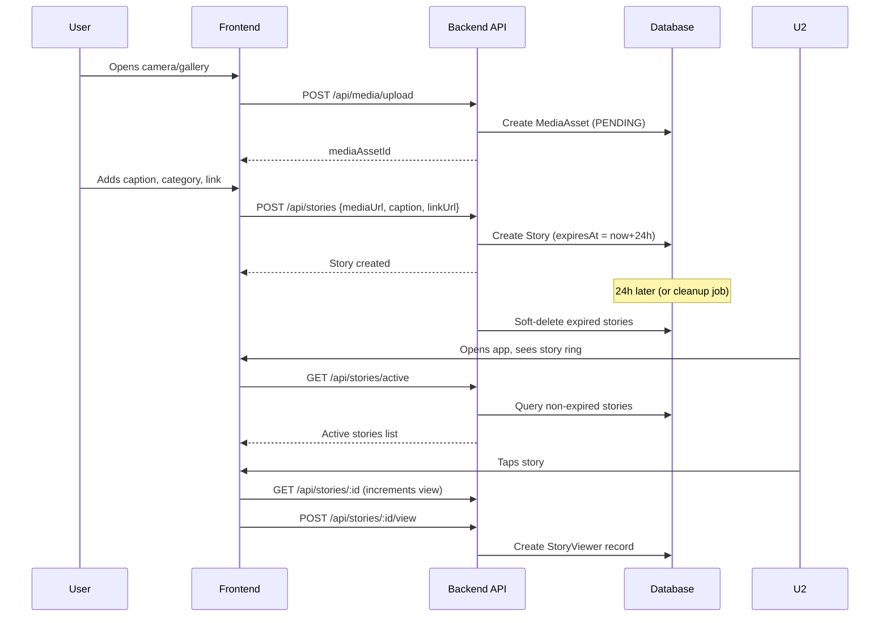
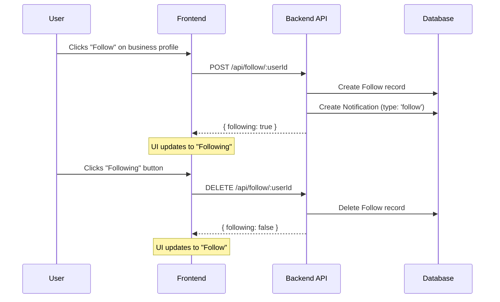
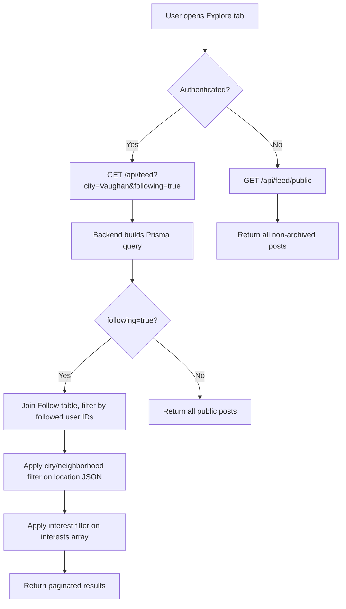

# Social Layer Features — Implementation Plan (P1)

## Overview

This plan covers the full social layer feature set for Neighborly: Stories, Follow/Unfollow, Feed Filtering, Content Creation, Content Moderation, and Explore-to-Business navigation.

---

## 1. Prisma Schema Changes

### 1.1 Story Model (new)

Add after the `PostComment` model (line ~734 in [`prisma/schema.prisma`](prisma/schema.prisma:734)):

```prisma
enum StoryVisibility {
  PUBLIC
  FOLLOWERS_ONLY
}

model Story {
  id           String          @id @default(cuid())
  authorId     String
  author       User            @relation(fields: [authorId], references: [id])
  mediaUrl     String
  thumbnailUrl String?
  caption      String?
  linkUrl      String?         // optional link to a service/business page
  linkLabel    String?         // e.g. "Book Now", "Learn More"
  visibility   StoryVisibility @default(PUBLIC)
  views        Int             @default(0)
  expiresAt    DateTime        // 24h from creation
  createdAt    DateTime        @default(now())
  archivedAt   DateTime?

  viewers      StoryViewer[]

  @@index([authorId])
  @@index([expiresAt])
  @@index([createdAt])
}

model StoryViewer {
  id        String   @id @default(cuid())
  storyId   String
  story     Story    @relation(fields: [storyId], references: [id], onDelete: Cascade)
  userId    String
  user      User     @relation(fields: [userId], references: [id])
  viewedAt  DateTime @default(now())

  @@unique([storyId, userId])
}
```

**Migration file:** [`prisma/migrations/20260526000000_add_story_models`](prisma/migrations/)

### 1.2 Follow Model (new)

Add after the `StoryViewer` model:

```prisma
model Follow {
  id          String   @id @default(cuid())
  followerId  String   // user who follows
  follower    User     @relation("FollowerRelation", fields: [followerId], references: [id])
  followingId String   // user being followed
  following   User     @relation("FollowingRelation", fields: [followingId], references: [id])
  createdAt   DateTime @default(now())

  @@unique([followerId, followingId])
  @@index([followerId])
  @@index([followingId])
}
```

### 1.3 User Model Updates

Add to [`User`](prisma/schema.prisma:139) model relations:

```prisma
// After line ~212 (mediaAssets relation)
followers           Follow[]    @relation("FollowingRelation")
following           Follow[]    @relation("FollowerRelation")
stories             Story[]
```

### 1.4 Post Model Updates

Add to [`Post`](prisma/schema.prisma:693) model:

```prisma
// Add category field for content creation flow
categoryId  String?
category    Category? @relation(fields: [categoryId], references: [id])
```

### 1.5 Notification Model Updates

Add new notification types to [`Notification`](prisma/schema.prisma:736):

```prisma
// type enum values to support: 'follow', 'story_like', 'story_comment', 'post_like', 'post_comment', 'new_follower'
// Already has: 'request', 'ticket', 'system', 'payment'
// Just add these as valid string values — no enum change needed
```

---

## 2. Backend API Endpoints

### 2.1 New Route File: [`routes/stories.ts`](routes/stories.ts)

| Method | Endpoint | Auth | Description |
|--------|----------|------|-------------|
| `POST` | `/api/stories` | Required | Create a story (24h expiry auto-set) |
| `GET` | `/api/stories/active` | Optional | Get active (non-expired) stories from followed users + public |
| `GET` | `/api/stories/:id` | Optional | Get single story + increment view |
| `GET` | `/api/stories/user/:userId` | Optional | Get active stories for a specific user |
| `DELETE` | `/api/stories/:id` | Required (owner) | Delete a story |
| `POST` | `/api/stories/:id/view` | Required | Mark story as viewed |

**Key logic:**
- `POST /api/stories` — accepts `mediaUrl`, `thumbnailUrl`, `caption`, `linkUrl`, `linkLabel`, `visibility`. Sets `expiresAt` to `now() + 24h`.
- `GET /api/stories/active` — returns stories where `expiresAt > now()` and `archivedAt IS NULL`. If authenticated, prioritize followed users' stories first.
- `GET /api/stories/:id` — increments `views` count on each fetch.
- A cleanup job (or scheduled task) can soft-delete expired stories by setting `archivedAt`.

### 2.2 New Route File: [`routes/follow.ts`](routes/follow.ts)

| Method | Endpoint | Auth | Description |
|--------|----------|------|-------------|
| `POST` | `/api/follow/:userId` | Required | Follow a user |
| `DELETE` | `/api/follow/:userId` | Required | Unfollow a user |
| `GET` | `/api/follow/:userId/followers` | Optional | Get followers of a user |
| `GET` | `/api/follow/:userId/following` | Optional | Get who a user is following |
| `GET` | `/api/follow/me/following` | Required | Get current user's following list |
| `GET` | `/api/follow/me/followers` | Required | Get current user's followers |
| `GET` | `/api/follow/status/:userId` | Required | Check if current user follows target user |

**Key logic:**
- `POST /api/follow/:userId` — creates a `Follow` record + creates a `Notification` of type `'follow'` for the target user.
- `DELETE /api/follow/:userId` — removes the `Follow` record.
- `GET /api/follow/:userId/followers` — paginated list of users following `:userId`.

### 2.3 Feed Filtering Updates: [`routes/feed.ts`](routes/feed.ts)

**Enhance `GET /api/feed` with query params:**

| Param | Type | Description |
|-------|------|-------------|
| `city` | string | Filter posts by city (from `Post.location` JSON field) |
| `neighborhood` | string | Filter posts by neighborhood |
| `interest` | string | Filter by interest tag |
| `categoryId` | string | Filter by category |
| `following` | boolean | If true, only show posts from followed users |

**Implementation:**
- Parse `location` JSON field to extract city/neighborhood for filtering.
- If `following=true`, join with `Follow` table to get posts from followed users.
- If `interest` provided, filter `Post.interests` array using `hasSome`.
- If `categoryId` provided, filter `Post.categoryId`.

### 2.4 Content Creation: [`routes/posts.ts`](routes/posts.ts) Updates

**Enhance `POST /api/posts` to support:**

| New Field | Type | Description |
|-----------|------|-------------|
| `categoryId` | string | Mandatory category selection |
| `mediaAssetId` | string | Link to uploaded MediaAsset for moderation |

**Add new endpoint:**

| Method | Endpoint | Auth | Description |
|--------|----------|------|-------------|
| `POST` | `/api/posts/upload-media` | Required | Upload media for a post (returns MediaAsset with moderationStatus) |

### 2.5 Content Moderation Queue (Admin)

**Existing routes in [`routes/adminMedia.ts`](routes/adminMedia.ts) already support:**
- `GET /api/admin/media` — list all media with moderation status
- `POST /api/admin/media/:id/moderate` — approve/remove/warn

**New admin endpoint needed:**

| Method | Endpoint | Auth | Description |
|--------|----------|------|-------------|
| `GET` | `/api/admin/content-queue` | Admin | Combined queue of pending posts + stories + media for moderation |

**Add to [`routes/admin.ts`](routes/admin.ts):**

```typescript
// GET /api/admin/content-queue — unified moderation queue
router.get('/content-queue', async (req: AuthRequest, res: Response) => {
  const [pendingMedia, flaggedPosts] = await Promise.all([
    prisma.mediaAsset.findMany({
      where: { moderationStatus: 'PENDING', archivedAt: null },
      include: { uploader: { select: { id: true, displayName: true } } },
      orderBy: { createdAt: 'desc' },
      take: 50,
    }),
    prisma.post.findMany({
      where: {
        archivedAt: null,
        mediaAsset: { moderationStatus: 'PENDING' },
      },
      include: {
        author: { select: { id: true, displayName: true } },
        mediaAsset: true,
      },
      orderBy: { createdAt: 'desc' },
      take: 50,
    }),
  ]);
  res.json({ pendingMedia, flaggedPosts });
});
```

### 2.6 Business Page Endpoint

| Method | Endpoint | Auth | Description |
|--------|----------|------|-------------|
| `GET` | `/api/companies/:id/profile` | Optional | Full business profile with posts, stories, services |

**Add to [`routes/companies.ts`](routes/companies.ts):**

```typescript
// GET /api/companies/:id/profile — business page with social content
router.get('/:id/profile', async (req, res: Response) => {
  const company = await prisma.company.findUnique({
    where: { id: req.params.id },
    include: {
      owner: { select: { id: true, displayName: true, avatarUrl: true } },
      posts: {
        where: { archivedAt: null },
        orderBy: { createdAt: 'desc' },
        take: 20,
      },
      _count: { select: { members: true } },
    },
  });
  // Also fetch active stories for this business
  const activeStories = await prisma.story.findMany({
    where: {
      authorId: company?.ownerId,
      expiresAt: { gt: new Date() },
      archivedAt: null,
    },
    orderBy: { createdAt: 'desc' },
  });
  res.json({ ...company, activeStories });
});
```

---

## 3. Frontend React Changes

### 3.1 Story Viewer Component (new)

**File:** [`frontend/src/components/social/StoryViewer.tsx`](frontend/src/components/social/StoryViewer.tsx)

- Fullscreen overlay component
- Swipe left/right to navigate between stories
- Auto-advance every 5 seconds
- Progress bar at top showing story position
- Tap left side → previous story, tap right side → next story
- Long press to pause
- Close button (X) or swipe down to dismiss
- Shows: author avatar + name, timestamp, caption, optional link button

**Props:**
```typescript
interface StoryViewerProps {
  stories: Story[]
  initialIndex?: number
  onClose: () => void
}
```

### 3.2 Stories Row Component (new)

**File:** [`frontend/src/components/social/StoriesRow.tsx`](frontend/src/components/social/StoriesRow.tsx)

- Horizontal scrollable row of story circles
- Each circle shows: user avatar with gradient ring (unseen) or gray ring (seen)
- "Add Story" button (current user's own story or + button to create)
- Click opens [`StoryViewer`](frontend/src/components/social/StoryViewer.tsx)

### 3.3 Explore Page Updates: [`frontend/src/pages/public/Explore.tsx`](frontend/src/pages/public/Explore.tsx)

**Changes:**
1. Replace hardcoded `STORIES` with dynamic data from `GET /api/stories/active`
2. Replace hardcoded post cards with dynamic data from `GET /api/feed`
3. Add follow/unfollow button on post author headers
4. Add feed filtering UI (city/neighborhood/interest dropdowns)
5. Click on post author → navigate to business profile page
6. Add "Create Post" FAB button

### 3.4 HomeScreen Updates: [`frontend/src/pages/public/HomeScreen.tsx`](frontend/src/pages/public/HomeScreen.tsx)

**Changes:**
1. Add Stories row below the header (from [`StoriesRow`](frontend/src/components/social/StoriesRow.tsx))
2. Add notification for new followers / story likes
3. Update notification panel to show follow notifications

### 3.5 Business Profile Page (new)

**File:** [`frontend/src/pages/public/BusinessProfile.tsx`](frontend/src/pages/public/BusinessProfile.tsx)

- Shows company logo, cover image, name, slogan, about
- Active stories row at top
- Posts feed from this business
- Follow/Unfollow button
- Link to order services from this business
- Staff list

### 3.6 Content Creation Page (new)

**File:** [`frontend/src/pages/public/CreatePost.tsx`](frontend/src/pages/public/CreatePost.tsx)

- Camera/gallery media picker
- Category selector (mandatory, from [`GET /api/categories`](routes/categories.ts))
- Caption text input
- Location picker (auto-detect or manual)
- Link to service (optional, searchable dropdown)
- Post button → calls `POST /api/posts`

### 3.7 Router Updates: [`frontend/src/app/router.tsx`](frontend/src/app/router.tsx)

Add routes:
- `/app/business/:id` → [`BusinessProfile`](frontend/src/pages/public/BusinessProfile.tsx)
- `/app/create-post` → [`CreatePost`](frontend/src/pages/public/CreatePost.tsx)

---

## 4. Flutter Widget Changes

### 4.1 Story Viewer Widget (new)

**File:** [`flutter_project/lib/widgets/story_viewer.dart`](flutter_project/lib/widgets/story_viewer.dart)

- Fullscreen overlay with `GestureDetector` for swipe navigation
- `AnimationController` for auto-advance progress bar
- Tap zones: left 1/3 = previous, right 1/3 = next, center = pause
- Close button or swipe down to dismiss
- Shows: author info, caption, link button

### 4.2 Stories Row Widget (new)

**File:** [`flutter_project/lib/widgets/stories_row.dart`](flutter_project/lib/widgets/stories_row.dart)

- Horizontal `ListView` of story circles
- Gradient ring for unseen, gray ring for seen
- "Add Story" button
- Tap opens [`StoryViewer`](flutter_project/lib/widgets/story_viewer.dart)

### 4.3 Social Screen Updates: [`flutter_project/lib/screens/social_screen.dart`](flutter_project/lib/screens/social_screen.dart)

**Changes:**
1. Replace hardcoded `_stories` with API data from `GET /api/stories/active`
2. Replace hardcoded `_buildPost1()` / `_buildPost2()` with dynamic feed from `GET /api/feed`
3. Add follow/unfollow on post author tap
4. Add feed filtering UI
5. Add "Create Post" FAB
6. Post author tap → navigate to business profile

### 4.4 Home Screen Updates: [`flutter_project/lib/screens/home_screen.dart`](flutter_project/lib/screens/home_screen.dart)

**Changes:**
1. Add [`StoriesRow`](flutter_project/lib/widgets/stories_row.dart) widget below the header
2. Update notification panel for social notifications

### 4.5 Business Profile Screen (new)

**File:** [`flutter_project/lib/screens/business_profile_screen.dart`](flutter_project/lib/screens/business_profile_screen.dart)

- Company header (logo, name, cover, about)
- Active stories row
- Posts feed
- Follow/Unfollow button
- "Order Service" CTA

### 4.6 Content Creation Screen (new)

**File:** [`flutter_project/lib/screens/create_post_screen.dart`](flutter_project/lib/screens/create_post_screen.dart)

- Camera/gallery picker (using `image_picker` package)
- Category dropdown (mandatory)
- Caption text field
- Location auto-detect
- Service link (optional)
- Post button

### 4.7 Flutter Router Updates

**File:** [`flutter_project/lib/main.dart`](flutter_project/lib/main.dart) (or router config)

Add routes:
- `/business-profile` → [`BusinessProfileScreen`](flutter_project/lib/screens/business_profile_screen.dart)
- `/create-post` → [`CreatePostScreen`](flutter_project/lib/screens/create_post_screen.dart)

---

## 5. Content Moderation Flow



**Existing infrastructure:**
- [`MediaAsset.moderationStatus`](prisma/schema.prisma:1005) enum: `PENDING | APPROVED | REMOVED | WARNED`
- [`routes/adminMedia.ts`](routes/adminMedia.ts) — full CRUD for media moderation
- [`frontend/admin/src/pages/Media.tsx`](frontend/admin/src/pages/Media.tsx) — admin UI for moderation

**What needs adding:**
1. Content queue endpoint combining pending posts + stories + media (see §2.5)
2. Admin SPA page update to show content queue with post/story context
3. Auto-flagging: if a post's linked media is REMOVED, auto-archive the post
4. User notification when their content is moderated

---

## 6. File-by-File Change List (Priority Order)

### Phase 1: Backend Foundation (P0)

| # | File | Action | Description |
|---|------|--------|-------------|
| 1 | [`prisma/schema.prisma`](prisma/schema.prisma) | Modify | Add `Story`, `StoryViewer`, `Follow` models; add `categoryId` to `Post`; add relations to `User` |
| 2 | [`prisma/migrations/20260526000000_add_social_models`](prisma/migrations/) | Create | Migration for new models |
| 3 | [`routes/stories.ts`](routes/stories.ts) | Create | Stories CRUD endpoints |
| 4 | [`routes/follow.ts`](routes/follow.ts) | Create | Follow/unfollow endpoints |
| 5 | [`routes/feed.ts`](routes/feed.ts) | Modify | Add city/neighborhood/interest/following filters |
| 6 | [`routes/posts.ts`](routes/posts.ts) | Modify | Add `categoryId` support, upload-media endpoint |
| 7 | [`routes/admin.ts`](routes/admin.ts) | Modify | Add `/admin/content-queue` endpoint |
| 8 | [`routes/companies.ts`](routes/companies.ts) | Modify | Add `/companies/:id/profile` endpoint |
| 9 | [`server.ts`](server.ts) | Modify | Mount `routes/stories.ts` and `routes/follow.ts` |

### Phase 2: React Frontend (P1)

| # | File | Action | Description |
|---|------|--------|-------------|
| 10 | [`frontend/src/components/social/StoryViewer.tsx`](frontend/src/components/social/StoryViewer.tsx) | Create | Fullscreen story viewer |
| 11 | [`frontend/src/components/social/StoriesRow.tsx`](frontend/src/components/social/StoriesRow.tsx) | Create | Stories row component |
| 12 | [`frontend/src/pages/public/Explore.tsx`](frontend/src/pages/public/Explore.tsx) | Modify | Dynamic stories + posts, follow button, filters |
| 13 | [`frontend/src/pages/public/HomeScreen.tsx`](frontend/src/pages/public/HomeScreen.tsx) | Modify | Add stories row, social notifications |
| 14 | [`frontend/src/pages/public/BusinessProfile.tsx`](frontend/src/pages/public/BusinessProfile.tsx) | Create | Business profile page |
| 15 | [`frontend/src/pages/public/CreatePost.tsx`](frontend/src/pages/public/CreatePost.tsx) | Create | Content creation page |
| 16 | [`frontend/src/app/router.tsx`](frontend/src/app/router.tsx) | Modify | Add business profile + create post routes |

### Phase 3: Flutter Frontend (P1)

| # | File | Action | Description |
|---|------|--------|-------------|
| 17 | [`flutter_project/lib/widgets/story_viewer.dart`](flutter_project/lib/widgets/story_viewer.dart) | Create | Fullscreen story viewer |
| 18 | [`flutter_project/lib/widgets/stories_row.dart`](flutter_project/lib/widgets/stories_row.dart) | Create | Stories row widget |
| 19 | [`flutter_project/lib/screens/social_screen.dart`](flutter_project/lib/screens/social_screen.dart) | Modify | Dynamic stories + posts, follow, filters |
| 20 | [`flutter_project/lib/screens/home_screen.dart`](flutter_project/lib/screens/home_screen.dart) | Modify | Add stories row, social notifications |
| 21 | [`flutter_project/lib/screens/business_profile_screen.dart`](flutter_project/lib/screens/business_profile_screen.dart) | Create | Business profile screen |
| 22 | [`flutter_project/lib/screens/create_post_screen.dart`](flutter_project/lib/screens/create_post_screen.dart) | Create | Content creation screen |
| 23 | [`flutter_project/lib/main.dart`](flutter_project/lib/main.dart) | Modify | Add new routes |

### Phase 4: Admin & Polish (P2)

| # | File | Action | Description |
|---|------|--------|-------------|
| 24 | [`frontend/admin/src/pages/Media.tsx`](frontend/admin/src/pages/Media.tsx) | Modify | Add content queue tab showing pending posts + stories |
| 25 | [`routes/notifications.ts`](routes/notifications.ts) | Modify | Add social notification types (follow, story_like, etc.) |
| 26 | [`frontend/src/store/socialStore.ts`](frontend/src/store/socialStore.ts) | Create | Zustand store for social state (stories, feed, follows) |
| 27 | [`flutter_project/lib/services/api_service.dart`](flutter_project/lib/services/api_service.dart) | Modify | Add story/follow API methods |

---

## 7. Data Flow Diagrams

### 7.1 Story Lifecycle



### 7.2 Follow/Unfollow Flow



### 7.3 Feed Filtering Flow



---

## 8. Key Design Decisions

1. **Stories are NOT linked to MediaAsset for moderation** — Stories have their own `mediaUrl` field. This simplifies the story creation flow. Moderation of story content can be added later via a separate `Story.moderationStatus` field if needed.

2. **Follow model is unidirectional** — No "friendship" concept. User A follows User B is independent of User B following User A. This matches Instagram/Twitter model.

3. **Feed filtering is query-param based** — No separate filtered feed endpoint. The existing `GET /api/feed` is enhanced with optional query params. This keeps the API surface small.

4. **Category on posts is mandatory** — This enables content discovery and feeds into the recommendation engine. Uses existing [`Category`](prisma/schema.prisma:601) model.

5. **Story expiry is handled by query filter** — `GET /api/stories/active` filters `WHERE expiresAt > NOW()`. A background cleanup job can soft-delete expired stories, but the query filter is the source of truth.

6. **Admin moderation queue is additive** — The existing [`adminMedia.ts`](routes/adminMedia.ts) routes are untouched. A new `/admin/content-queue` endpoint aggregates pending content from multiple sources.

---

## 9. Verification Checklist

After implementation, verify:

- [ ] `POST /api/stories` creates a story with 24h expiry
- [ ] `GET /api/stories/active` only returns non-expired stories
- [ ] Story viewer opens fullscreen with swipe navigation
- [ ] `POST /api/follow/:userId` creates follow + notification
- [ ] `DELETE /api/follow/:userId` removes follow
- [ ] Feed filtering by city/neighborhood/interest works
- [ ] Feed filtering by `following=true` works
- [ ] Content creation flow: pick media → select category → add caption → post
- [ ] Explore profile tap navigates to business page
- [ ] Admin content queue shows pending media + flagged posts
- [ ] Admin can approve/remove/warn content
- [ ] Both React and Flutter implementations are visually consistent
