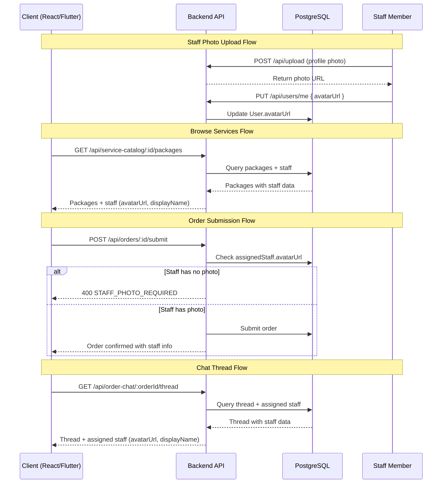

# Staff Identity Display Feature — Implementation Plan

## Overview

Enforce profile photo requirement for staff performing in-person services (KYC Level 0) and display staff identity (photo + name) across the platform: service cards, order confirmation, and chat threads.

---

## 1. Prisma Schema Changes

### 1.1 Add `assignedStaffId` to [`Order`](prisma/schema.prisma:400)

Add an optional relation from `Order` → `User` (staff) so each order can track which specific staff member is assigned.

```prisma
model Order {
  // ... existing fields ...
  assignedStaffId   String?
  assignedStaff     User?     @relation("OrderAssignedStaff", fields: [assignedStaffId], references: [id])
}
```

Also add the reverse relation on [`User`](prisma/schema.prisma:139):

```prisma
model User {
  // ... existing fields ...
  ordersAsAssignedStaff Order[] @relation("OrderAssignedStaff")
}
```

**Migration needed:** `npx prisma migrate dev --name add_assigned_staff_to_order`

### 1.2 Add `photoRequired` to [`ProviderServicePackage`](prisma/schema.prisma:299)

Add a flag to indicate whether a package requires staff photo verification:

```prisma
model ProviderServicePackage {
  // ... existing fields ...
  photoRequired Boolean @default(true)
}
```

**Migration needed:** `npx prisma migrate dev --name add_photo_required_to_package`

### 1.3 No changes to `CompanyUser`, `User`, or `Schedule` models

The existing models already support:
- [`User.avatarUrl`](prisma/schema.prisma:169) — profile photo
- [`CompanyUser`](prisma/schema.prisma:259) — links staff to company
- [`Schedule`](prisma/schema.prisma:660) — links `staffId` to `User`

---

## 2. Backend API Changes

### 2.1 New Endpoint: `GET /api/companies/:id/staff` — List company staff with profile photos

**File:** [`routes/companies.ts`](routes/companies.ts)

Add a new route that returns all staff members of a company with their profile details, including `avatarUrl` and KYC Level 0 status.

```typescript
// GET /api/companies/:id/staff
router.get('/:id/staff', authenticate, async (req: AuthRequest, res: Response) => {
  const members = await prisma.companyUser.findMany({
    where: { companyId: req.params.id },
    include: {
      user: {
        select: {
          id: true,
          displayName: true,
          firstName: true,
          lastName: true,
          avatarUrl: true,
          kycLevel0Profile: { select: { id: true } },
        },
      },
    },
  });
  res.json(members.map(m => ({
    id: m.user.id,
    displayName: m.user.displayName,
    firstName: m.user.firstName,
    lastName: m.user.lastName,
    avatarUrl: m.user.avatarUrl,
    role: m.role,
    hasProfilePhoto: !!m.user.avatarUrl,
    kycLevel0Complete: !!m.user.kycLevel0Profile,
  })));
});
```

### 2.2 Modify `POST /api/orders/draft/:id/submit` — Validate staff photo before booking

**File:** [`routes/orders.ts`](routes/orders.ts) — [`runSubmitDraftOrderFlow()`](routes/orders.ts:235)

Add validation logic in the submit flow:

1. If the order has an `assignedStaffId`, verify that staff member has `avatarUrl` set.
2. If the matched package has `photoRequired: true`, reject the submission if the assigned staff has no photo.

Add this check after line ~350 (before the transaction):

```typescript
// Staff photo validation
if (order.assignedStaffId) {
  const staff = await prisma.user.findUnique({
    where: { id: order.assignedStaffId },
    select: { avatarUrl: true },
  });
  if (!staff?.avatarUrl) {
    res.status(400).json({
      error: 'Assigned staff member must have a profile photo before booking.',
      code: 'STAFF_PHOTO_REQUIRED',
    });
    return;
  }
}
```

### 2.3 Modify `POST /api/orders/:id/submit` (F5 wizard) — Same staff photo validation

**File:** [`routes/orders.ts`](routes/orders.ts:691)

Add the same staff photo validation in the F5 wizard submit flow, after the package validation (around line ~745).

### 2.4 Modify `GET /api/orders/me` — Include assigned staff in order response

**File:** [`routes/orders.ts`](routes/orders.ts:816)

Update the `include` in the [`GET /me`](routes/orders.ts:837-847) query to also include `assignedStaff`:

```typescript
include: {
  // ... existing includes ...
  assignedStaff: {
    select: { id: true, displayName: true, firstName: true, lastName: true, avatarUrl: true },
  },
},
```

Also update the [`orderToCustomerJson()`](routes/orders.ts:148) function to include `assignedStaff` in the response shape.

### 2.5 Modify `GET /api/orders/provider/me` — Same include for provider pipeline

**File:** [`routes/orders.ts`](routes/orders.ts:918)

Update the provider pipeline query to include `assignedStaff` in the same way.

### 2.6 Modify `GET /api/service-catalog/:id/packages` — Include staff info

**File:** [`routes/serviceCatalog.ts`](routes/serviceCatalog.ts:106)

When returning packages, include the provider's staff members who can perform the service. Add an optional `staff` array to each package response:

```typescript
// After fetching packages, for each package, get the workspace staff
const workspaceId = packages[0]?.workspaceId; // or from context
const staff = workspaceId ? await prisma.companyUser.findMany({
  where: { companyId: workspaceId, role: { in: ['staff', 'member'] } },
  include: {
    user: { select: { id: true, displayName: true, avatarUrl: true } },
  },
}) : [];
```

Add `staff` to the response shape in the map function (around line 131).

### 2.7 Modify `GET /api/order-chat/:orderId/thread` — Include staff info in thread

**File:** [`routes/orderChat.ts`](routes/orderChat.ts:154)

Update the thread response to include the assigned staff member's info alongside the provider info. In the [`ensureThread()`](routes/orderChat.ts:85) function, after resolving the thread, fetch the assigned staff:

```typescript
const assignedStaff = order.assignedStaffId
  ? await prisma.user.findUnique({
      where: { id: order.assignedStaffId },
      select: { id: true, displayName: true, avatarUrl: true },
    })
  : null;
```

Include `assignedStaff` in the thread response.

### 2.8 New Endpoint: `PUT /api/orders/:id/assign-staff` — Assign staff to order

**File:** [`routes/orders.ts`](routes/orders.ts)

Add a new authenticated endpoint for providers/workspace admins to assign a staff member to an order:

```typescript
// PUT /api/orders/:id/assign-staff
router.put('/:id/assign-staff', authenticate, async (req: AuthRequest, res: Response) => {
  const { staffId } = req.body;
  // Validate: user must be workspace member
  // Validate: staffId must be a member of the same workspace
  // Validate: staff must have avatarUrl
  // Update order.assignedStaffId
});
```

---

## 3. Frontend React Changes

### 3.1 [`ServiceDetail.tsx`](frontend/src/pages/public/ServiceDetail.tsx) — Show staff on service cards

Add a "Staff" section to each package card showing the available staff members with their photos and names.

**Changes:**
- After the package description (around line 176), add a staff avatar row:
```tsx
<div style={{ display: 'flex', gap: 8, marginTop: 8, alignItems: 'center' }}>
  <div style={{ display: 'flex' }}>
    {staffMembers.slice(0, 3).map((s) => (
      
    ))}
  </div>
  <span style={{ fontSize: 11, color: 'var(--text3)' }}>
    {staffMembers.length > 3
      ? `${staffMembers.slice(0, 3).map(s => s.firstName).join(', ')} +${staffMembers.length - 3} more`
      : staffMembers.map(s => s.firstName).join(', ')}
  </span>
</div>
```

### 3.2 [`Activity.tsx`](frontend/src/pages/customer/Activity.tsx) — Show staff on order confirmation

Update the activity items to show staff info when an order is confirmed. This requires the activity feed to include order data with assigned staff.

**Changes:**
- When rendering an order confirmation activity item, show the assigned staff's avatar and name alongside the provider name.

### 3.3 [`BusinessDashboard.tsx`](frontend/src/pages/business/BusinessDashboard.tsx) — Staff management section

Add a "Staff" section to the business dashboard menu that links to staff management (photo upload, assignment).

**Changes:**
- Add a "Staff & Photos" menu item (around line 23-33)
- When clicked, show a staff list with photo status indicators (green checkmark if photo exists, red warning if missing)

---

## 4. Flutter Changes

### 4.1 [`dashboard_screen.dart`](flutter_project/lib/screens/dashboard_screen.dart) — Staff management UI

Add a staff management section accessible from the dashboard menu.

**Changes:**
- Add "Staff & Photos" to the `_menuItems` list (around line 50-60)
- Create a new screen or bottom sheet showing staff members with:
  - Avatar thumbnail
  - Name
  - Role
  - Photo status badge (verified/missing)
  - "Upload Photo" button for staff without photos

### 4.2 [`home_screen.dart`](flutter_project/lib/screens/home_screen.dart) — Show staff on service cards

When browsing services on the home screen, show staff avatars on service provider cards.

**Changes:**
- In the service card widget, add a staff avatar row similar to the React implementation
- Fetch staff data from `GET /api/companies/:id/staff`

### 4.3 [`activity_screen.dart`](flutter_project/lib/screens/activity_screen.dart) — Show staff on order items

Update activity items to display assigned staff info when an order is confirmed.

**Changes:**
- When rendering order-related activity items, include the assigned staff's avatar and name

---

## 5. Validation Logic for Photo Enforcement

### 5.1 Backend Validation Flow

```
Order Submit Flow:
1. Client submits order (with or without assignedStaffId)
2. Backend checks if assignedStaffId is set
3. If set → verify staff.avatarUrl is not null/empty
4. If no avatarUrl → return 400 with code STAFF_PHOTO_REQUIRED
5. If package.photoRequired is true AND no assignedStaffId → return 400 with code STAFF_ASSIGNMENT_REQUIRED
6. If all valid → proceed with order submission
```

### 5.2 KYC Level 0 Integration

The [`KycLevel0Profile`](prisma/schema.prisma:786) model already exists and tracks:
- `emailVerifiedAt`
- `phoneVerifiedAt`
- `addressVerifiedAt`
- `adminAcknowledgedAt`

**Photo enforcement at KYC Level 0:**
- When a staff member completes KYC Level 0, require `avatarUrl` on the [`User`](prisma/schema.prisma:139) model
- Add a validation in the KYC submission flow that checks `avatarUrl` is set before allowing Level 0 approval
- This can be done in [`routes/kyc.ts`](routes/kyc.ts) or [`routes/kycUser.ts`](routes/kycUser.ts)

### 5.3 Staff Photo Upload Endpoint

**File:** [`routes/upload.ts`](routes/upload.ts)

The existing upload endpoint can be used. Staff members upload their profile photo via:
```
POST /api/upload
→ returns URL
→ client calls PUT /api/users/me with { avatarUrl: "<uploaded-url>" }
```

---

## 6. File-by-File Change List

| # | File | Change Type | Description |
|---|------|-------------|-------------|
| 1 | [`prisma/schema.prisma`](prisma/schema.prisma) | **Modify** | Add `assignedStaffId` to `Order` model, add reverse relation on `User`, add `photoRequired` to `ProviderServicePackage` |
| 2 | `prisma/migrations/` | **New** | Migration for schema changes |
| 3 | [`routes/companies.ts`](routes/companies.ts) | **New route** | `GET /api/companies/:id/staff` — list staff with photos |
| 4 | [`routes/orders.ts`](routes/orders.ts) | **Modify** | Add staff photo validation in `runSubmitDraftOrderFlow()` (~line 350) |
| 5 | [`routes/orders.ts`](routes/orders.ts) | **Modify** | Add staff photo validation in F5 wizard submit (~line 745) |
| 6 | [`routes/orders.ts`](routes/orders.ts) | **Modify** | Include `assignedStaff` in `GET /me` and `GET /provider/me` queries |
| 7 | [`routes/orders.ts`](routes/orders.ts) | **Modify** | Include `assignedStaff` in `orderToCustomerJson()` response |
| 8 | [`routes/orders.ts`](routes/orders.ts) | **New route** | `PUT /api/orders/:id/assign-staff` |
| 9 | [`routes/serviceCatalog.ts`](routes/serviceCatalog.ts) | **Modify** | Include staff info in `GET /:id/packages` response |
| 10 | [`routes/orderChat.ts`](routes/orderChat.ts) | **Modify** | Include assigned staff info in thread response |
| 11 | [`routes/kyc.ts`](routes/kyc.ts) or [`routes/kycUser.ts`](routes/kycUser.ts) | **Modify** | Validate `avatarUrl` before KYC Level 0 approval |
| 12 | [`frontend/src/pages/public/ServiceDetail.tsx`](frontend/src/pages/public/ServiceDetail.tsx) | **Modify** | Add staff avatar row to package cards |
| 13 | [`frontend/src/pages/customer/Activity.tsx`](frontend/src/pages/customer/Activity.tsx) | **Modify** | Show assigned staff on order confirmation items |
| 14 | [`frontend/src/pages/business/BusinessDashboard.tsx`](frontend/src/pages/business/BusinessDashboard.tsx) | **Modify** | Add "Staff & Photos" menu item and staff list view |
| 15 | [`flutter_project/lib/screens/dashboard_screen.dart`](flutter_project/lib/screens/dashboard_screen.dart) | **Modify** | Add staff management section |
| 16 | [`flutter_project/lib/screens/home_screen.dart`](flutter_project/lib/screens/home_screen.dart) | **Modify** | Show staff avatars on service cards |
| 17 | [`flutter_project/lib/screens/activity_screen.dart`](flutter_project/lib/screens/activity_screen.dart) | **Modify** | Show assigned staff on order items |

---

## 7. Implementation Order

1. **Prisma schema** — Add `assignedStaffId` and `photoRequired` fields, run migration
2. **Backend: Staff list endpoint** — `GET /api/companies/:id/staff`
3. **Backend: Order validation** — Staff photo check in submit flows
4. **Backend: Order response** — Include `assignedStaff` in order queries
5. **Backend: Assign staff endpoint** — `PUT /api/orders/:id/assign-staff`
6. **Backend: Service catalog** — Include staff in package response
7. **Backend: Chat thread** — Include staff in thread response
8. **Backend: KYC validation** — Avatar URL check for Level 0
9. **Frontend: ServiceDetail** — Staff avatars on package cards
10. **Frontend: Activity** — Staff display on order items
11. **Frontend: BusinessDashboard** — Staff management UI
12. **Flutter: Dashboard** — Staff management section
13. **Flutter: Home** — Staff avatars on service cards
14. **Flutter: Activity** — Staff display on order items

---

## 8. Architecture Diagram



---

## 9. Edge Cases & Considerations

1. **Staff without photos at booking time** — The validation in the submit flow prevents booking. The provider must assign a different staff member or the staff must upload a photo first.

2. **Staff leaves company** — When a `CompanyUser` record is deleted, any orders with that `assignedStaffId` should be handled. Consider adding a `ON DELETE SET NULL` behavior or a pre-deletion check.

3. **Multiple staff per order** — The current design assigns one staff per order. If multiple staff are needed, a `OrderStaff` join table would be required instead of a single `assignedStaffId`.

4. **Default avatar** — Both React and Flutter should handle null `avatarUrl` gracefully by showing a default avatar (initials or placeholder icon).

5. **Photo re-upload** — Staff can update their photo at any time via the existing upload endpoint. The validation only checks at booking time, so a photo uploaded after booking doesn't affect existing orders.
