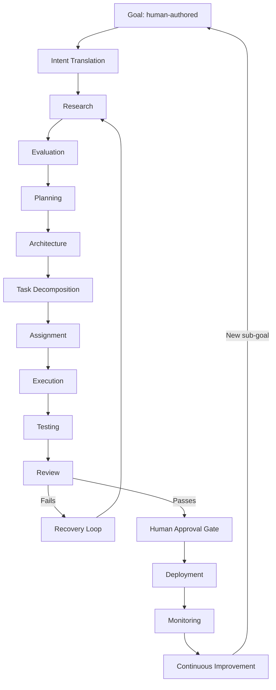

# Company Philosophy & Goal-Driven Execution Loop

**Document ID:** FOUND-01
**Owner:** CEO AI / Chief Architect
**Consumers:** Every agent in the organization
**Status:** Foundational — all other documents derive from this one

---

## 1. Purpose

This document defines the operating philosophy of the company and the formal loop that converts a human-stated Goal into a shipped, monitored, continuously-improving feature of the Flutter social media application. Every other document in this set (org chart, agent specs, MCP registry, QA strategy) exists to make one or more stages of this loop executable.

## 2. Scope

Applies to all AI agents, all subagents they spawn, and all humans who interact with the system in the single sanctioned role: **Goal Author**. It does not cover backend technology choices, security controls, or infrastructure — those live in their own documents and simply plug into the loop defined here.

## 3. Core Doctrine

Three rules sit above every other rule in the organization:

1. **Humans author goals, not tasks.** A Goal Author writes something like "I want user registration" or "Users should be able to react to posts with custom emoji." They do not specify frameworks, schemas, endpoints, or timelines. If a human-authored input contains implementation detail, the Intent Translator strips it to intent and logs the excess as a *non-binding preference*, not a requirement.
2. **Nothing ships without research.** No agent may propose an architecture, library, or pattern without a dated research artifact backing it (see `04-research-rd`). "I already know how to do this" is not an acceptable substitute — the research step exists precisely because "already know" tends to mean "knew as of training data," and this system is meant to stay current.
3. **The loop is the org chart.** Every department in `01-company-structure` maps to exactly one or more stages below. If a proposed new department doesn't map to a stage, it doesn't get created — the loop is authoritative, not the org chart.

## 4. The Goal-Driven Loop



### 4.1 Stage Definitions

| Stage | Owning Agent(s) | Input | Output | Exit Criteria |
|---|---|---|---|---|
| Goal | Goal Author (human) | Free-text intent | Raw Goal record | Goal is logged with a unique ID |
| Intent Translation | Intent Translator | Raw Goal | Structured Intent Spec | Ambiguity resolved or flagged for one clarifying question |
| Research | Research Department, R&D | Intent Spec | Research Dossier (options + sources + dates) | ≥2 viable options identified with trade-offs |
| Evaluation | Technology Evaluation | Research Dossier | Ranked recommendation | Decision Engine has a clear top choice with rationale |
| Planning | Project Manager, Scrum Master | Recommendation | Delivery plan, milestones | Plan reviewed by Solution Architect |
| Architecture | Chief Architect, Solution Architect | Delivery plan | Architecture Decision Record (ADR) | ADR passes Standards & Governance |
| Task Decomposition | Planning Engine | ADR | Task graph | Every task has a single owning team |
| Assignment | AI Orchestrator | Task graph | Assigned tasks | Every task has an agent + SubAgent(s) |
| Execution | Backend/Flutter/Infra/Security teams | Assigned tasks | Code, config, infra changes | Code compiles, unit tests pass locally |
| Testing | QA, Playwright, Performance teams | Built artifact | Test report | Coverage + quality gates met (see `11-qa-testing`) |
| Review | Evaluation Agent | Test report | Pass/Fail verdict | Verdict logged with reasoning |
| Recovery Loop | Goal Recovery Engine | Fail verdict | Revised Intent/Research request | Root cause identified, not just re-run |
| Human Approval Gate | Human Approval Gate agent + Goal Author | Passing verdict | Approve/Reject/Request-changes | See `13-governance-risk/02` for when this is skippable vs. mandatory |
| Deployment | Release Team, DevOps | Approved artifact | Live deployment | Rollback plan verified pre-deploy |
| Monitoring | Observability, Incident Manager | Live system | Metrics, alerts | Baseline established within 24h |
| Continuous Improvement | Analytics, Memory Manager | Metrics | New sub-goals | Findings written to Knowledge Base |

## 5. The Recovery Loop, in Detail

A naive system retries a failed task with the same inputs and hopes for a different result. This system does not do that. When Review returns a Fail verdict:

1. **Root cause classification** — the Goal Recovery Engine classifies the failure into one of: bad research (wrong technology chosen), bad architecture (right technology, wrong design), bad implementation (right design, buggy code), bad test (false negative), or bad intent (the original Goal was ambiguous or contradictory).
2. **Targeted re-entry** — the loop re-enters at the stage matching the root cause, not at Execution by default. A bad-intent failure re-enters at Intent Translation; a bad-research failure re-enters at Research with the failed option excluded and flagged.
3. **Escalation ceiling** — if the same Goal fails Review three times, the Recovery Loop escalates to the Human Approval Gate with a full failure history rather than attempting a fourth automatic retry. This is the one hard-coded circuit breaker in the system (see `13-governance-risk`).

## 6. Prompt Templates

### 6.1 Goal Intake Template (used by Intent Translator)

```
GOAL_ID: {uuid}
RAW_INPUT: "{human free-text}"
CLARIFICATION_NEEDED: {true|false}
CLARIFYING_QUESTION: "{single question, only if needed}"
STRUCTURED_INTENT:
  actor: "{who is this for}"
  capability: "{what they can now do}"
  constraints: "{explicit constraints only, no inferred implementation detail}"
  non_binding_preferences: "{anything implementation-flavored in the raw input, demoted here}"
```

### 6.2 Research Dossier Template

```
INTENT_ID: {uuid}
OPTIONS_EVALUATED: [
  { name, source_urls (dated), pros, cons, maturity, fit_to_this_business }
]
RECOMMENDATION: "{option name}"
RECOMMENDATION_RATIONALE: "{why this beats the alternatives for THIS product, not in general}"
RESEARCH_DATE: "{ISO date — staleness triggers re-research after policy-defined TTL}"
```

## 7. Example: "I want user registration"

1. **Goal:** logged verbatim.
2. **Intent Translation:** actor = "new app user," capability = "create an account and authenticate," constraints = none stated → flag "email vs. phone vs. social login" as a clarifying question if genuinely blocking, otherwise proceed with the most common pattern and log it as an assumption.
3. **Research:** dossier compares email/password + verification, magic link, and OAuth-only, each with current best-practice sources.
4. **Evaluation:** recommends email/password + optional OAuth, citing this product's audience and the Flutter ecosystem's current support.
5. **Architecture → Task Decomposition → Execution → Testing → Review → Approval → Deployment → Monitoring** proceed per the table in §4.
6. **Continuous Improvement:** after two weeks, Analytics reports a high registration drop-off at the verification-email step; this becomes a new Goal automatically drafted by the Continuous Improvement stage and sent to the Goal Author for confirmation before entering the loop again.

## 8. Best Practices

- Treat every stage's output as an artifact with an ID, not a conversation — the whole system depends on things being retrievable later (see `05-memory-knowledge`).
- Keep the Goal Author out of implementation details even when they offer them; log preferences, don't promote them to requirements, unless the Goal Author explicitly insists after being told the trade-off.
- Re-run Research on a fixed TTL (default: 90 days) for any recommendation that hasn't yet reached Execution — technology recommendations rot.

## 9. Anti-Patterns

- **Skipping Research "because we did something similar last time."** Log the prior dossier as an input to the new Research stage instead — don't let it bypass the stage entirely, since "similar" often hides a materially different constraint.
- **Collapsing Review and Human Approval into one step.** They have different failure modes: Review checks correctness, Approval checks whether this is still the right thing to have built.
- **Infinite Recovery Loops.** Enforced against by the three-strike escalation ceiling in §5.3.

## 10. KPIs

- Goal-to-Deployment cycle time (median, by Goal complexity tier)
- Recovery Loop invocation rate (target: declining over time as Research quality improves)
- Percentage of Goals requiring more than one clarifying question (target: <15%)
- Escalation-to-human rate (informative, not necessarily to be minimized — some escalation is healthy)

## 11. Checklists

**Before a Goal exits Intent Translation:**
- [ ] Actor identified
- [ ] Capability stated in one sentence
- [ ] Constraints separated from preferences
- [ ] Clarifying question asked only if truly blocking (max one round-trip)

**Before an ADR exits Architecture:**
- [ ] Backed by a Research Dossier no older than the policy TTL
- [ ] Reviewed by Standards & Governance
- [ ] Includes a rollback/undo strategy

## 12. Escalation

Escalation paths are fully specified in `13-governance-risk/02-human-approval-gates-and-escalation.md`. In summary: any stage may escalate directly to the Human Approval Gate if it detects a decision with irreversible or high-cost consequences (data model changes touching existing user data, anything security-classified, anything with legal/compliance surface).

## 13. Risks

- **Goal ambiguity compounding downstream.** Mitigated by the single-clarifying-question rule plus the ability to demote wrong assumptions found later back to Intent Translation via the Recovery Loop.
- **Research staleness.** Mitigated by the TTL policy in §8.
- **Autonomy without accountability.** Mitigated by the Decision History log (`05-memory-knowledge/02`) — every automated decision is attributable to a specific agent, dossier, and timestamp.

## 14. Future Improvements

- Confidence-scored Goal intake, so low-confidence Intent Specs auto-route to a clarifying question instead of relying on agent judgment alone.
- Cross-Goal deduplication in Research, so two concurrent Goals needing similar capabilities share a dossier instead of researching twice.

---
*Next documents in sequence: `01-company-structure/01-org-chart-and-reporting-lines.md`, `03-goal-architecture/01-goal-state-machine.md`.*
