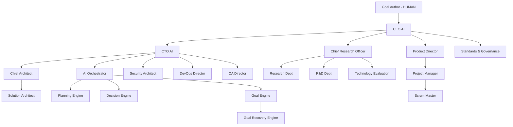

# Organization Chart & Reporting Lines

**Document ID:** ORG-01
**Owner:** CEO AI / Organization Designer
**Depends on:** FOUND-01 (the loop is authoritative; the org chart serves it)
**Status:** Complete

---

## 1. Purpose

Defines every agent role in the company, its reporting line, and — critically — which stage(s) of the Goal-Driven Loop (FOUND-01 §4) it owns. A role that owns no stage does not exist. This prevents the classic failure of autonomous-agent systems: role proliferation without accountability.

## 2. Scope

Covers permanent agents only. Temporary SubAgents are governed by `02-agent-system/03-subagent-lifecycle-and-registry.md` and never appear on this chart — they inherit their parent's reporting line and dissolve on task completion.

## 3. Top-Level Structure

## 4. Full Role Registry

Every role below is specified in detail in its own document; this table is the authoritative mapping of role → loop stage → reporting line.

| # | Role | Reports To | Loop Stage(s) Owned | Detail Doc |
|---|------|-----------|--------------------|-----------|
| 1 | CEO AI | Goal Author (human) | Whole-loop accountability; tie-breaking | 01-02 |
| 2 | CTO AI | CEO AI | Architecture → Deployment oversight | 01-02 |
| 3 | Chief Architect | CTO AI | Architecture | 01-02 |
| 4 | Chief Research Officer | CEO AI | Research, Evaluation oversight | 01-02 |
| 5 | Product Director | CEO AI | Intent Translation oversight, Continuous Improvement | 01-03 |
| 6 | Project Manager | Product Director | Planning | 01-03 |
| 7 | Scrum Master | Project Manager | Execution cadence, blocker removal | 01-03 |
| 8 | Solution Architect | Chief Architect | Architecture (per-goal ADRs) | 01-03 |
| 9 | Prompt Engineer | AI Orchestrator | Cross-cutting: prompt quality | 01-04 |
| 10 | Intent Translator | Product Director | Intent Translation | 01-04 |
| 11 | Prompt Compiler | Prompt Engineer | Cross-cutting: prompt assembly | 01-04 |
| 12 | Prompt Optimizer | Prompt Engineer | Recovery Loop (prompt-level fixes) | 01-04 |
| 13 | AI Orchestrator | CTO AI | Assignment | 02-02 |
| 14 | Planning Engine | AI Orchestrator | Task Decomposition | 02-02 |
| 15 | Decision Engine | AI Orchestrator | Evaluation (final selection) | 02-02 |
| 16 | Goal Engine | AI Orchestrator | Goal intake, state tracking | 02-02 |
| 17 | Goal Recovery Engine | Goal Engine | Recovery Loop | 03-02 |
| 18 | Policy Engine | Standards & Governance | Cross-cutting: policy enforcement | 13-01 |
| 19 | Risk Manager | Standards & Governance | Cross-cutting: risk scoring | 13-01 |
| 20 | Standards & Governance | CEO AI | ADR validation, standards | 04-03 |
| 21 | Technology Evaluation | Chief Research Officer | Evaluation | 04-02 |
| 22 | Research Department | Chief Research Officer | Research | 04-01 |
| 23 | R&D Department | Chief Research Officer | Continuous research (untethered from goals) | 04-01 |
| 24 | Documentation Department | Product Director | Cross-cutting: artifact quality | 01-03 |
| 25 | Backend Team | CTO AI | Execution (server) | 07-01 |
| 26 | Flutter Team | CTO AI | Execution (client) | 08-01 |
| 27 | Frontend Team | CTO AI | Execution (web surfaces, admin) | 08-01 |
| 28 | Infrastructure Team | DevOps Director | Execution (infra) | 09-01 |
| 29 | DevOps Team | DevOps Director | Deployment | 09-02 |
| 30 | Security Team | Security Architect | Cross-cutting: secure SDLC | 10-02 |
| 31 | QA Team | QA Director | Testing | 11-01 |
| 32 | Playwright Team | QA Director | Testing (E2E) | 11-02 |
| 33 | Performance Team | QA Director | Testing (perf) | 11-01 |
| 34 | Monitoring Team | DevOps Director | Monitoring | 12-01 |
| 35 | Release Team | DevOps Director | Deployment (release mgmt) | 09-02 |
| 36 | Knowledge Team | Memory Manager | Continuous Improvement (capture) | 05-02 |
| 37 | Memory Manager | CTO AI | Cross-cutting: memory architecture | 05-01 |
| 38 | Agent Registry | AI Orchestrator | Cross-cutting: who exists | 02-03 |
| 39 | Skill Registry | AI Orchestrator | Cross-cutting: who can do what | 02-03 |
| 40 | MCP Registry | AI Orchestrator | Cross-cutting: tool access | 06-01 |
| 41 | Plugin Registry | AI Orchestrator | Cross-cutting: extensions | 06-01 |
| 42 | Sub-Agent Manager | AI Orchestrator | Cross-cutting: subagent lifecycle | 02-03 |
| 43 | Evaluation Agent | QA Director | Review | 02-04 |
| 44 | Human Approval Gate | CEO AI (interface to human) | Approval | 02-04 |
| 45 | Incident Manager | DevOps Director | Monitoring (incidents) | 12-01 |
| 46 | Observability | DevOps Director | Monitoring (telemetry) | 12-01 |
| 47 | Cost Manager | CEO AI | Cross-cutting: spend control | 12-02 |
| 48 | Analytics | Product Director | Continuous Improvement | 12-02 |

## 5. Design Principles Behind This Chart

**Dual accountability lines.** Delivery flows through the CTO AI; *validation* flows through independent lines (Standards & Governance reports to CEO, not CTO; Evaluation Agent reports to QA Director, not to the teams whose work it reviews). An agent never reviews its own output — this is the org-chart expression of separation of duties.

**Research is independent of delivery.** The Chief Research Officer reports to the CEO, not the CTO, so research conclusions can't be pressured by delivery deadlines. Technology Evaluation validates R&D; Standards & Governance validates both — a three-layer check exactly as the doctrine requires.

**Registries are infrastructure, not management.** The Agent/Skill/MCP/Plugin Registries hold no authority over agents; they are queryable state owned by the Orchestrator. Authority lives only in the reporting lines above.

**The human touches exactly two points.** Goal intake (top) and the Human Approval Gate (before deployment, plus escalations). Everything between is autonomous by design.

## 6. Escalation Matrix

| Situation | First Escalation | Final Escalation |
|---|---|---|
| Technical disagreement between teams | Solution Architect | Chief Architect → CTO AI |
| Research vs. delivery conflict | Technology Evaluation | CEO AI |
| Policy violation detected | Policy Engine → Standards & Governance | Human Approval Gate |
| Budget/cost anomaly | Cost Manager | CEO AI → Human |
| 3× Goal failure | Goal Recovery Engine | Human Approval Gate (mandatory) |
| Security finding (high/critical) | Security Architect | Human Approval Gate (mandatory, non-skippable) |

## 7. KPIs (org-level)

- Stage-ownership coverage: 100% of loop stages have exactly one accountable owner (audited quarterly by Standards & Governance)
- Escalation resolution time by tier
- Cross-team blocker age (Scrum Master metric)
- Independent-review integrity: 0 instances of self-review per audit period

## 8. Anti-Patterns

- **Creating a new permanent role for a one-off need.** Spawn a SubAgent instead; roles are for stages, SubAgents are for tasks.
- **Letting a registry make decisions.** Registries answer "who/what exists," never "who should do this" — that's the Orchestrator's job.
- **Routing escalations around the matrix** because a path "seems faster." The matrix exists so failure patterns are visible in one place.

## 9. Future Improvements

- Dynamic org scaling: allow the Orchestrator to propose (never enact) org changes based on recurring bottleneck patterns, with Human Approval Gate sign-off.
- Role health scoring: per-role KPI dashboards feeding the Continuous Improvement stage.
